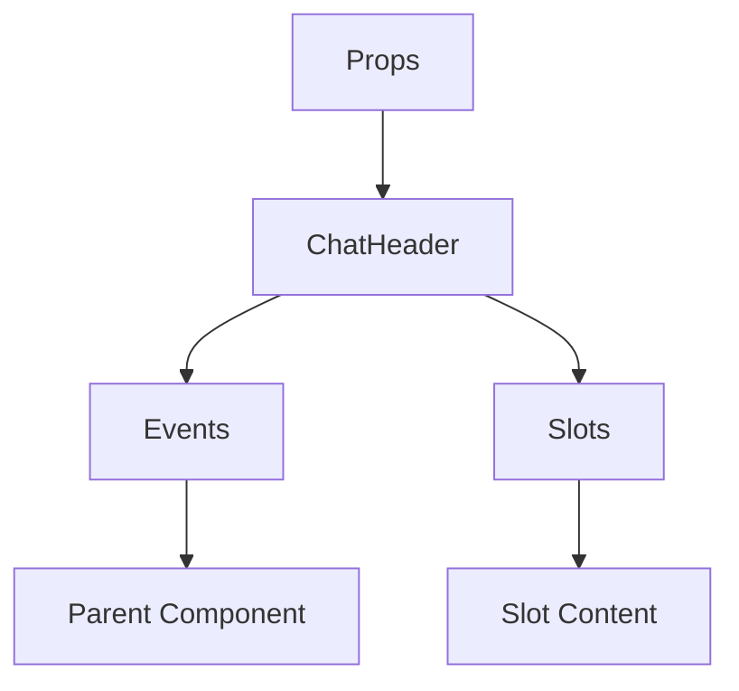

# ChatHeader

No description available.

**File:** `src/components/chat/ChatHeader.vue`

## Overview


```mermaid
graph TB
    PROPS[Props] --> COMPONENT[ChatHeader]
    COMPONENT --> EVENTS[Events]
    COMPONENT --> SLOTS[Slots]
    EVENTS --> PARENT[Parent Component]
    SLOTS --> CONTENT[Slot Content]
```

## Props

| Name | Type | Default | Required | Description |
|------|------|---------|----------|-------------|
| `channel` | `Channel` | `undefined` | ✅ | No description |
| `server` | `Server` | `undefined` | ❌ | No description |
| `isMobile` | `boolean` | `undefined` | ❌ | No description |
| `rightSidebarOpen` | `boolean` | `undefined` | ❌ | No description |

### Props Details

#### `channel`

No description available.

- **Type:** `Channel`
- **Required:** Yes
- **Default:** `undefined`


#### `server`

No description available.

- **Type:** `Server`
- **Required:** No
- **Default:** `undefined`


#### `isMobile`

No description available.

- **Type:** `boolean`
- **Required:** No
- **Default:** `undefined`


#### `rightSidebarOpen`

No description available.

- **Type:** `boolean`
- **Required:** No
- **Default:** `undefined`


## Events

| Name | Parameters | Description |
|------|------------|-------------|
| `toggle-left-sidebar` | unknown | No description |
| `toggle-voice-panel` | unknown | No description |
| `toggle-right-sidebar` | unknown | No description |

### Event Details

#### `toggle-left-sidebar`

No description available.

**Parameters:** `unknown`


#### `toggle-voice-panel`

No description available.

**Parameters:** `unknown`


#### `toggle-right-sidebar`

No description available.

**Parameters:** `unknown`


## Slots

This component has no slots.

## Methods

This component exposes no public methods.

## Usage Example

```vue
<template>
  <ChatHeader
    :channel="undefined"
    @toggle-left-sidebar="handleToggle-left-sidebar"
    @toggle-voice-panel="handleToggle-voice-panel"
    @toggle-right-sidebar="handleToggle-right-sidebar" />
</template>

<script setup lang="ts">
const handleToggle-left-sidebar = (data) => {
  // Handle toggle-left-sidebar event
}

const handleToggle-voice-panel = (data) => {
  // Handle toggle-voice-panel event
}

const handleToggle-right-sidebar = (data) => {
  // Handle toggle-right-sidebar event
}
</script>
```


## File Location

`src/components/chat/ChatHeader.vue`

---

*This documentation was automatically generated from the component source code.*