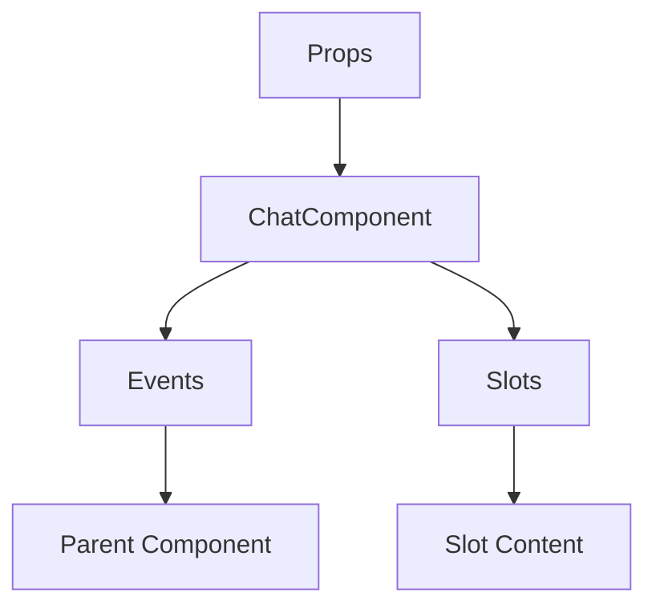

# ChatComponent

A Vue component.

**File:** `src/components/ChatComponent.vue`

## Overview



## Props

| Name | Type | Default | Required | Description |
|------|------|---------|----------|-------------|
| `messages` | `Array` | `undefined` | ✅ | No description |
| `isLoading` | `boolean` | `false` | ❌ | No description |
| `loadMoreMessages` | `TSFunctionType` | `undefined` | ❌ | No description |
| `isDM` | `boolean` | `false` | ❌ | No description |
| `channelId` | `string` | `undefined` | ❌ | No description |
| `conversationId` | `string` | `undefined` | ❌ | No description |
| `channelName` | `string` | `undefined` | ❌ | No description |
| `dmUsername` | `string` | `undefined` | ❌ | No description |

### Props Details

#### `messages`

No description available.

- **Type:** `Array`
- **Required:** Yes
- **Default:** `undefined`


#### `isLoading`

No description available.

- **Type:** `boolean`
- **Required:** No
- **Default:** `false`


#### `loadMoreMessages`

No description available.

- **Type:** `TSFunctionType`
- **Required:** No
- **Default:** `undefined`


#### `isDM`

No description available.

- **Type:** `boolean`
- **Required:** No
- **Default:** `false`


#### `channelId`

No description available.

- **Type:** `string`
- **Required:** No
- **Default:** `undefined`


#### `conversationId`

No description available.

- **Type:** `string`
- **Required:** No
- **Default:** `undefined`


#### `channelName`

No description available.

- **Type:** `string`
- **Required:** No
- **Default:** `undefined`


#### `dmUsername`

No description available.

- **Type:** `string`
- **Required:** No
- **Default:** `undefined`


## Events

| Name | Parameters | Description |
|------|------------|-------------|
| `sendMessage` | `Array` | No description |
| `loadMoreMessages` | `unknown` | No description |
| `showAllThreads` | `unknown` | No description |

### Event Details

#### `sendMessage`

No description available.

**Parameters:** `Array`


#### `loadMoreMessages`

No description available.

**Parameters:** `unknown`


#### `showAllThreads`

No description available.

**Parameters:** `unknown`


## Slots

This component has no slots.

## Methods

This component exposes no public methods.

## Usage Example

```vue
<template>
  <ChatComponent
    :messages="[]"
    @sendMessage="handleSendMessage"
    @loadMoreMessages="handleLoadMoreMessages"
    @showAllThreads="handleShowAllThreads" />
</template>

<script setup lang="ts">
const handleSendMessage = (data: Array) => {
  // Handle sendMessage event
}

const handleLoadMoreMessages = (data: unknown) => {
  // Handle loadMoreMessages event
}

const handleShowAllThreads = (data: unknown) => {
  // Handle showAllThreads event
}
</script>
```


## File Location

`src/components/ChatComponent.vue`

---

*This documentation was automatically generated from the component source code.*