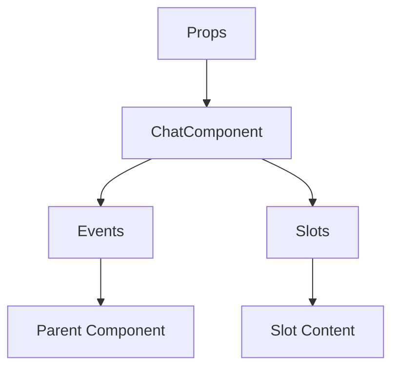

# ChatComponent

No description available.

**File:** `src/components/ChatComponent.vue`

## Overview


```mermaid
graph TB
    PROPS[Props] --> COMPONENT[ChatComponent]
    COMPONENT --> EVENTS[Events]
    COMPONENT --> SLOTS[Slots]
    EVENTS --> PARENT[Parent Component]
    SLOTS --> CONTENT[Slot Content]
```

## Props

| Name | Type | Default | Required | Description |
|------|------|---------|----------|-------------|
| `messages` | `Array` | `undefined` | ✅ | No description |
| `isLoading` | `boolean` | `false` | ❌ | No description |
| `loadMoreMessages` | `TSFunctionType` | `undefined` | ❌ | No description |
| `isDM` | `boolean` | `false` | ❌ | No description |

### Props Details

#### `messages`

No description available.

- **Type:** `Array`
- **Required:** Yes
- **Default:** `undefined`


#### `isLoading`

No description available.

- **Type:** `boolean`
- **Required:** No
- **Default:** `false`


#### `loadMoreMessages`

No description available.

- **Type:** `TSFunctionType`
- **Required:** No
- **Default:** `undefined`


#### `isDM`

No description available.

- **Type:** `boolean`
- **Required:** No
- **Default:** `false`


## Events

| Name | Parameters | Description |
|------|------------|-------------|
| `loadMoreMessages` | unknown | No description |
| `sendMessage` | Array | No description |

### Event Details

#### `loadMoreMessages`

No description available.

**Parameters:** `unknown`


#### `sendMessage`

No description available.

**Parameters:** `Array`


## Slots

This component has no slots.

## Methods

This component exposes no public methods.

## Usage Example

```vue
<template>
  <ChatComponent
    :messages="[]"
    @loadMoreMessages="handleLoadMoreMessages"
    @sendMessage="handleSendMessage" />
</template>

<script setup lang="ts">
const handleLoadMoreMessages = (data) => {
  // Handle loadMoreMessages event
}

const handleSendMessage = (Array) => {
  // Handle sendMessage event
}
</script>
```


## File Location

`src/components/ChatComponent.vue`

---

*This documentation was automatically generated from the component source code.*