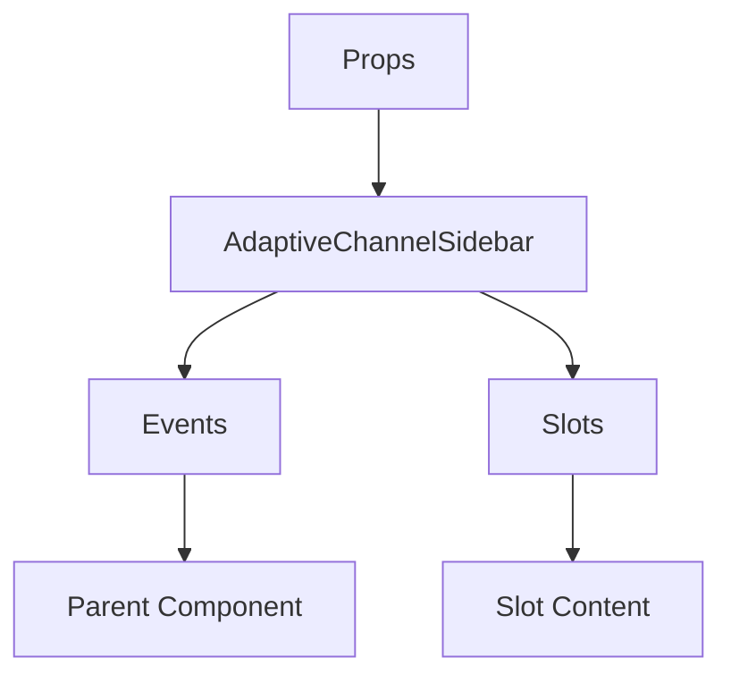

# AdaptiveChannelSidebar

A Vue component.

**File:** `src/components/common/AdaptiveChannelSidebar.vue`

## Overview



## Props

| Name | Type | Default | Required | Description |
|------|------|---------|----------|-------------|
| `mode` | `union` | `'chat'` | ✅ | No description |
| `currentServer` | `Server` | `undefined` | ❌ | No description |
| `channels` | `Array` | `() => []` | ✅ | No description |
| `currentChannelId` | `string` | `''` | ❌ | No description |
| `categories` | `Array` | `() => []` | ✅ | No description |
| `categoryChannels` | `Record` | `() => ({})` | ✅ | No description |
| `isDM` | `boolean` | `false` | ❌ | No description |
| `followingCount` | `number` | `0` | ❌ | No description |
| `followersCount` | `number` | `0` | ❌ | No description |
| `instanceDomain` | `string` | `import.meta.env.VITE_DOMAIN as string` | ❌ | No description |
| `instanceUserCount` | `number` | `0` | ❌ | No description |
| `instancePostCount` | `number` | `0` | ❌ | No description |

### Props Details

#### `mode`

No description available.

- **Type:** `union`
- **Required:** Yes
- **Default:** `'chat'`


#### `currentServer`

No description available.

- **Type:** `Server`
- **Required:** No
- **Default:** `undefined`


#### `channels`

No description available.

- **Type:** `Array`
- **Required:** Yes
- **Default:** `() => []`


#### `currentChannelId`

No description available.

- **Type:** `string`
- **Required:** No
- **Default:** `''`


#### `categories`

No description available.

- **Type:** `Array`
- **Required:** Yes
- **Default:** `() => []`


#### `categoryChannels`

No description available.

- **Type:** `Record`
- **Required:** Yes
- **Default:** `() => ({})`


#### `isDM`

No description available.

- **Type:** `boolean`
- **Required:** No
- **Default:** `false`


#### `followingCount`

No description available.

- **Type:** `number`
- **Required:** No
- **Default:** `0`


#### `followersCount`

No description available.

- **Type:** `number`
- **Required:** No
- **Default:** `0`


#### `instanceDomain`

No description available.

- **Type:** `string`
- **Required:** No
- **Default:** `import.meta.env.VITE_DOMAIN as string`


#### `instanceUserCount`

No description available.

- **Type:** `number`
- **Required:** No
- **Default:** `0`


#### `instancePostCount`

No description available.

- **Type:** `number`
- **Required:** No
- **Default:** `0`


## Events

| Name | Parameters | Description |
|------|------------|-------------|
| `channel-selected` | `string` | No description |
| `create-channel` | `string` | No description |
| `conversation-selected` | `string` | No description |
| `profile-click` | `unknown` | No description |
| `switch-mode` | `union` | No description |
| `compose-post` | `unknown` | No description |

### Event Details

#### `channel-selected`

No description available.

**Parameters:** `string`


#### `create-channel`

No description available.

**Parameters:** `string`


#### `conversation-selected`

No description available.

**Parameters:** `string`


#### `profile-click`

No description available.

**Parameters:** `unknown`


#### `switch-mode`

No description available.

**Parameters:** `union`


#### `compose-post`

No description available.

**Parameters:** `unknown`


## Slots

This component has no slots.

## Methods

This component exposes no public methods.

## Usage Example

```vue
<template>
  <AdaptiveChannelSidebar
    :mode="'chat'"
    :channels="[]"
    :categories="[]"
    :categoryChannels="() => ({})"
    @channel-selected="handleChannelSelected"
    @create-channel="handleCreateChannel"
    @conversation-selected="handleConversationSelected"
    @profile-click="handleProfileClick"
    @switch-mode="handleSwitchMode"
    @compose-post="handleComposePost" />
</template>

<script setup lang="ts">
const handleChannelSelected = (data: string) => {
  // Handle channel-selected event
}

const handleCreateChannel = (data: string) => {
  // Handle create-channel event
}

const handleConversationSelected = (data: string) => {
  // Handle conversation-selected event
}

const handleProfileClick = (data: unknown) => {
  // Handle profile-click event
}

const handleSwitchMode = (data: union) => {
  // Handle switch-mode event
}

const handleComposePost = (data: unknown) => {
  // Handle compose-post event
}
</script>
```


## File Location

`src/components/common/AdaptiveChannelSidebar.vue`

---

*This documentation was automatically generated from the component source code.*