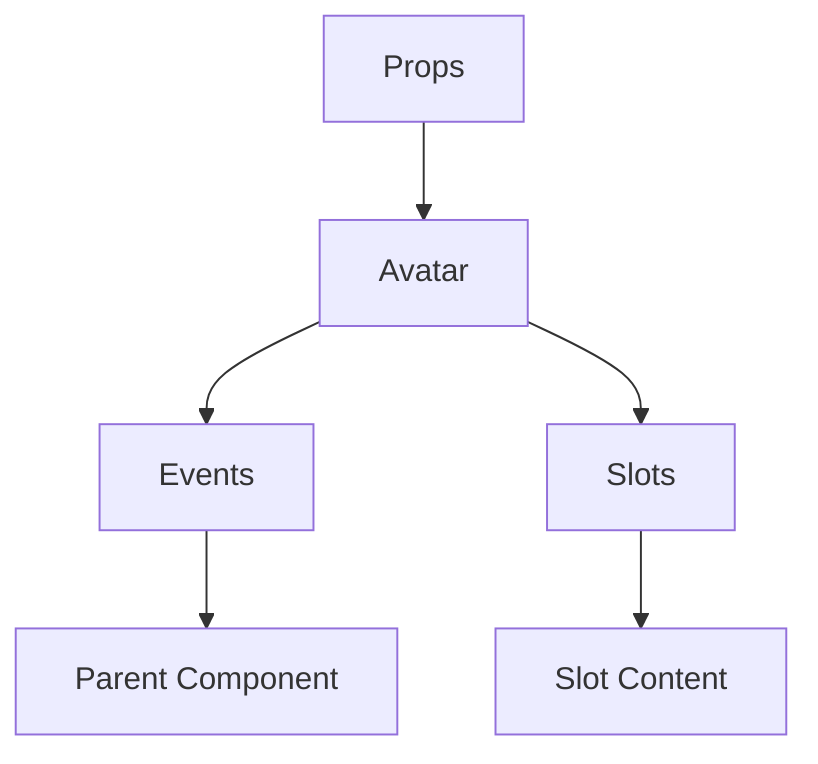

# Avatar

A Vue component.

**File:** `src/components/common/Avatar.vue`

## Overview



## Props

| Name | Type | Default | Required | Description |
|------|------|---------|----------|-------------|
| `src` | `union` | `undefined` | ❌ | No description |
| `alt` | `string` | `'Avatar'` | ❌ | No description |
| `size` | `AvatarSize` | `'md'` | ❌ | No description |
| `status` | `UserStatus` | `undefined` | ❌ | No description |
| `isMobile` | `boolean` | `false` | ❌ | No description |
| `editable` | `boolean` | `false` | ❌ | No description |
| `interactive` | `boolean` | `false` | ❌ | No description |
| `loading` | `boolean` | `false` | ❌ | No description |

### Props Details

#### `src`

No description available.

- **Type:** `union`
- **Required:** No
- **Default:** `undefined`


#### `alt`

No description available.

- **Type:** `string`
- **Required:** No
- **Default:** `'Avatar'`


#### `size`

No description available.

- **Type:** `AvatarSize`
- **Required:** No
- **Default:** `'md'`


#### `status`

No description available.

- **Type:** `UserStatus`
- **Required:** No
- **Default:** `undefined`


#### `isMobile`

No description available.

- **Type:** `boolean`
- **Required:** No
- **Default:** `false`


#### `editable`

No description available.

- **Type:** `boolean`
- **Required:** No
- **Default:** `false`


#### `interactive`

No description available.

- **Type:** `boolean`
- **Required:** No
- **Default:** `false`


#### `loading`

No description available.

- **Type:** `boolean`
- **Required:** No
- **Default:** `false`


## Events

| Name | Parameters | Description |
|------|------------|-------------|
| `click` | `unknown` | No description |
| `upload` | `File` | No description |
| `edit` | `unknown` | No description |

### Event Details

#### `click`

No description available.

**Parameters:** `unknown`


#### `upload`

No description available.

**Parameters:** `File`


#### `edit`

No description available.

**Parameters:** `unknown`


## Slots

This component has no slots.

## Methods

This component exposes no public methods.

## Usage Example

```vue
<template>
  <Avatar
    
    @click="handleClick"
    @upload="handleUpload"
    @edit="handleEdit" />
</template>

<script setup lang="ts">
const handleClick = (data: unknown) => {
  // Handle click event
}

const handleUpload = (data: File) => {
  // Handle upload event
}

const handleEdit = (data: unknown) => {
  // Handle edit event
}
</script>
```


## File Location

`src/components/common/Avatar.vue`

---

*This documentation was automatically generated from the component source code.*