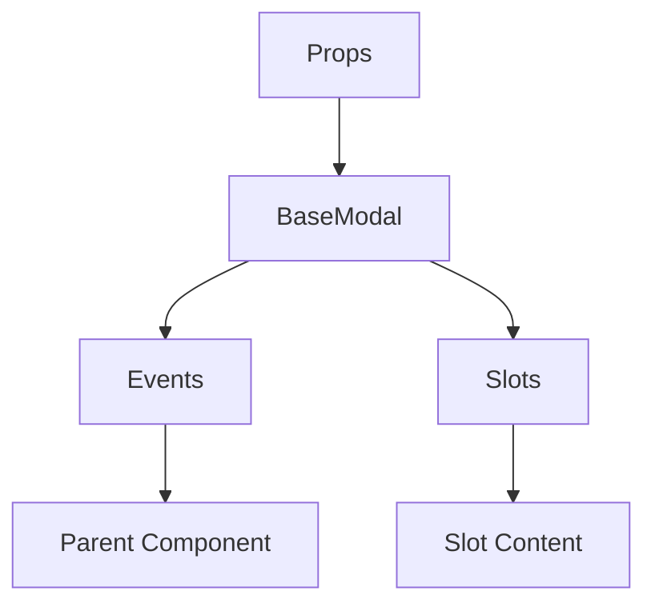

# BaseModal

A Vue component.

**File:** `src/components/common/BaseModal.vue`

## Overview



## Props

| Name | Type | Default | Required | Description |
|------|------|---------|----------|-------------|
| `show` | `boolean` | `undefined` | ✅ | No description |
| `title` | `string` | `undefined` | ❌ | No description |
| `subtitle` | `string` | `undefined` | ❌ | No description |
| `icon` | `any` | `undefined` | ❌ | No description |
| `compact` | `boolean` | `false` | ❌ | No description |
| `showHeader` | `boolean` | `true` | ❌ | No description |
| `showCloseButton` | `boolean` | `true` | ❌ | No description |
| `closeOnOverlay` | `boolean` | `true` | ❌ | No description |

### Props Details

#### `show`

No description available.

- **Type:** `boolean`
- **Required:** Yes
- **Default:** `undefined`


#### `title`

No description available.

- **Type:** `string`
- **Required:** No
- **Default:** `undefined`


#### `subtitle`

No description available.

- **Type:** `string`
- **Required:** No
- **Default:** `undefined`


#### `icon`

No description available.

- **Type:** `any`
- **Required:** No
- **Default:** `undefined`


#### `compact`

No description available.

- **Type:** `boolean`
- **Required:** No
- **Default:** `false`


#### `showHeader`

No description available.

- **Type:** `boolean`
- **Required:** No
- **Default:** `true`


#### `showCloseButton`

No description available.

- **Type:** `boolean`
- **Required:** No
- **Default:** `true`


#### `closeOnOverlay`

No description available.

- **Type:** `boolean`
- **Required:** No
- **Default:** `true`


## Events

| Name | Parameters | Description |
|------|------------|-------------|
| `close` | `unknown` | No description |

### Event Details

#### `close`

No description available.

**Parameters:** `unknown`


## Slots

| Name | Scoped | Description |
|------|--------|-------------|
| `default` | ❌ | No description |
| `footer` | ❌ | No description |

### Slot Details

#### `default`

No description available.

**Scoped:** No


#### `footer`

No description available.

**Scoped:** No


## Methods

This component exposes no public methods.

## Usage Example

```vue
<template>
  <BaseModal
    :show="true"
    @close="handleClose">
    <template #default>
      <!-- Slot content for default -->
    </template>
    <template #footer>
      <!-- Slot content for footer -->
    </template>
  </BaseModal>
</template>

<script setup lang="ts">
const handleClose = (data: unknown) => {
  // Handle close event
}
</script>
```


## File Location

`src/components/common/BaseModal.vue`

---

*This documentation was automatically generated from the component source code.*