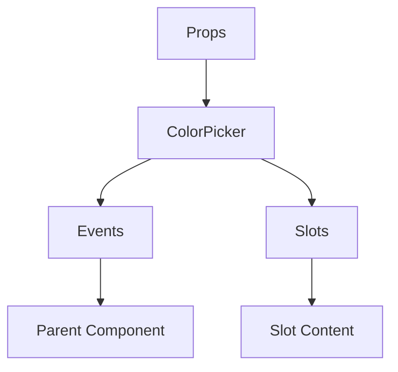

# ColorPicker

A Vue component.

**File:** `src/components/common/ColorPicker.vue`

## Overview



## Props

| Name | Type | Default | Required | Description |
|------|------|---------|----------|-------------|
| `color` | `string` | `'#5865f2'` | ❌ | No description |

### Props Details

#### `color`

No description available.

- **Type:** `string`
- **Required:** No
- **Default:** `'#5865f2'`


## Events

| Name | Parameters | Description |
|------|------------|-------------|
| `update:color` | `string` | No description |
| `change` | `string` | No description |

### Event Details

#### `update:color`

No description available.

**Parameters:** `string`


#### `change`

No description available.

**Parameters:** `string`


## Slots

This component has no slots.

## Methods

This component exposes no public methods.

## Usage Example

```vue
<template>
  <ColorPicker
    
    @update:color="handleUpdate:color"
    @change="handleChange" />
</template>

<script setup lang="ts">
const handleUpdate:color = (data: string) => {
  // Handle update:color event
}

const handleChange = (data: string) => {
  // Handle change event
}
</script>
```


## File Location

`src/components/common/ColorPicker.vue`

---

*This documentation was automatically generated from the component source code.*