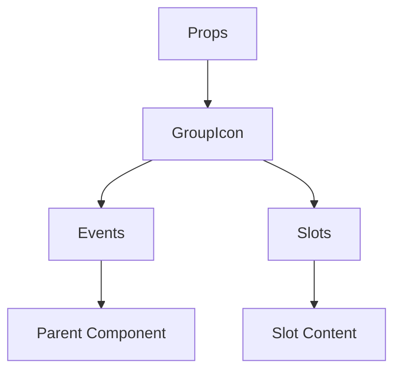

# GroupIcon

A Vue component.

**File:** `src/components/common/GroupIcon.vue`

## Overview



## Props

| Name | Type | Default | Required | Description |
|------|------|---------|----------|-------------|
| `conversationId` | `string` | `undefined` | ✅ | No description |
| `iconPath` | `union` | `undefined` | ❌ | No description |
| `size` | `union` | `'md'` | ❌ | No description |
| `alt` | `string` | `'Group icon'` | ❌ | No description |
| `showParticipantCount` | `boolean` | `false` | ❌ | No description |
| `participantCount` | `number` | `0` | ❌ | No description |
| `clickable` | `boolean` | `false` | ❌ | No description |
| `loading` | `boolean` | `false` | ❌ | No description |

### Props Details

#### `conversationId`

No description available.

- **Type:** `string`
- **Required:** Yes
- **Default:** `undefined`


#### `iconPath`

No description available.

- **Type:** `union`
- **Required:** No
- **Default:** `undefined`


#### `size`

No description available.

- **Type:** `union`
- **Required:** No
- **Default:** `'md'`


#### `alt`

No description available.

- **Type:** `string`
- **Required:** No
- **Default:** `'Group icon'`


#### `showParticipantCount`

No description available.

- **Type:** `boolean`
- **Required:** No
- **Default:** `false`


#### `participantCount`

No description available.

- **Type:** `number`
- **Required:** No
- **Default:** `0`


#### `clickable`

No description available.

- **Type:** `boolean`
- **Required:** No
- **Default:** `false`


#### `loading`

No description available.

- **Type:** `boolean`
- **Required:** No
- **Default:** `false`


## Events

| Name | Parameters | Description |
|------|------------|-------------|
| `click` | `unknown` | No description |
| `error` | `Event` | No description |
| `load` | `Event` | No description |

### Event Details

#### `click`

No description available.

**Parameters:** `unknown`


#### `error`

No description available.

**Parameters:** `Event`


#### `load`

No description available.

**Parameters:** `Event`


## Slots

This component has no slots.

## Methods

This component exposes no public methods.

## Usage Example

```vue
<template>
  <GroupIcon
    :conversationId=""example""
    @click="handleClick"
    @error="handleError"
    @load="handleLoad" />
</template>

<script setup lang="ts">
const handleClick = (data: unknown) => {
  // Handle click event
}

const handleError = (data: Event) => {
  // Handle error event
}

const handleLoad = (data: Event) => {
  // Handle load event
}
</script>
```


## File Location

`src/components/common/GroupIcon.vue`

---

*This documentation was automatically generated from the component source code.*