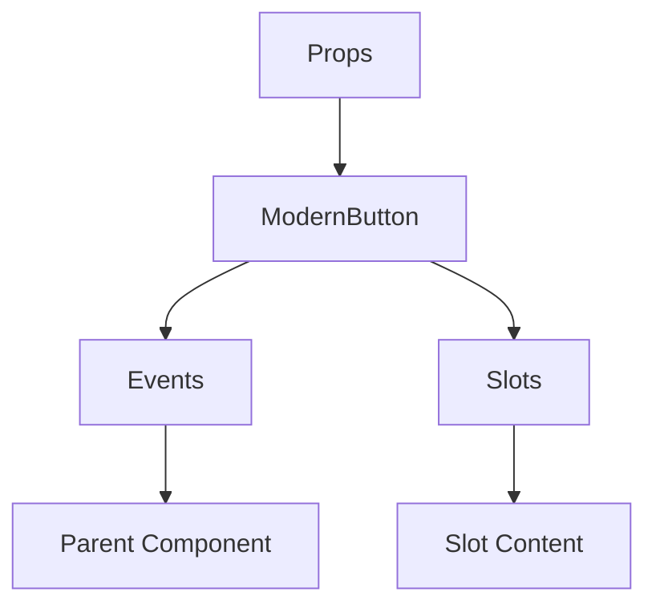

# ModernButton

A Vue component.

**File:** `src/components/common/ModernButton.vue`

## Overview



## Props

| Name | Type | Default | Required | Description |
|------|------|---------|----------|-------------|
| `variant` | `union` | `'primary'` | ❌ | No description |
| `size` | `union` | `'medium'` | ❌ | No description |
| `type` | `union` | `'button'` | ❌ | No description |
| `disabled` | `boolean` | `false` | ❌ | No description |
| `loading` | `boolean` | `false` | ❌ | No description |
| `showTextWhileLoading` | `boolean` | `false` | ❌ | No description |
| `iconLeft` | `any` | `undefined` | ❌ | No description |
| `iconRight` | `any` | `undefined` | ❌ | No description |
| `text` | `string` | `undefined` | ❌ | No description |
| `fullWidth` | `boolean` | `false` | ❌ | No description |
| `rounded` | `boolean` | `false` | ❌ | No description |

### Props Details

#### `variant`

No description available.

- **Type:** `union`
- **Required:** No
- **Default:** `'primary'`


#### `size`

No description available.

- **Type:** `union`
- **Required:** No
- **Default:** `'medium'`


#### `type`

No description available.

- **Type:** `union`
- **Required:** No
- **Default:** `'button'`


#### `disabled`

No description available.

- **Type:** `boolean`
- **Required:** No
- **Default:** `false`


#### `loading`

No description available.

- **Type:** `boolean`
- **Required:** No
- **Default:** `false`


#### `showTextWhileLoading`

No description available.

- **Type:** `boolean`
- **Required:** No
- **Default:** `false`


#### `iconLeft`

No description available.

- **Type:** `any`
- **Required:** No
- **Default:** `undefined`


#### `iconRight`

No description available.

- **Type:** `any`
- **Required:** No
- **Default:** `undefined`


#### `text`

No description available.

- **Type:** `string`
- **Required:** No
- **Default:** `undefined`


#### `fullWidth`

No description available.

- **Type:** `boolean`
- **Required:** No
- **Default:** `false`


#### `rounded`

No description available.

- **Type:** `boolean`
- **Required:** No
- **Default:** `false`


## Events

| Name | Parameters | Description |
|------|------------|-------------|
| `click` | `MouseEvent` | No description |

### Event Details

#### `click`

No description available.

**Parameters:** `MouseEvent`


## Slots

| Name | Scoped | Description |
|------|--------|-------------|
| `default` | ❌ | No description |

### Slot Details

#### `default`

No description available.

**Scoped:** No


## Methods

This component exposes no public methods.

## Usage Example

```vue
<template>
  <ModernButton
    
    @click="handleClick">
    <template #default>
      <!-- Slot content for default -->
    </template>
  </ModernButton>
</template>

<script setup lang="ts">
const handleClick = (data: MouseEvent) => {
  // Handle click event
}
</script>
```


## File Location

`src/components/common/ModernButton.vue`

---

*This documentation was automatically generated from the component source code.*