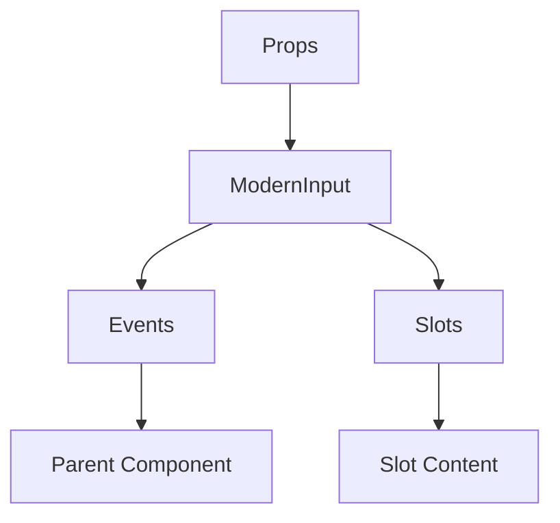

# ModernInput

A Vue component.

**File:** `src/components/common/ModernInput.vue`

## Overview



## Props

| Name | Type | Default | Required | Description |
|------|------|---------|----------|-------------|
| `modelValue` | `string` | `undefined` | ✅ | No description |
| `label` | `string` | `undefined` | ❌ | No description |
| `placeholder` | `string` | `undefined` | ❌ | No description |
| `type` | `string` | `'text'` | ❌ | No description |
| `required` | `boolean` | `false` | ❌ | No description |
| `disabled` | `boolean` | `false` | ❌ | No description |
| `maxLength` | `number` | `undefined` | ❌ | No description |
| `showCharCount` | `boolean` | `false` | ❌ | No description |
| `errorMessage` | `string` | `undefined` | ❌ | No description |
| `successMessage` | `string` | `undefined` | ❌ | No description |
| `hint` | `string` | `undefined` | ❌ | No description |
| `autofocus` | `boolean` | `false` | ❌ | No description |
| `validateOnInput` | `boolean` | `true` | ❌ | No description |

### Props Details

#### `modelValue`

No description available.

- **Type:** `string`
- **Required:** Yes
- **Default:** `undefined`


#### `label`

No description available.

- **Type:** `string`
- **Required:** No
- **Default:** `undefined`


#### `placeholder`

No description available.

- **Type:** `string`
- **Required:** No
- **Default:** `undefined`


#### `type`

No description available.

- **Type:** `string`
- **Required:** No
- **Default:** `'text'`


#### `required`

No description available.

- **Type:** `boolean`
- **Required:** No
- **Default:** `false`


#### `disabled`

No description available.

- **Type:** `boolean`
- **Required:** No
- **Default:** `false`


#### `maxLength`

No description available.

- **Type:** `number`
- **Required:** No
- **Default:** `undefined`


#### `showCharCount`

No description available.

- **Type:** `boolean`
- **Required:** No
- **Default:** `false`


#### `errorMessage`

No description available.

- **Type:** `string`
- **Required:** No
- **Default:** `undefined`


#### `successMessage`

No description available.

- **Type:** `string`
- **Required:** No
- **Default:** `undefined`


#### `hint`

No description available.

- **Type:** `string`
- **Required:** No
- **Default:** `undefined`


#### `autofocus`

No description available.

- **Type:** `boolean`
- **Required:** No
- **Default:** `false`


#### `validateOnInput`

No description available.

- **Type:** `boolean`
- **Required:** No
- **Default:** `true`


## Events

| Name | Parameters | Description |
|------|------------|-------------|
| `update:modelValue` | `string` | No description |
| `focus` | `FocusEvent` | No description |
| `blur` | `FocusEvent` | No description |
| `keydown` | `KeyboardEvent` | No description |
| `enter` | `KeyboardEvent` | No description |

### Event Details

#### `update:modelValue`

No description available.

**Parameters:** `string`


#### `focus`

No description available.

**Parameters:** `FocusEvent`


#### `blur`

No description available.

**Parameters:** `FocusEvent`


#### `keydown`

No description available.

**Parameters:** `KeyboardEvent`


#### `enter`

No description available.

**Parameters:** `KeyboardEvent`


## Slots

This component has no slots.

## Methods

This component exposes no public methods.

## Usage Example

```vue
<template>
  <ModernInput
    :modelValue=""example""
    @update:modelValue="handleUpdate:modelValue"
    @focus="handleFocus"
    @blur="handleBlur"
    @keydown="handleKeydown"
    @enter="handleEnter" />
</template>

<script setup lang="ts">
const handleUpdate:modelValue = (data: string) => {
  // Handle update:modelValue event
}

const handleFocus = (data: FocusEvent) => {
  // Handle focus event
}

const handleBlur = (data: FocusEvent) => {
  // Handle blur event
}

const handleKeydown = (data: KeyboardEvent) => {
  // Handle keydown event
}

const handleEnter = (data: KeyboardEvent) => {
  // Handle enter event
}
</script>
```


## File Location

`src/components/common/ModernInput.vue`

---

*This documentation was automatically generated from the component source code.*