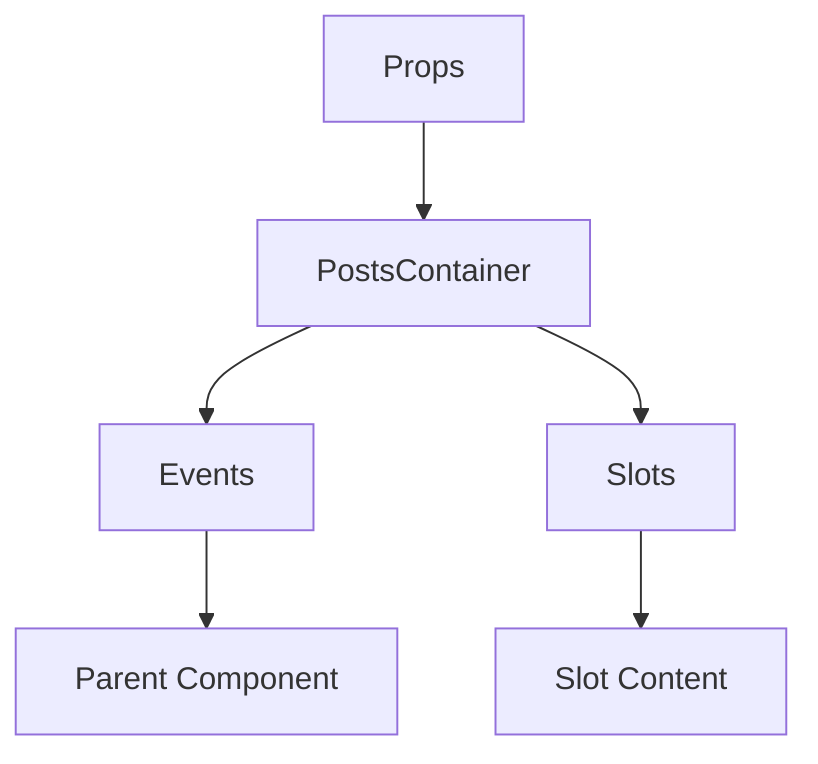

# PostsContainer

A Vue component.

**File:** `src/components/common/PostsContainer.vue`

## Overview



## Props

| Name | Type | Default | Required | Description |
|------|------|---------|----------|-------------|
| `posts` | `Array` | `() => []` | ✅ | No description |
| `isLoading` | `boolean` | `false` | ❌ | No description |
| `hasMore` | `boolean` | `false` | ❌ | No description |
| `loadingMessage` | `string` | `'Loading posts...'` | ❌ | No description |
| `emptyTitle` | `string` | `'No posts yet'` | ❌ | No description |
| `emptyMessage` | `string` | `'Posts will appear here when available.'` | ❌ | No description |
| `emptyIcon` | `string` | `'users'` | ❌ | No description |
| `emptyAction` | `string` | `undefined` | ❌ | No description |
| `postProps` | `Record` | `() => ({})` | ❌ | No description |

### Props Details

#### `posts`

No description available.

- **Type:** `Array`
- **Required:** Yes
- **Default:** `() => []`


#### `isLoading`

No description available.

- **Type:** `boolean`
- **Required:** No
- **Default:** `false`


#### `hasMore`

No description available.

- **Type:** `boolean`
- **Required:** No
- **Default:** `false`


#### `loadingMessage`

No description available.

- **Type:** `string`
- **Required:** No
- **Default:** `'Loading posts...'`


#### `emptyTitle`

No description available.

- **Type:** `string`
- **Required:** No
- **Default:** `'No posts yet'`


#### `emptyMessage`

No description available.

- **Type:** `string`
- **Required:** No
- **Default:** `'Posts will appear here when available.'`


#### `emptyIcon`

No description available.

- **Type:** `string`
- **Required:** No
- **Default:** `'users'`


#### `emptyAction`

No description available.

- **Type:** `string`
- **Required:** No
- **Default:** `undefined`


#### `postProps`

No description available.

- **Type:** `Record`
- **Required:** No
- **Default:** `() => ({})`


## Events

| Name | Parameters | Description |
|------|------------|-------------|
| `empty-action` | `unknown` | No description |
| `reply` | `any` | No description |
| `favorite` | `string` | No description |
| `reblog` | `string` | No description |
| `bookmark` | `string` | No description |
| `delete` | `string` | No description |
| `user-click` | `any` | No description |
| `hashtag-click` | `string` | No description |
| `show-conversation` | `string` | No description |
| `load-more` | `unknown` | No description |

### Event Details

#### `empty-action`

No description available.

**Parameters:** `unknown`


#### `reply`

No description available.

**Parameters:** `any`


#### `favorite`

No description available.

**Parameters:** `string`


#### `reblog`

No description available.

**Parameters:** `string`


#### `bookmark`

No description available.

**Parameters:** `string`


#### `delete`

No description available.

**Parameters:** `string`


#### `user-click`

No description available.

**Parameters:** `any`


#### `hashtag-click`

No description available.

**Parameters:** `string`


#### `show-conversation`

No description available.

**Parameters:** `string`


#### `load-more`

No description available.

**Parameters:** `unknown`


## Slots

This component has no slots.

## Methods

This component exposes no public methods.

## Usage Example

```vue
<template>
  <PostsContainer
    :posts="[]"
    @empty-action="handleEmptyAction"
    @reply="handleReply"
    @favorite="handleFavorite"
    @reblog="handleReblog"
    @bookmark="handleBookmark"
    @delete="handleDelete"
    @user-click="handleUserClick"
    @hashtag-click="handleHashtagClick"
    @show-conversation="handleShowConversation"
    @load-more="handleLoadMore" />
</template>

<script setup lang="ts">
const handleEmptyAction = (data: unknown) => {
  // Handle empty-action event
}

const handleReply = (data: any) => {
  // Handle reply event
}

const handleFavorite = (data: string) => {
  // Handle favorite event
}

const handleReblog = (data: string) => {
  // Handle reblog event
}

const handleBookmark = (data: string) => {
  // Handle bookmark event
}

const handleDelete = (data: string) => {
  // Handle delete event
}

const handleUserClick = (data: any) => {
  // Handle user-click event
}

const handleHashtagClick = (data: string) => {
  // Handle hashtag-click event
}

const handleShowConversation = (data: string) => {
  // Handle show-conversation event
}

const handleLoadMore = (data: unknown) => {
  // Handle load-more event
}
</script>
```


## File Location

`src/components/common/PostsContainer.vue`

---

*This documentation was automatically generated from the component source code.*