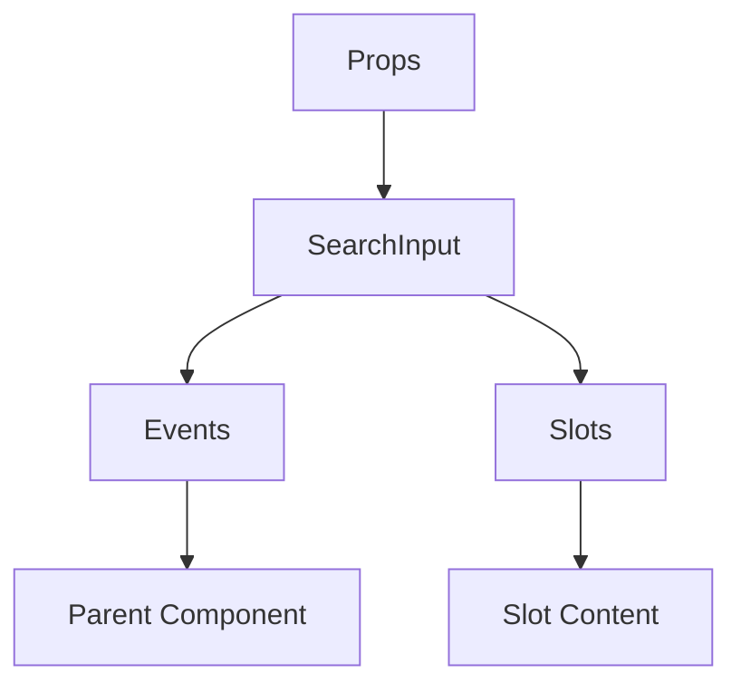

# SearchInput

A Vue component.

**File:** `src/components/common/SearchInput.vue`

## Overview



## Props

| Name | Type | Default | Required | Description |
|------|------|---------|----------|-------------|
| `modelValue` | `string` | `undefined` | ✅ | No description |
| `placeholder` | `string` | `'Search...'` | ❌ | No description |
| `isLoading` | `boolean` | `false` | ❌ | No description |
| `disabled` | `boolean` | `false` | ❌ | No description |
| `showClearButton` | `boolean` | `true` | ❌ | No description |

### Props Details

#### `modelValue`

No description available.

- **Type:** `string`
- **Required:** Yes
- **Default:** `undefined`


#### `placeholder`

No description available.

- **Type:** `string`
- **Required:** No
- **Default:** `'Search...'`


#### `isLoading`

No description available.

- **Type:** `boolean`
- **Required:** No
- **Default:** `false`


#### `disabled`

No description available.

- **Type:** `boolean`
- **Required:** No
- **Default:** `false`


#### `showClearButton`

No description available.

- **Type:** `boolean`
- **Required:** No
- **Default:** `true`


## Events

| Name | Parameters | Description |
|------|------------|-------------|
| `update:modelValue` | `string` | No description |
| `clear` | `unknown` | No description |
| `escape` | `unknown` | No description |

### Event Details

#### `update:modelValue`

No description available.

**Parameters:** `string`


#### `clear`

No description available.

**Parameters:** `unknown`


#### `escape`

No description available.

**Parameters:** `unknown`


## Slots

This component has no slots.

## Methods

This component exposes no public methods.

## Usage Example

```vue
<template>
  <SearchInput
    :modelValue=""example""
    @update:modelValue="handleUpdate:modelValue"
    @clear="handleClear"
    @escape="handleEscape" />
</template>

<script setup lang="ts">
const handleUpdate:modelValue = (data: string) => {
  // Handle update:modelValue event
}

const handleClear = (data: unknown) => {
  // Handle clear event
}

const handleEscape = (data: unknown) => {
  // Handle escape event
}
</script>
```


## File Location

`src/components/common/SearchInput.vue`

---

*This documentation was automatically generated from the component source code.*