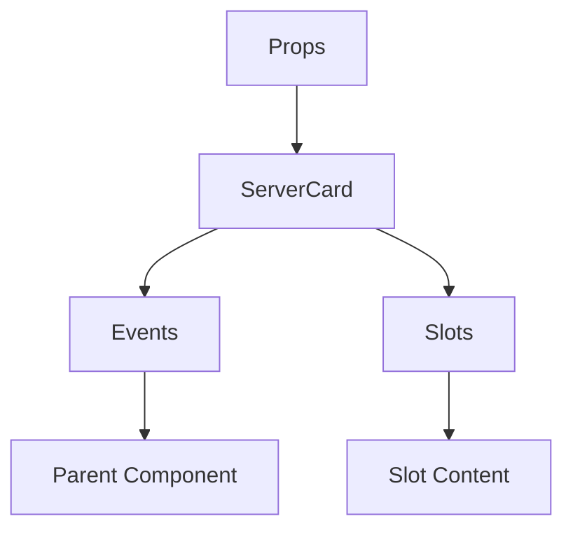

# ServerCard

A Vue component.

**File:** `src/components/common/ServerCard.vue`

## Overview



## Props

| Name | Type | Default | Required | Description |
|------|------|---------|----------|-------------|
| `server` | `PublicServerWithStats` | `undefined` | ✅ | No description |
| `isJoined` | `boolean` | `undefined` | ✅ | No description |
| `isLoading` | `boolean` | `false` | ❌ | No description |

### Props Details

#### `server`

No description available.

- **Type:** `PublicServerWithStats`
- **Required:** Yes
- **Default:** `undefined`


#### `isJoined`

No description available.

- **Type:** `boolean`
- **Required:** Yes
- **Default:** `undefined`


#### `isLoading`

No description available.

- **Type:** `boolean`
- **Required:** No
- **Default:** `false`


## Events

| Name | Parameters | Description |
|------|------------|-------------|
| `join` | `string` | No description |
| `leave` | `string` | No description |
| `viewOwnerProfile` | `string` | No description |

### Event Details

#### `join`

No description available.

**Parameters:** `string`


#### `leave`

No description available.

**Parameters:** `string`


#### `viewOwnerProfile`

No description available.

**Parameters:** `string`


## Slots

This component has no slots.

## Methods

This component exposes no public methods.

## Usage Example

```vue
<template>
  <ServerCard
    :server="undefined"
    :isJoined="true"
    @join="handleJoin"
    @leave="handleLeave"
    @viewOwnerProfile="handleViewOwnerProfile" />
</template>

<script setup lang="ts">
const handleJoin = (data: string) => {
  // Handle join event
}

const handleLeave = (data: string) => {
  // Handle leave event
}

const handleViewOwnerProfile = (data: string) => {
  // Handle viewOwnerProfile event
}
</script>
```


## File Location

`src/components/common/ServerCard.vue`

---

*This documentation was automatically generated from the component source code.*