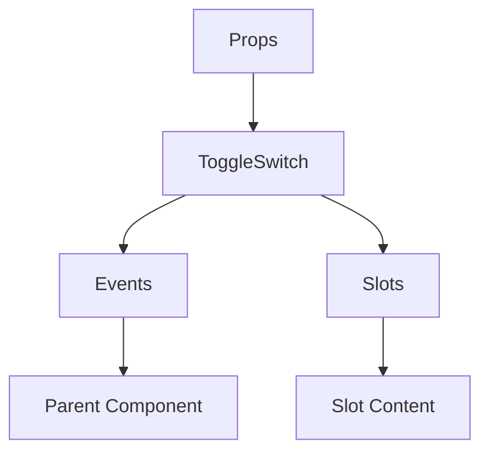

# ToggleSwitch

A Vue component.

**File:** `src/components/common/ToggleSwitch.vue`

## Overview



## Props

| Name | Type | Default | Required | Description |
|------|------|---------|----------|-------------|
| `modelValue` | `boolean` | `undefined` | ✅ | No description |
| `disabled` | `boolean` | `false` | ❌ | No description |

### Props Details

#### `modelValue`

No description available.

- **Type:** `boolean`
- **Required:** Yes
- **Default:** `undefined`


#### `disabled`

No description available.

- **Type:** `boolean`
- **Required:** No
- **Default:** `false`


## Events

| Name | Parameters | Description |
|------|------------|-------------|
| `update:modelValue` | `boolean` | No description |
| `change` | `boolean` | No description |

### Event Details

#### `update:modelValue`

No description available.

**Parameters:** `boolean`


#### `change`

No description available.

**Parameters:** `boolean`


## Slots

This component has no slots.

## Methods

This component exposes no public methods.

## Usage Example

```vue
<template>
  <ToggleSwitch
    :modelValue="true"
    @update:modelValue="handleUpdate:modelValue"
    @change="handleChange" />
</template>

<script setup lang="ts">
const handleUpdate:modelValue = (data: boolean) => {
  // Handle update:modelValue event
}

const handleChange = (data: boolean) => {
  // Handle change event
}
</script>
```


## File Location

`src/components/common/ToggleSwitch.vue`

---

*This documentation was automatically generated from the component source code.*