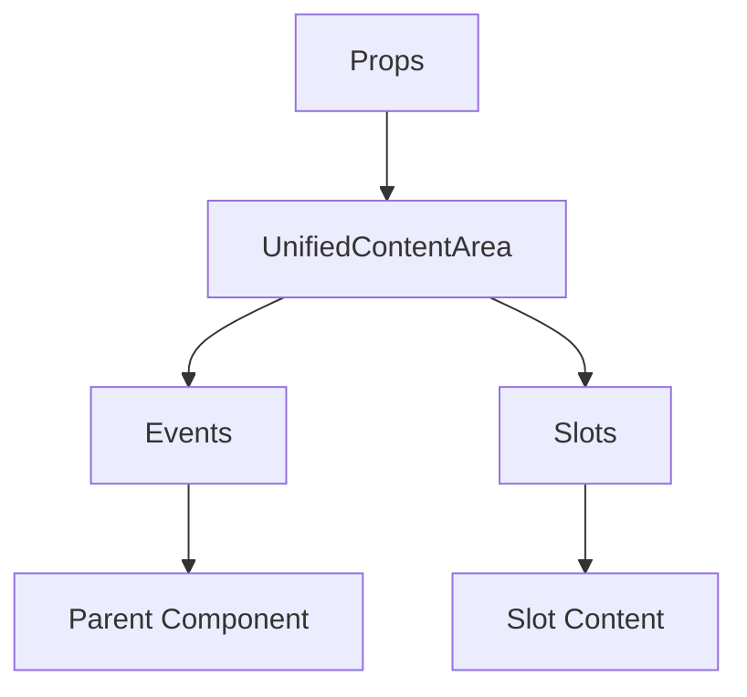

# UnifiedContentArea

A Vue component.

**File:** `src/components/common/UnifiedContentArea.vue`

## Overview



## Props

| Name | Type | Default | Required | Description |
|------|------|---------|----------|-------------|
| `mode` | `ViewMode` | `undefined` | ✅ | No description |
| `chatMessages` | `Array` | `() => []` | ❌ | No description |
| `isLoading` | `boolean` | `false` | ❌ | No description |
| `isDM` | `boolean` | `false` | ❌ | No description |
| `channelId` | `string` | `undefined` | ❌ | No description |
| `conversationId` | `string` | `undefined` | ❌ | No description |
| `channelName` | `string` | `undefined` | ❌ | No description |
| `dmUsername` | `string` | `undefined` | ❌ | No description |
| `viewType` | `ViewType` | `ViewType.TIMELINE` | ❌ | No description |
| `currentView` | `string` | `'home'` | ❌ | No description |
| `posts` | `Array` | `() => []` | ❌ | No description |
| `isLoadingFeed` | `boolean` | `false` | ❌ | No description |
| `hasMorePosts` | `boolean` | `false` | ❌ | No description |
| `profileUser` | `union` | `null` | ❌ | No description |
| `profileHandle` | `string` | `undefined` | ❌ | No description |
| `specialViewData` | `Array` | `() => []` | ❌ | No description |
| `hasMoreSpecialData` | `boolean` | `false` | ❌ | No description |
| `postId` | `string` | `undefined` | ❌ | No description |

### Props Details

#### `mode`

No description available.

- **Type:** `ViewMode`
- **Required:** Yes
- **Default:** `undefined`


#### `chatMessages`

No description available.

- **Type:** `Array`
- **Required:** No
- **Default:** `() => []`


#### `isLoading`

No description available.

- **Type:** `boolean`
- **Required:** No
- **Default:** `false`


#### `isDM`

No description available.

- **Type:** `boolean`
- **Required:** No
- **Default:** `false`


#### `channelId`

No description available.

- **Type:** `string`
- **Required:** No
- **Default:** `undefined`


#### `conversationId`

No description available.

- **Type:** `string`
- **Required:** No
- **Default:** `undefined`


#### `channelName`

No description available.

- **Type:** `string`
- **Required:** No
- **Default:** `undefined`


#### `dmUsername`

No description available.

- **Type:** `string`
- **Required:** No
- **Default:** `undefined`


#### `viewType`

No description available.

- **Type:** `ViewType`
- **Required:** No
- **Default:** `ViewType.TIMELINE`


#### `currentView`

No description available.

- **Type:** `string`
- **Required:** No
- **Default:** `'home'`


#### `posts`

No description available.

- **Type:** `Array`
- **Required:** No
- **Default:** `() => []`


#### `isLoadingFeed`

No description available.

- **Type:** `boolean`
- **Required:** No
- **Default:** `false`


#### `hasMorePosts`

No description available.

- **Type:** `boolean`
- **Required:** No
- **Default:** `false`


#### `profileUser`

No description available.

- **Type:** `union`
- **Required:** No
- **Default:** `null`


#### `profileHandle`

No description available.

- **Type:** `string`
- **Required:** No
- **Default:** `undefined`


#### `specialViewData`

No description available.

- **Type:** `Array`
- **Required:** No
- **Default:** `() => []`


#### `hasMoreSpecialData`

No description available.

- **Type:** `boolean`
- **Required:** No
- **Default:** `false`


#### `postId`

No description available.

- **Type:** `string`
- **Required:** No
- **Default:** `undefined`


## Events

| Name | Parameters | Description |
|------|------------|-------------|
| `update:is-at-bottom` | `boolean` | No description |
| `send-message` | `any` | No description |
| `show-all-threads` | `unknown` | No description |
| `clear-all-bookmarks` | `unknown` | No description |
| `load-more-special-data` | `unknown` | No description |
| `switch-feed` | `union` | No description |
| `post-created` | `TimelinePost` | No description |
| `load-more-posts` | `unknown` | No description |
| `reply-to-post` | `any` | No description |
| `favorite-post` | `string` | No description |
| `reblog-post` | `string` | No description |
| `bookmark-post` | `string` | No description |
| `delete-post` | `string` | No description |
| `show-user-profile` | `any` | No description |
| `load-more-messages` | `unknown` | No description |
| `back-to-timeline` | `unknown` | No description |

### Event Details

#### `update:is-at-bottom`

No description available.

**Parameters:** `boolean`


#### `send-message`

No description available.

**Parameters:** `any`


#### `show-all-threads`

No description available.

**Parameters:** `unknown`


#### `clear-all-bookmarks`

No description available.

**Parameters:** `unknown`


#### `load-more-special-data`

No description available.

**Parameters:** `unknown`


#### `switch-feed`

No description available.

**Parameters:** `union`


#### `post-created`

No description available.

**Parameters:** `TimelinePost`


#### `load-more-posts`

No description available.

**Parameters:** `unknown`


#### `reply-to-post`

No description available.

**Parameters:** `any`


#### `favorite-post`

No description available.

**Parameters:** `string`


#### `reblog-post`

No description available.

**Parameters:** `string`


#### `bookmark-post`

No description available.

**Parameters:** `string`


#### `delete-post`

No description available.

**Parameters:** `string`


#### `show-user-profile`

No description available.

**Parameters:** `any`


#### `load-more-messages`

No description available.

**Parameters:** `unknown`


#### `back-to-timeline`

No description available.

**Parameters:** `unknown`


## Slots

This component has no slots.

## Methods

This component exposes no public methods.

## Usage Example

```vue
<template>
  <UnifiedContentArea
    :mode="undefined"
    @update:is-at-bottom="handleUpdate:isAtBottom"
    @send-message="handleSendMessage"
    @show-all-threads="handleShowAllThreads"
    @clear-all-bookmarks="handleClearAllBookmarks"
    @load-more-special-data="handleLoadMoreSpecialData"
    @switch-feed="handleSwitchFeed"
    @post-created="handlePostCreated"
    @load-more-posts="handleLoadMorePosts"
    @reply-to-post="handleReplyToPost"
    @favorite-post="handleFavoritePost"
    @reblog-post="handleReblogPost"
    @bookmark-post="handleBookmarkPost"
    @delete-post="handleDeletePost"
    @show-user-profile="handleShowUserProfile"
    @load-more-messages="handleLoadMoreMessages"
    @back-to-timeline="handleBackToTimeline" />
</template>

<script setup lang="ts">
const handleUpdate:isAtBottom = (data: boolean) => {
  // Handle update:is-at-bottom event
}

const handleSendMessage = (data: any) => {
  // Handle send-message event
}

const handleShowAllThreads = (data: unknown) => {
  // Handle show-all-threads event
}

const handleClearAllBookmarks = (data: unknown) => {
  // Handle clear-all-bookmarks event
}

const handleLoadMoreSpecialData = (data: unknown) => {
  // Handle load-more-special-data event
}

const handleSwitchFeed = (data: union) => {
  // Handle switch-feed event
}

const handlePostCreated = (data: TimelinePost) => {
  // Handle post-created event
}

const handleLoadMorePosts = (data: unknown) => {
  // Handle load-more-posts event
}

const handleReplyToPost = (data: any) => {
  // Handle reply-to-post event
}

const handleFavoritePost = (data: string) => {
  // Handle favorite-post event
}

const handleReblogPost = (data: string) => {
  // Handle reblog-post event
}

const handleBookmarkPost = (data: string) => {
  // Handle bookmark-post event
}

const handleDeletePost = (data: string) => {
  // Handle delete-post event
}

const handleShowUserProfile = (data: any) => {
  // Handle show-user-profile event
}

const handleLoadMoreMessages = (data: unknown) => {
  // Handle load-more-messages event
}

const handleBackToTimeline = (data: unknown) => {
  // Handle back-to-timeline event
}
</script>
```


## File Location

`src/components/common/UnifiedContentArea.vue`

---

*This documentation was automatically generated from the component source code.*