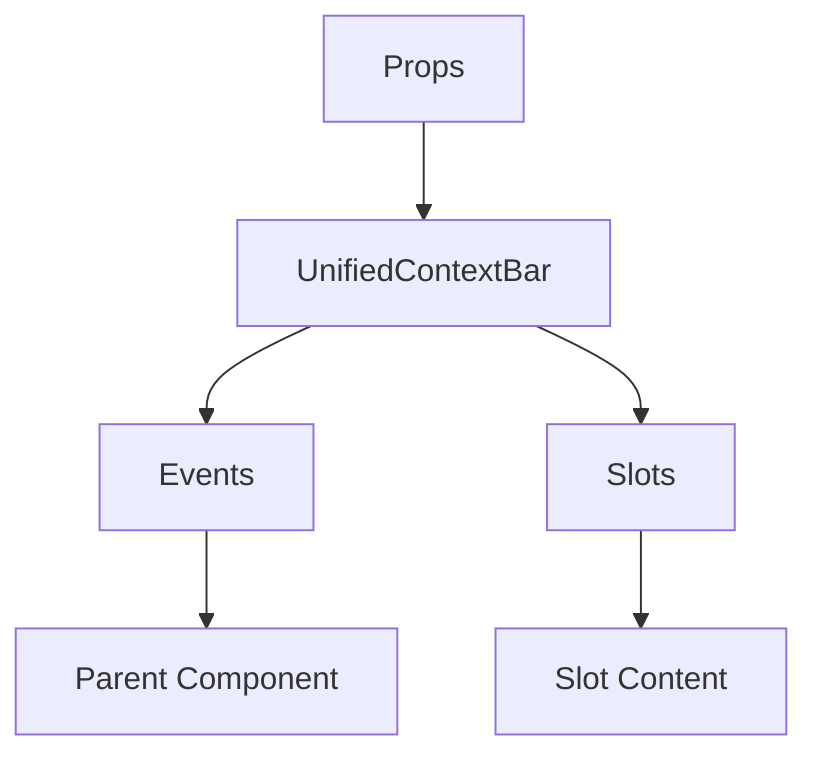

# UnifiedContextBar

A Vue component.

**File:** `src/components/common/UnifiedContextBar.vue`

## Overview



## Props

| Name | Type | Default | Required | Description |
|------|------|---------|----------|-------------|
| `mode` | `union` | `undefined` | ✅ | No description |
| `isMobile` | `boolean` | `false` | ❌ | No description |
| `leftSidebarOpen` | `boolean` | `false` | ❌ | No description |
| `rightSidebarOpen` | `boolean` | `false` | ❌ | No description |
| `voicePanelOpen` | `boolean` | `false` | ❌ | No description |
| `currentServer` | `union` | `undefined` | ❌ | No description |
| `currentChannel` | `union` | `undefined` | ❌ | No description |
| `isDM` | `boolean` | `false` | ❌ | No description |
| `currentView` | `union` | `'home'` | ❌ | No description |
| `instanceDomain` | `string` | `undefined` | ❌ | No description |

### Props Details

#### `mode`

No description available.

- **Type:** `union`
- **Required:** Yes
- **Default:** `undefined`


#### `isMobile`

No description available.

- **Type:** `boolean`
- **Required:** No
- **Default:** `false`


#### `leftSidebarOpen`

No description available.

- **Type:** `boolean`
- **Required:** No
- **Default:** `false`


#### `rightSidebarOpen`

No description available.

- **Type:** `boolean`
- **Required:** No
- **Default:** `false`


#### `voicePanelOpen`

No description available.

- **Type:** `boolean`
- **Required:** No
- **Default:** `false`


#### `currentServer`

No description available.

- **Type:** `union`
- **Required:** No
- **Default:** `undefined`


#### `currentChannel`

No description available.

- **Type:** `union`
- **Required:** No
- **Default:** `undefined`


#### `isDM`

No description available.

- **Type:** `boolean`
- **Required:** No
- **Default:** `false`


#### `currentView`

No description available.

- **Type:** `union`
- **Required:** No
- **Default:** `'home'`


#### `instanceDomain`

No description available.

- **Type:** `string`
- **Required:** No
- **Default:** `undefined`


## Events

| Name | Parameters | Description |
|------|------------|-------------|
| `toggle-left-sidebar` | `unknown` | No description |

### Event Details

#### `toggle-left-sidebar`

No description available.

**Parameters:** `unknown`


## Slots

This component has no slots.

## Methods

This component exposes no public methods.

## Usage Example

```vue
<template>
  <UnifiedContextBar
    :mode="undefined"
    @toggle-left-sidebar="handleToggleLeftSidebar" />
</template>

<script setup lang="ts">
const handleToggleLeftSidebar = (data: unknown) => {
  // Handle toggle-left-sidebar event
}
</script>
```


## File Location

`src/components/common/UnifiedContextBar.vue`

---

*This documentation was automatically generated from the component source code.*