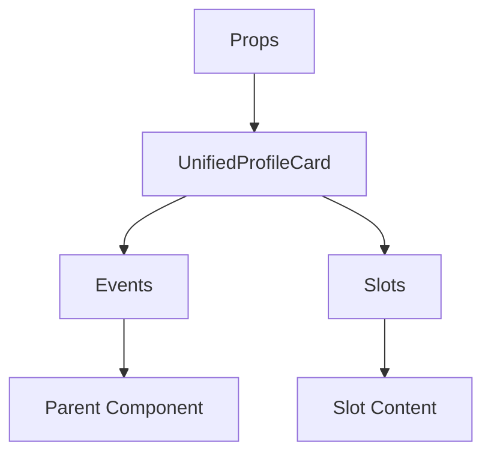

# UnifiedProfileCard

A Vue component.

**File:** `src/components/common/UnifiedProfileCard.vue`

## Overview



## Props

| Name | Type | Default | Required | Description |
|------|------|---------|----------|-------------|
| `user` | `union` | `undefined` | ✅ | No description |
| `isCompact` | `boolean` | `false` | ❌ | No description |
| `isInteractive` | `boolean` | `true` | ❌ | No description |
| `showActions` | `boolean` | `true` | ❌ | No description |
| `showFollowBtn` | `boolean` | `true` | ❌ | No description |
| `showMoreActions` | `boolean` | `true` | ❌ | No description |
| `showInstanceBadge` | `boolean` | `true` | ❌ | No description |
| `showRoles` | `boolean` | `false` | ❌ | No description |
| `hasStats` | `boolean` | `true` | ❌ | No description |
| `maxBioLength` | `number` | `120` | ❌ | No description |

### Props Details

#### `user`

No description available.

- **Type:** `union`
- **Required:** Yes
- **Default:** `undefined`


#### `isCompact`

No description available.

- **Type:** `boolean`
- **Required:** No
- **Default:** `false`


#### `isInteractive`

No description available.

- **Type:** `boolean`
- **Required:** No
- **Default:** `true`


#### `showActions`

No description available.

- **Type:** `boolean`
- **Required:** No
- **Default:** `true`


#### `showFollowBtn`

No description available.

- **Type:** `boolean`
- **Required:** No
- **Default:** `true`


#### `showMoreActions`

No description available.

- **Type:** `boolean`
- **Required:** No
- **Default:** `true`


#### `showInstanceBadge`

No description available.

- **Type:** `boolean`
- **Required:** No
- **Default:** `true`


#### `showRoles`

No description available.

- **Type:** `boolean`
- **Required:** No
- **Default:** `false`


#### `hasStats`

No description available.

- **Type:** `boolean`
- **Required:** No
- **Default:** `true`


#### `maxBioLength`

No description available.

- **Type:** `number`
- **Required:** No
- **Default:** `120`


## Events

| Name | Parameters | Description |
|------|------------|-------------|
| `click` | `union` | No description |
| `follow` | `string` | No description |
| `unfollow` | `string` | No description |
| `message` | `union` | No description |
| `mention` | `FederatedUser` | No description |
| `mute` | `string` | No description |
| `unmute` | `string` | No description |
| `block` | `string` | No description |
| `unblock` | `string` | No description |

### Event Details

#### `click`

No description available.

**Parameters:** `union`


#### `follow`

No description available.

**Parameters:** `string`


#### `unfollow`

No description available.

**Parameters:** `string`


#### `message`

No description available.

**Parameters:** `union`


#### `mention`

No description available.

**Parameters:** `FederatedUser`


#### `mute`

No description available.

**Parameters:** `string`


#### `unmute`

No description available.

**Parameters:** `string`


#### `block`

No description available.

**Parameters:** `string`


#### `unblock`

No description available.

**Parameters:** `string`


## Slots

This component has no slots.

## Methods

This component exposes no public methods.

## Usage Example

```vue
<template>
  <UnifiedProfileCard
    :user="undefined"
    @click="handleClick"
    @follow="handleFollow"
    @unfollow="handleUnfollow"
    @message="handleMessage"
    @mention="handleMention"
    @mute="handleMute"
    @unmute="handleUnmute"
    @block="handleBlock"
    @unblock="handleUnblock" />
</template>

<script setup lang="ts">
const handleClick = (data: union) => {
  // Handle click event
}

const handleFollow = (data: string) => {
  // Handle follow event
}

const handleUnfollow = (data: string) => {
  // Handle unfollow event
}

const handleMessage = (data: union) => {
  // Handle message event
}

const handleMention = (data: FederatedUser) => {
  // Handle mention event
}

const handleMute = (data: string) => {
  // Handle mute event
}

const handleUnmute = (data: string) => {
  // Handle unmute event
}

const handleBlock = (data: string) => {
  // Handle block event
}

const handleUnblock = (data: string) => {
  // Handle unblock event
}
</script>
```


## File Location

`src/components/common/UnifiedProfileCard.vue`

---

*This documentation was automatically generated from the component source code.*