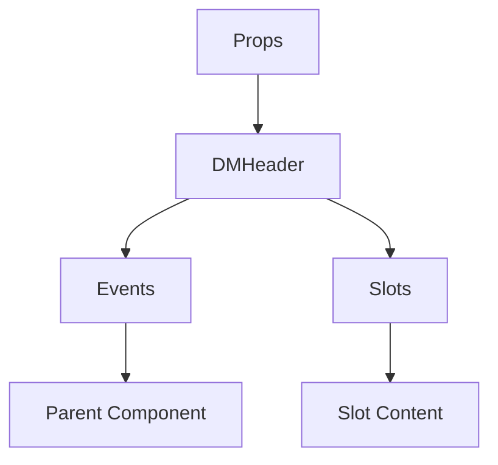

# DMHeader

A Vue component.

**File:** `src/components/dm/DMHeader.vue`

## Overview



## Props

| Name | Type | Default | Required | Description |
|------|------|---------|----------|-------------|
| `conversation` | `DMConversation` | `undefined` | ✅ | No description |
| `isMobile` | `boolean` | `undefined` | ❌ | No description |

### Props Details

#### `conversation`

No description available.

- **Type:** `DMConversation`
- **Required:** Yes
- **Default:** `undefined`


#### `isMobile`

No description available.

- **Type:** `boolean`
- **Required:** No
- **Default:** `undefined`


## Events

| Name | Parameters | Description |
|------|------------|-------------|
| `toggle-left-sidebar` | `unknown` | No description |
| `add-user` | `unknown` | No description |
| `toggle-voice-panel` | `unknown` | No description |
| `group-updated` | `unknown` | No description |
| `incoming-call` | `{ callerId: string, callType: 'voice' | 'video', conversationId: string }` | No description |

### Event Details

#### `toggle-left-sidebar`

No description available.

**Parameters:** `unknown`


#### `add-user`

No description available.

**Parameters:** `unknown`


#### `toggle-voice-panel`

No description available.

**Parameters:** `unknown`


#### `group-updated`

No description available.

**Parameters:** `unknown`


#### `incoming-call`

No description available.

**Parameters:** `{ callerId: string, callType: 'voice' | 'video', conversationId: string }`


## Slots

This component has no slots.

## Methods

This component exposes no public methods.

## Usage Example

```vue
<template>
  <DMHeader
    :conversation="undefined"
    @toggle-left-sidebar="handleToggleLeftSidebar"
    @add-user="handleAddUser"
    @toggle-voice-panel="handleToggleVoicePanel"
    @group-updated="handleGroupUpdated"
    @incoming-call="handleIncomingCall" />
</template>

<script setup lang="ts">
const handleToggleLeftSidebar = (data: unknown) => {
  // Handle toggle-left-sidebar event
}

const handleAddUser = (data: unknown) => {
  // Handle add-user event
}

const handleToggleVoicePanel = (data: unknown) => {
  // Handle toggle-voice-panel event
}

const handleGroupUpdated = (data: unknown) => {
  // Handle group-updated event
}

const handleIncomingCall = (data: { callerId: string, callType: 'voice' | 'video', conversationId: string }) => {
  // Handle incoming-call event
}
</script>
```


## File Location

`src/components/dm/DMHeader.vue`

---

*This documentation was automatically generated from the component source code.*