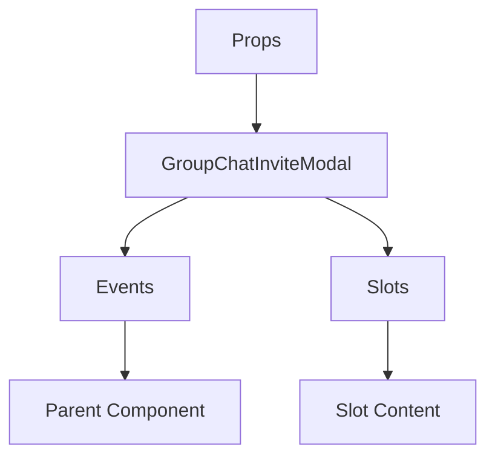

# GroupChatInviteModal

A Vue component.

**File:** `src/components/dm/GroupChatInviteModal.vue`

## Overview



## Props

| Name | Type | Default | Required | Description |
|------|------|---------|----------|-------------|
| `show` | `boolean` | `undefined` | ✅ | No description |
| `conversationId` | `string` | `undefined` | ❌ | No description |
| `existingParticipants` | `Array` | `undefined` | ❌ | No description |

### Props Details

#### `show`

No description available.

- **Type:** `boolean`
- **Required:** Yes
- **Default:** `undefined`


#### `conversationId`

No description available.

- **Type:** `string`
- **Required:** No
- **Default:** `undefined`


#### `existingParticipants`

No description available.

- **Type:** `Array`
- **Required:** No
- **Default:** `undefined`


## Events

| Name | Parameters | Description |
|------|------------|-------------|
| `close` | `unknown` | No description |
| `conversationCreated` | `string` | No description |
| `usersAdded` | `string` | No description |

### Event Details

#### `close`

No description available.

**Parameters:** `unknown`


#### `conversationCreated`

No description available.

**Parameters:** `string`


#### `usersAdded`

No description available.

**Parameters:** `string`


## Slots

This component has no slots.

## Methods

This component exposes no public methods.

## Usage Example

```vue
<template>
  <GroupChatInviteModal
    :show="true"
    @close="handleClose"
    @conversationCreated="handleConversationCreated"
    @usersAdded="handleUsersAdded" />
</template>

<script setup lang="ts">
const handleClose = (data: unknown) => {
  // Handle close event
}

const handleConversationCreated = (data: string) => {
  // Handle conversationCreated event
}

const handleUsersAdded = (data: string) => {
  // Handle usersAdded event
}
</script>
```


## File Location

`src/components/dm/GroupChatInviteModal.vue`

---

*This documentation was automatically generated from the component source code.*