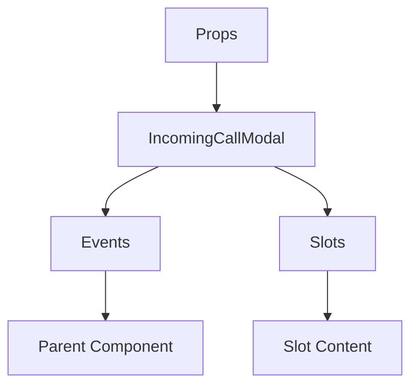

# IncomingCallModal

A Vue component.

**File:** `src/components/dm/IncomingCallModal.vue`

## Overview



## Props

| Name | Type | Default | Required | Description |
|------|------|---------|----------|-------------|
| `show` | `boolean` | `undefined` | ✅ | No description |
| `callerId` | `string` | `undefined` | ✅ | No description |
| `callerName` | `string` | `undefined` | ✅ | No description |
| `callerAvatar` | `string` | `undefined` | ✅ | No description |
| `callType` | `union` | `undefined` | ✅ | No description |
| `conversationId` | `string` | `undefined` | ✅ | No description |

### Props Details

#### `show`

No description available.

- **Type:** `boolean`
- **Required:** Yes
- **Default:** `undefined`


#### `callerId`

No description available.

- **Type:** `string`
- **Required:** Yes
- **Default:** `undefined`


#### `callerName`

No description available.

- **Type:** `string`
- **Required:** Yes
- **Default:** `undefined`


#### `callerAvatar`

No description available.

- **Type:** `string`
- **Required:** Yes
- **Default:** `undefined`


#### `callType`

No description available.

- **Type:** `union`
- **Required:** Yes
- **Default:** `undefined`


#### `conversationId`

No description available.

- **Type:** `string`
- **Required:** Yes
- **Default:** `undefined`


## Events

| Name | Parameters | Description |
|------|------------|-------------|
| `accept` | `boolean` | No description |
| `decline` | `unknown` | No description |

### Event Details

#### `accept`

No description available.

**Parameters:** `boolean`


#### `decline`

No description available.

**Parameters:** `unknown`


## Slots

This component has no slots.

## Methods

This component exposes no public methods.

## Usage Example

```vue
<template>
  <IncomingCallModal
    :show="true"
    :callerId=""example""
    :callerName=""example""
    :callerAvatar=""example""
    :callType="undefined"
    :conversationId=""example""
    @accept="handleAccept"
    @decline="handleDecline" />
</template>

<script setup lang="ts">
const handleAccept = (data: boolean) => {
  // Handle accept event
}

const handleDecline = (data: unknown) => {
  // Handle decline event
}
</script>
```


## File Location

`src/components/dm/IncomingCallModal.vue`

---

*This documentation was automatically generated from the component source code.*