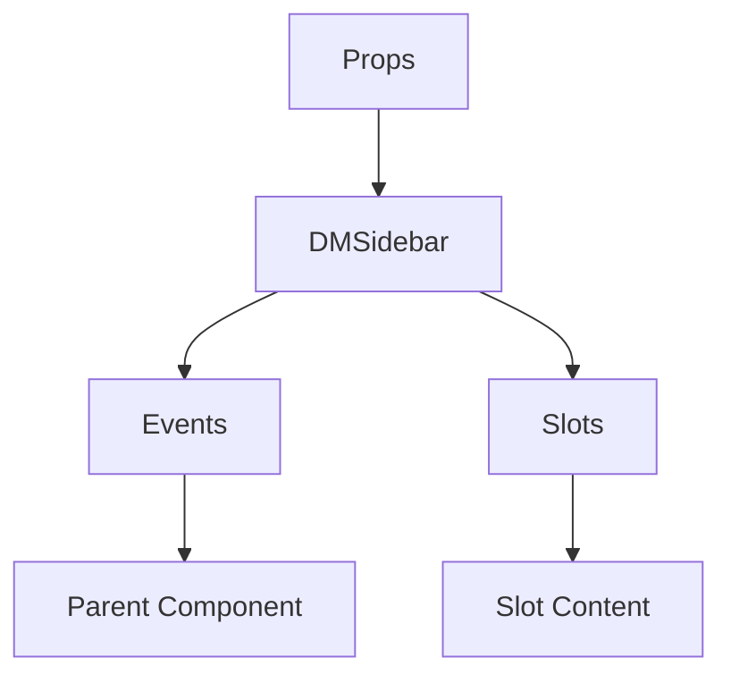

# DMSidebar

A Vue component.

**File:** `src/components/DMSidebar.vue`

## Overview



## Props

This component has no props.

## Events

| Name | Parameters | Description |
|------|------------|-------------|
| `conversationSelected` | `string` | No description |

### Event Details

#### `conversationSelected`

No description available.

**Parameters:** `string`


## Slots

This component has no slots.

## Methods

This component exposes no public methods.

## Usage Example

```vue
<template>
  <DMSidebar
    @conversationSelected="handleConversationSelected" />
</template>

<script setup lang="ts">
const handleConversationSelected = (data: string) => {
  // Handle conversationSelected event
}
</script>
```


## File Location

`src/components/DMSidebar.vue`

---

*This documentation was automatically generated from the component source code.*