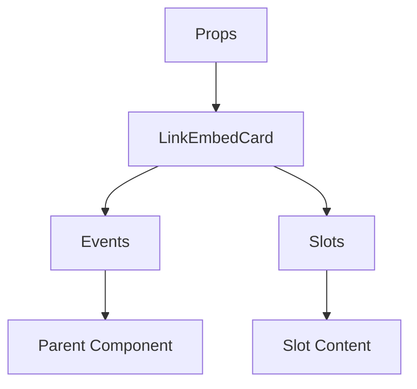

# LinkEmbedCard

A Vue component.

**File:** `src/components/embeds/LinkEmbedCard.vue`

## Overview


```mermaid
graph TB
    PROPS[Props] --> COMPONENT[LinkEmbedCard]
    COMPONENT --> EVENTS[Events]
    COMPONENT --> SLOTS[Slots]
    EVENTS --> PARENT[Parent Component]
    SLOTS --> CONTENT[Slot Content]
```

## Props

| Name | Type | Default | Required | Description |
|------|------|---------|----------|-------------|
| `payload` | `EmbedPayload` | `undefined` | ✅ | No description |

### Props Details

#### `payload`

No description available.

- **Type:** `EmbedPayload`
- **Required:** Yes
- **Default:** `undefined`


## Events

This component emits no events.

## Slots

This component has no slots.

## Methods

This component exposes no public methods.

## Usage Example

```vue
<template>
  <LinkEmbedCard
    :payload="undefined" />
</template>

<script setup lang="ts">
// No event handlers needed
</script>
```


## File Location

`src/components/embeds/LinkEmbedCard.vue`

---

*This documentation was automatically generated from the component source code.*