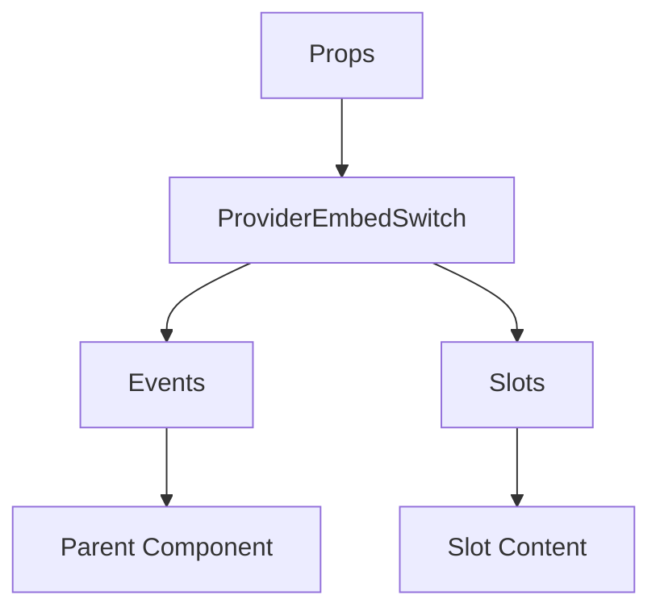

# ProviderEmbedSwitch

A Vue component.

**File:** `src/components/embeds/ProviderEmbedSwitch.vue`

## Overview



## Props

| Name | Type | Default | Required | Description |
|------|------|---------|----------|-------------|
| `payload` | `EmbedPayload` | `undefined` | ✅ | No description |
| `messageId` | `string` | `undefined` | ❌ | No description |

### Props Details

#### `payload`

No description available.

- **Type:** `EmbedPayload`
- **Required:** Yes
- **Default:** `undefined`


#### `messageId`

No description available.

- **Type:** `string`
- **Required:** No
- **Default:** `undefined`


## Events

| Name | Parameters | Description |
|------|------------|-------------|
| `embed-loaded` | `unknown` | No description |

### Event Details

#### `embed-loaded`

No description available.

**Parameters:** `unknown`


## Slots

This component has no slots.

## Methods

This component exposes no public methods.

## Usage Example

```vue
<template>
  <ProviderEmbedSwitch
    :payload="undefined"
    @embed-loaded="handleEmbedLoaded" />
</template>

<script setup lang="ts">
const handleEmbedLoaded = (data: unknown) => {
  // Handle embed-loaded event
}
</script>
```


## File Location

`src/components/embeds/ProviderEmbedSwitch.vue`

---

*This documentation was automatically generated from the component source code.*