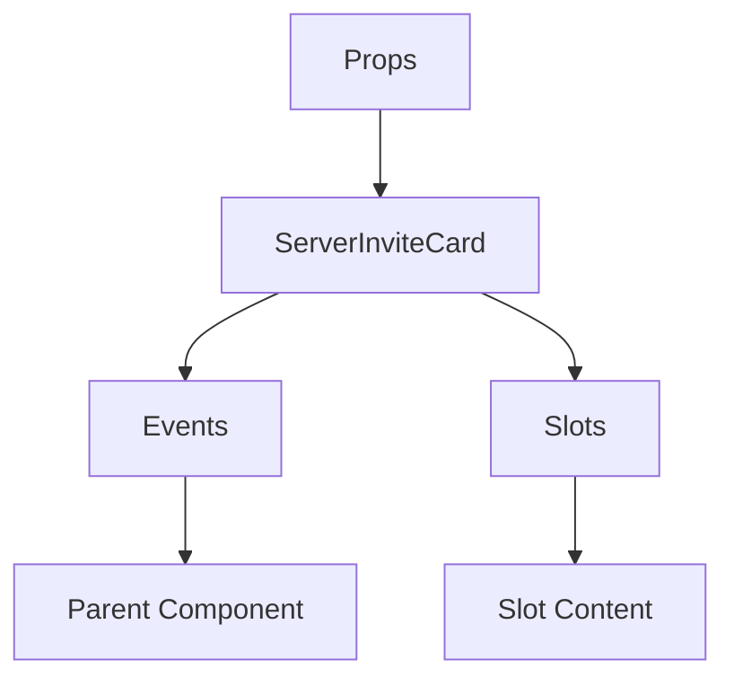

# ServerInviteCard

A Vue component.

**File:** `src/components/embeds/ServerInviteCard.vue`

## Overview



## Props

| Name | Type | Default | Required | Description |
|------|------|---------|----------|-------------|
| `inviteCode` | `string` | `undefined` | ✅ | No description |
| `inviteUrl` | `string` | `undefined` | ✅ | No description |

### Props Details

#### `inviteCode`

No description available.

- **Type:** `string`
- **Required:** Yes
- **Default:** `undefined`


#### `inviteUrl`

No description available.

- **Type:** `string`
- **Required:** Yes
- **Default:** `undefined`


## Events

| Name | Parameters | Description |
|------|------------|-------------|
| `joined` | `string` | No description |

### Event Details

#### `joined`

No description available.

**Parameters:** `string`


## Slots

This component has no slots.

## Methods

This component exposes no public methods.

## Usage Example

```vue
<template>
  <ServerInviteCard
    :inviteCode=""example""
    :inviteUrl=""example""
    @joined="handleJoined" />
</template>

<script setup lang="ts">
const handleJoined = (data: string) => {
  // Handle joined event
}
</script>
```


## File Location

`src/components/embeds/ServerInviteCard.vue`

---

*This documentation was automatically generated from the component source code.*