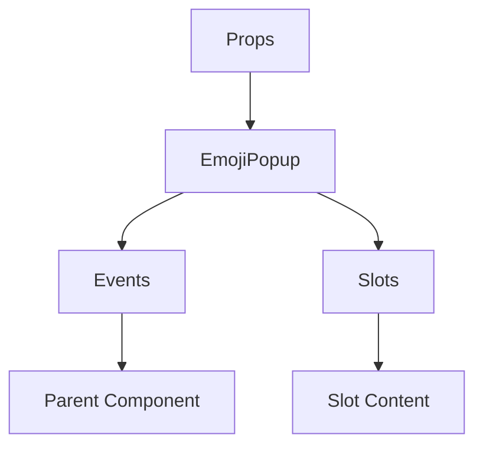

# EmojiPopup

A Vue component.

**File:** `src/components/EmojiPopup.vue`

## Overview



## Props

| Name | Type | Default | Required | Description |
|------|------|---------|----------|-------------|
| `closeEmojiList` | `TSFunctionType` | `() => {}` | ❌ | Function to call to close the popup. |
| `emojiIconClicked` | `boolean` | `false` | ❌ | Flag indicating if the popup was opened via the icon click. |
| `isReaction` | `boolean` | `false` | ❌ | Determines if the emoji is for a reaction (future use). |
| `triggerElement` | `HTMLElement` | `undefined` | ❌ | The element that triggers the popup for positioning. |
| `position` | `union` | `'above'` | ❌ | The desired position relative to the trigger element. |

### Props Details

#### `closeEmojiList`

Function to call to close the popup.

- **Type:** `TSFunctionType`
- **Required:** No
- **Default:** `() => {}`


#### `emojiIconClicked`

Flag indicating if the popup was opened via the icon click.

- **Type:** `boolean`
- **Required:** No
- **Default:** `false`


#### `isReaction`

Determines if the emoji is for a reaction (future use).

- **Type:** `boolean`
- **Required:** No
- **Default:** `false`


#### `triggerElement`

The element that triggers the popup for positioning.

- **Type:** `HTMLElement`
- **Required:** No
- **Default:** `undefined`


#### `position`

The desired position relative to the trigger element.

- **Type:** `union`
- **Required:** No
- **Default:** `'above'`


## Events

| Name | Parameters | Description |
|------|------------|-------------|
| `sendEmoji` | `Emoji` | Emits the selected emoji object. |
| `resetEmojiIconClicked` | `unknown` | Notifies the parent to reset the emojiIconClicked flag. |

### Event Details

#### `sendEmoji`

Emits the selected emoji object.

**Parameters:** `Emoji`


#### `resetEmojiIconClicked`

Notifies the parent to reset the emojiIconClicked flag.

**Parameters:** `unknown`


## Slots

This component has no slots.

## Methods

This component exposes no public methods.

## Usage Example

```vue
<template>
  <EmojiPopup
    
    @sendEmoji="handleSendEmoji"
    @resetEmojiIconClicked="handleResetEmojiIconClicked" />
</template>

<script setup lang="ts">
const handleSendEmoji = (data: Emoji) => {
  // Handle sendEmoji event
}

const handleResetEmojiIconClicked = (data: unknown) => {
  // Handle resetEmojiIconClicked event
}
</script>
```


## File Location

`src/components/EmojiPopup.vue`

---

*This documentation was automatically generated from the component source code.*