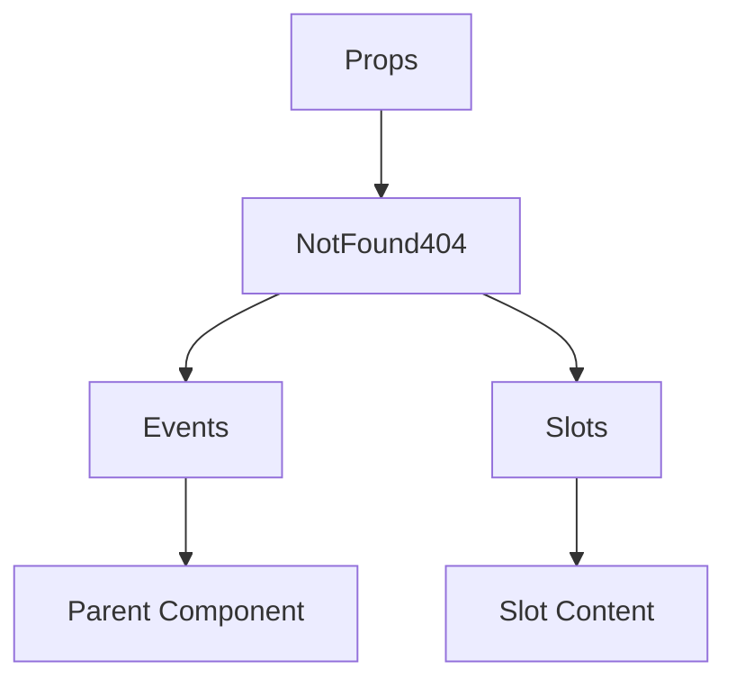

# NotFound404

A Vue component.

**File:** `src/components/error/NotFound404.vue`

## Overview



## Props

| Name | Type | Default | Required | Description |
|------|------|---------|----------|-------------|
| `title` | `string` | `''` | ❌ | Override the default title |
| `description` | `string` | `''` | ❌ | Override the default description |
| `homeButtonText` | `string` | `''` | ❌ | Override the home button text |
| `suggestedRoute` | `string` | `''` | ❌ | Override the suggested home route |

### Props Details

#### `title`

Override the default title

- **Type:** `string`
- **Required:** No
- **Default:** `''`


#### `description`

Override the default description

- **Type:** `string`
- **Required:** No
- **Default:** `''`


#### `homeButtonText`

Override the home button text

- **Type:** `string`
- **Required:** No
- **Default:** `''`


#### `suggestedRoute`

Override the suggested home route

- **Type:** `string`
- **Required:** No
- **Default:** `''`


## Events

This component emits no events.

## Slots

This component has no slots.

## Methods

This component exposes no public methods.

## Usage Example

```vue
<template>
  <NotFound404
     />
</template>

<script setup lang="ts">
// No event handlers needed
</script>
```


## File Location

`src/components/error/NotFound404.vue`

---

*This documentation was automatically generated from the component source code.*