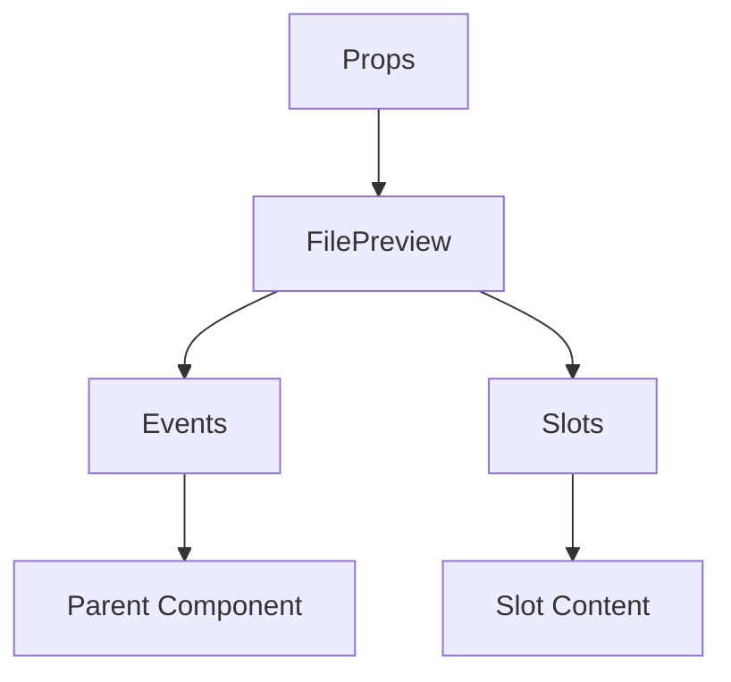

# FilePreview

A Vue component.

**File:** `src/components/FilePreview.vue`

## Overview



## Props

| Name | Type | Default | Required | Description |
|------|------|---------|----------|-------------|
| `files` | `Array` | `undefined` | ✅ | No description |

### Props Details

#### `files`

No description available.

- **Type:** `Array`
- **Required:** Yes
- **Default:** `undefined`


## Events

| Name | Parameters | Description |
|------|------------|-------------|
| `remove-file` | `number` | No description |

### Event Details

#### `remove-file`

No description available.

**Parameters:** `number`


## Slots

This component has no slots.

## Methods

This component exposes no public methods.

## Usage Example

```vue
<template>
  <FilePreview
    :files="[]"
    @remove-file="handleRemoveFile" />
</template>

<script setup lang="ts">
const handleRemoveFile = (data: number) => {
  // Handle remove-file event
}
</script>
```


## File Location

`src/components/FilePreview.vue`

---

*This documentation was automatically generated from the component source code.*