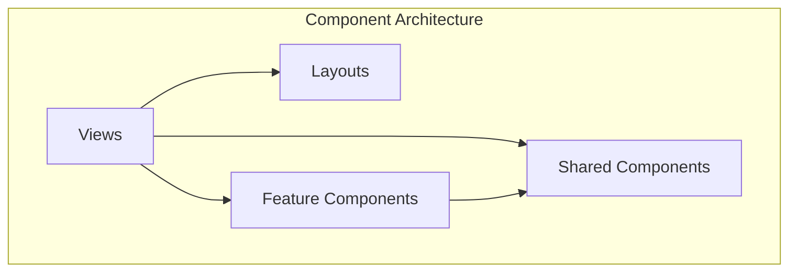

# Component Library

This documentation is automatically generated from the Vue component source code.

**Total Components:** 215

## Overview

## Components by Category

### Activitypub

- [Composer](./activitypub/composer.md) - 7 props, 2 events
- [EmojiPicker](./activitypub/emojipicker.md) - 1 props, 2 events
- [ExploreContent](./activitypub/explorecontent.md) - 1 props, 11 events
- [InstanceDetailModal](./activitypub/instancedetailmodal.md) - 1 props, 2 events
- [MonyContent](./activitypub/monycontent.md) - 3 props, 3 events
- [MonyFeed](./activitypub/monyfeed.md)
- [MonyHeader](./activitypub/monyheader.md) - 3 props, 6 events
- [MonyMediaGallery](./activitypub/monymediagallery.md) - 2 props
- [MonyMediaUpload](./activitypub/monymediaupload.md) - 1 props, 2 events
- [MonyPost](./activitypub/monypost.md) - 3 props, 9 events
- [PostReactions](./activitypub/postreactions.md) - 2 props, 2 events
- [ThreadedPost](./activitypub/threadedpost.md) - 6 props, 9 events
- [UserCard](./activitypub/usercard.md) - 6 props, 9 events
- [UserSearchModal](./activitypub/usersearchmodal.md) - 2 events

### Admin

- [BotManagement](./admin/botmanagement.md)
- [EmojiImporter](./admin/emojiimporter.md)
- [PerformanceMonitoring](./admin/performancemonitoring.md)

### Chat

- [ChatHeader](./chat/chatheader.md) - 4 props, 5 events

### Common

- [AdaptiveChannelSidebar](./common/adaptivechannelsidebar.md) - 12 props, 6 events
- [Avatar](./common/avatar.md) - 8 props, 3 events
- [BaseModal](./common/basemodal.md) - 8 props, 1 events, 2 slots
- [CodeBlock](./common/codeblock.md) - 2 props
- [ColorPicker](./common/colorpicker.md) - 1 props, 2 events
- [GroupIcon](./common/groupicon.md) - 8 props, 3 events
- [Icon](./common/icon.md) - 2 props
- [ModernButton](./common/modernbutton.md) - 11 props, 1 events, 1 slots
- [ModernInput](./common/moderninput.md) - 13 props, 5 events
- [PostDetailDisplay](./common/postdetaildisplay.md) - 1 props, 7 events
- [PostsContainer](./common/postscontainer.md) - 9 props, 10 events
- [ProfileCard](./common/profilecard.md) - 9 props, 9 events
- [SearchInput](./common/searchinput.md) - 5 props, 3 events
- [ServerCard](./common/servercard.md) - 3 props, 3 events
- [ServerCardSkeleton](./common/servercardskeleton.md) - 1 props
- [ServerIcon](./common/servericon.md) - 11 props, 3 events
- [ToggleSwitch](./common/toggleswitch.md) - 2 props, 2 events
- [UnifiedContentArea](./common/unifiedcontentarea.md) - 18 props, 16 events
- [UnifiedContextBar](./common/unifiedcontextbar.md) - 10 props, 1 events
- [UnifiedProfileCard](./common/unifiedprofilecard.md) - 10 props, 9 events
- [ViewHeader](./common/viewheader.md) - 2 props, 1 events

### Debug

- [UserDataDebugPanel](./debug/userdatadebugpanel.md)

### Demo

- [AudioThemeShowcase](./demo/audiothemeshowcase.md)
- [RichTextDemo](./demo/richtextdemo.md)

### Dm

- [DMHeader](./dm/dmheader.md) - 2 props, 5 events
- [FollowersList](./dm/followerslist.md) - 1 events
- [GroupChatInviteModal](./dm/groupchatinvitemodal.md) - 3 props, 3 events
- [GroupSettingsModal](./dm/groupsettingsmodal.md) - 4 props, 2 events
- [IncomingCallModal](./dm/incomingcallmodal.md) - 6 props, 2 events

### Easteregg

- [ConfettiEffect](./easteregg/confettieffect.md) - 2 props

### Embeds

- [LinkEmbedCard](./embeds/linkembedcard.md) - 1 props, 1 events
- [ProviderEmbedSwitch](./embeds/providerembedswitch.md) - 2 props, 1 events
- [ServerInviteCard](./embeds/serverinvitecard.md) - 2 props, 1 events

### Encryption

- [EncryptionIndicator](./encryption/encryptionindicator.md) - 4 props
- [EncryptionSettings](./encryption/encryptionsettings.md)
- [KeyRecoveryModal](./encryption/keyrecoverymodal.md) - 2 events
- [KeySetupWizard](./encryption/keysetupwizard.md) - 2 events
- [RecoveryKeySetupWizard](./encryption/recoverykeysetupwizard.md) - 2 events

### Error

- [NotFound404](./error/notfound404.md) - 4 props
- [ServerNotFound](./error/servernotfound.md)

### Icons

- [AcceptIcon](./icons/accepticon.md) - 2 props
- [ArrowDown](./icons/arrowdown.md)
- [Bell](./icons/bell.md)
- [Camera](./icons/camera.md)
- [ChatBubble](./icons/chatbubble.md)
- [Check](./icons/check.md)
- [ChevronDown](./icons/chevrondown.md)
- [Close](./icons/close.md)
- [Cog](./icons/cog.md)
- [Copy](./icons/copy.md)
- [DeclineIcon](./icons/declineicon.md) - 2 props
- [Delete](./icons/delete.md)
- [DismissIcon](./icons/dismissicon.md) - 2 props
- [DMIcon](./icons/dmicon.md) - 2 props
- [Edit](./icons/edit.md)
- [EmojiIcon](./icons/emojiicon.md) - 2 props
- [Eye](./icons/eye.md)
- [EyeOff](./icons/eyeoff.md)
- [Gif](./icons/gif.md)
- [Globe](./icons/globe.md)
- [HashTag](./icons/hashtag.md)
- [Headphones](./icons/headphones.md) - 1 props
- [JumpIcon](./icons/jumpicon.md) - 2 props
- [Keyboard](./icons/keyboard.md)
- [Lock](./icons/lock.md)
- [Logout](./icons/logout.md)
- [MarkReadIcon](./icons/markreadicon.md) - 2 props
- [MentionIcon](./icons/mentionicon.md) - 2 props
- [Mic](./icons/mic.md)
- [MicMuted](./icons/micmuted.md)
- [More](./icons/more.md)
- [Palette](./icons/palette.md)
- [Plus](./icons/plus.md)
- [Reaction](./icons/reaction.md)
- [ReactionIcon](./icons/reactionicon.md) - 2 props
- [Reply](./icons/reply.md)
- [Robot](./icons/robot.md)
- [ServerInviteIcon](./icons/serverinviteicon.md) - 2 props
- [Settings](./icons/settings.md)
- [Shield](./icons/shield.md)
- [Speaker](./icons/speaker.md)
- [Thread](./icons/thread.md)
- [Trash](./icons/trash.md)
- [UnreadIcon](./icons/unreadicon.md) - 2 props
- [User](./icons/user.md)
- [VoiceIcon](./icons/voiceicon.md) - 2 props

### Publicservers

- [PublicServersContent](./publicservers/publicserverscontent.md) - 9 props, 4 events
- [PublicServersFooter](./publicservers/publicserversfooter.md) - 2 events
- [PublicServersHeader](./publicservers/publicserversheader.md) - 1 events
- [PublicServersSearch](./publicservers/publicserverssearch.md) - 6 props, 2 events

### Root

- [AuthComponent](./authcomponent.md) - 1 props
- [AutoSuggest](./autosuggest.md) - 6 props, 2 events, 1 slots
- [CategoryContextMenu](./categorycontextmenu.md) - 3 props, 4 events
- [CategoryCreator](./categorycreator.md) - 2 events
- [CategoryEditModal](./categoryeditmodal.md) - 2 props, 2 events
- [ChannelContextMenu](./channelcontextmenu.md) - 3 props, 4 events
- [ChannelEditModal](./channeleditmodal.md) - 2 props, 2 events
- [ChannelSidebar](./channelsidebar.md) - 5 props, 2 events
- [ChatComponent](./chatcomponent.md) - 8 props, 3 events
- [ConfirmationModal](./confirmationmodal.md) - 7 props, 3 events
- [CreateChannel](./createchannel.md) - 3 props, 2 events
- [CreateServer](./createserver.md) - 1 events
- [DMSidebar](./dmsidebar.md) - 1 events
- [EmojiPickerContent](./emojipickercontent.md) - 1 events
- [EmojiPopup](./emojipopup.md) - 5 props, 2 events
- [EmojiUI](./emojiui.md)
- [FilePreview](./filepreview.md) - 1 props, 1 events
- [FileUploadMenu](./fileuploadmenu.md) - 1 props, 2 events
- [GifComponent](./gifcomponent.md) - 5 props, 3 events
- [GifPickerContent](./gifpickercontent.md) - 1 props, 2 events
- [InviteAccept](./inviteaccept.md)
- [InviteModal](./invitemodal.md) - 3 props, 1 events
- [JoinFederatedServer](./joinfederatedserver.md) - 2 events
- [LazyEmojiSection](./lazyemojisection.md) - 2 props, 2 slots
- [MainContentAreaHeader](./maincontentareaheader.md) - 5 props, 1 events
- [MainNavigation](./mainnavigation.md) - 2 props, 2 events
- [MarkdownContent](./markdowncontent.md) - 4 props
- [MediaPickerPopup](./mediapickerpopup.md) - 4 props, 2 events
- [MessageContent](./messagecontent.md) - 10 props, 6 events
- [MessageContextMenu](./messagecontextmenu.md) - 5 props, 4 events
- [MessageDisplay](./messagedisplay.md) - 8 props, 8 events
- [MessageInput](./messageinput.md) - 10 props, 7 events
- [MessageReactions](./messagereactions.md) - 2 props, 4 events
- [MessageReply](./messagereply.md) - 2 props, 1 events
- [NoServersSplash](./noserverssplash.md) - 1 events
- [NotificationBell](./notificationbell.md)
- [NotificationItem](./notificationitem.md) - 1 props, 3 events
- [NotificationToast](./notificationtoast.md)
- [PersistentVoiceConnection](./persistentvoiceconnection.md)
- [PinnedMessagesPopup](./pinnedmessagespopup.md) - 3 props, 2 events
- [PublicServers](./publicservers.md) - 1 props, 1 events
- [PushNotificationPrompt](./pushnotificationprompt.md)
- [PWAInstallBanner](./pwainstallbanner.md)
- [PWAInstallPrompt](./pwainstallprompt.md) - 2 props
- [PWAUpdateNotification](./pwaupdatenotification.md)
- [RichTextEditor](./richtexteditor.md) - 4 props, 7 events
- [ServerDropdown](./serverdropdown.md) - 2 props, 5 events
- [ServerFolder](./serverfolder.md) - 3 props, 7 events
- [ServerFolderContextMenu](./serverfoldercontextmenu.md) - 4 props, 5 events
- [ServerFolderSettingsModal](./serverfoldersettingsmodal.md) - 2 props, 2 events
- [ServerSidebar](./serversidebar.md) - 1 props, 3 events
- [SidebarComponent](./sidebarcomponent.md)
- [SpaceTimeGrid](./spacetimegrid.md) - 3 props
- [StatusPicker](./statuspicker.md) - 2 props, 2 events
- [ThreadEditModal](./threadeditmodal.md) - 2 props, 2 events
- [TypingIndicator](./typingindicator.md) - 1 props
- [UnifiedContentRenderer](./unifiedcontentrenderer.md) - 11 props, 5 events
- [UnifiedMessageContent](./unifiedmessagecontent.md) - 11 props, 9 events
- [UserPreviewComponent](./userpreviewcomponent.md) - 2 props
- [UserProfileComponent](./userprofilecomponent.md) - 1 props
- [UserProfileModal](./userprofilemodal.md) - 2 props, 5 events
- [UserSidebar](./usersidebar.md) - 1 props

### Search

- [MessageSearchModal](./search/messagesearchmodal.md) - 5 props, 2 events

### Settings

- [AdvancedSettings](./settings/user/advancedsettings.md) - 1 props, 1 events
- [AppearanceSettings](./settings/user/appearancesettings.md) - 2 props, 1 events
- [AudioThemeManager](./settings/audiothememanager.md) - 7 props, 3 events
- [AudioThemePicker](./settings/audiothemepicker.md) - 3 props
- [AudioThemeSettings](./settings/user/audiothemesettings.md)
- [ContentFilterSettings](./settings/contentfiltersettings.md)
- [InviteManagement](./settings/server/invitemanagement.md) - 1 props, 1 events
- [InviteSettings](./settings/server/invitesettings.md) - 1 props
- [KeybindSettings](./settings/user/keybindsettings.md) - 1 props, 1 events
- [LanguageSettings](./settings/user/languagesettings.md) - 1 props, 1 events
- [NotificationSettings](./settings/user/notificationsettings.md)
- [PrivacySettings](./settings/user/privacysettings.md) - 2 props, 1 events
- [RoleManagement](./settings/rolemanagement.md) - 1 props
- [ServerAdvancedSettings](./settings/serveradvancedsettings.md) - 5 props
- [ServerBasicInfo](./settings/serverbasicinfo.md) - 5 props, 3 events
- [ServerBotsSettings](./settings/serverbotssettings.md) - 1 props
- [ServerEmojiManagement](./settings/serveremojimanagement.md) - 6 props, 4 events
- [ServerEncryptionSettings](./settings/serverencryptionsettings.md) - 1 props
- [ServerPrivacySettings](./settings/serverprivacysettings.md) - 4 props, 2 events
- [UserAccountSettings](./settings/user/useraccountsettings.md) - 2 props, 3 events
- [UserBotsManagement](./settings/user/userbotsmanagement.md) - 1 props
- [VoiceSettingsInline](./settings/user/voicesettingsinline.md) - 1 props, 1 events
- [VoiceVideoSettings](./settings/user/voicevideosettings.md) - 1 props, 1 events

### Shared

- [UnifiedButton](./shared/unifiedbutton.md) - 19 props, 1 events, 1 slots
- [UnifiedConfirmationModal](./shared/unifiedconfirmationmodal.md) - 9 props, 3 events
- [UnifiedInput](./shared/unifiedinput.md) - 27 props, 9 events, 2 slots
- [UnifiedModal](./shared/unifiedmodal.md) - 16 props, 4 events, 5 slots

### Threads

- [AllThreadsModal](./threads/allthreadsmodal.md) - 3 props, 2 events
- [ThreadContextMenu](./threads/threadcontextmenu.md) - 4 props, 9 events
- [ThreadIndicator](./threads/threadindicator.md) - 1 props, 1 events
- [ThreadSidebar](./threads/threadsidebar.md) - 2 props, 1 events
- [ThreadView](./threads/threadview.md) - 5 props, 3 events

### Voice

- [DeviceSelector](./voice/deviceselector.md) - 1 props, 1 events
- [MobileVoiceChannelPreview](./voice/mobilevoicechannelpreview.md) - 4 props, 3 events
- [RecentSpeakers](./voice/recentspeakers.md) - 1 props
- [ScreensharePIP](./voice/screensharepip.md)
- [SpatialAudioPanel](./voice/spatialaudiopanel.md) - 2 props
- [UnifiedVoiceDock](./voice/unifiedvoicedock.md)
- [UnifiedVoiceOverlay](./voice/unifiedvoiceoverlay.md) - 1 props, 2 events
- [UnifiedVoiceUserCard](./voice/unifiedvoiceusercard.md) - 1 props, 2 events
- [VoiceChannelParticipants](./voice/voicechannelparticipants.md) - 2 props
- [VoiceChannelUserList](./voice/voicechanneluserlist.md) - 2 props
- [VoiceSettingsPanel](./voice/voicesettingspanel.md) - 2 events
- [VoiceUserContextMenu](./voice/voiceusercontextmenu.md) - 4 props, 1 events

## All Components

| Component | Props | Events | Slots | Path |
|-----------|-------|--------|-------|------|
| [AcceptIcon](./icons/accepticon.md) | 2 | 0 | 0 | `icons/AcceptIcon.vue` |
| [AdaptiveChannelSidebar](./common/adaptivechannelsidebar.md) | 12 | 6 | 0 | `common/AdaptiveChannelSidebar.vue` |
| [AdvancedSettings](./settings/user/advancedsettings.md) | 1 | 1 | 0 | `settings/user/AdvancedSettings.vue` |
| [AllThreadsModal](./threads/allthreadsmodal.md) | 3 | 2 | 0 | `threads/AllThreadsModal.vue` |
| [AppearanceSettings](./settings/user/appearancesettings.md) | 2 | 1 | 0 | `settings/user/AppearanceSettings.vue` |
| [ArrowDown](./icons/arrowdown.md) | 0 | 0 | 0 | `icons/ArrowDown.vue` |
| [AudioThemeManager](./settings/audiothememanager.md) | 7 | 3 | 0 | `settings/AudioThemeManager.vue` |
| [AudioThemePicker](./settings/audiothemepicker.md) | 3 | 0 | 0 | `settings/AudioThemePicker.vue` |
| [AudioThemeSettings](./settings/user/audiothemesettings.md) | 0 | 0 | 0 | `settings/user/AudioThemeSettings.vue` |
| [AudioThemeShowcase](./demo/audiothemeshowcase.md) | 0 | 0 | 0 | `demo/AudioThemeShowcase.vue` |
| [AuthComponent](./authcomponent.md) | 1 | 0 | 0 | `AuthComponent.vue` |
| [AutoSuggest](./autosuggest.md) | 6 | 2 | 1 | `AutoSuggest.vue` |
| [Avatar](./common/avatar.md) | 8 | 3 | 0 | `common/Avatar.vue` |
| [BaseModal](./common/basemodal.md) | 8 | 1 | 2 | `common/BaseModal.vue` |
| [Bell](./icons/bell.md) | 0 | 0 | 0 | `icons/Bell.vue` |
| [BotManagement](./admin/botmanagement.md) | 0 | 0 | 0 | `admin/BotManagement.vue` |
| [Camera](./icons/camera.md) | 0 | 0 | 0 | `icons/Camera.vue` |
| [CategoryContextMenu](./categorycontextmenu.md) | 3 | 4 | 0 | `CategoryContextMenu.vue` |
| [CategoryCreator](./categorycreator.md) | 0 | 2 | 0 | `CategoryCreator.vue` |
| [CategoryEditModal](./categoryeditmodal.md) | 2 | 2 | 0 | `CategoryEditModal.vue` |
| [ChannelContextMenu](./channelcontextmenu.md) | 3 | 4 | 0 | `ChannelContextMenu.vue` |
| [ChannelEditModal](./channeleditmodal.md) | 2 | 2 | 0 | `ChannelEditModal.vue` |
| [ChannelSidebar](./channelsidebar.md) | 5 | 2 | 0 | `ChannelSidebar.vue` |
| [ChatBubble](./icons/chatbubble.md) | 0 | 0 | 0 | `icons/ChatBubble.vue` |
| [ChatComponent](./chatcomponent.md) | 8 | 3 | 0 | `ChatComponent.vue` |
| [ChatHeader](./chat/chatheader.md) | 4 | 5 | 0 | `chat/ChatHeader.vue` |
| [Check](./icons/check.md) | 0 | 0 | 0 | `icons/Check.vue` |
| [ChevronDown](./icons/chevrondown.md) | 0 | 0 | 0 | `icons/ChevronDown.vue` |
| [Close](./icons/close.md) | 0 | 0 | 0 | `icons/Close.vue` |
| [CodeBlock](./common/codeblock.md) | 2 | 0 | 0 | `common/CodeBlock.vue` |
| [Cog](./icons/cog.md) | 0 | 0 | 0 | `icons/Cog.vue` |
| [ColorPicker](./common/colorpicker.md) | 1 | 2 | 0 | `common/ColorPicker.vue` |
| [Composer](./activitypub/composer.md) | 7 | 2 | 0 | `activitypub/Composer.vue` |
| [ConfettiEffect](./easteregg/confettieffect.md) | 2 | 0 | 0 | `easteregg/ConfettiEffect.vue` |
| [ConfirmationModal](./confirmationmodal.md) | 7 | 3 | 0 | `ConfirmationModal.vue` |
| [ContentFilterSettings](./settings/contentfiltersettings.md) | 0 | 0 | 0 | `settings/ContentFilterSettings.vue` |
| [Copy](./icons/copy.md) | 0 | 0 | 0 | `icons/Copy.vue` |
| [CreateChannel](./createchannel.md) | 3 | 2 | 0 | `CreateChannel.vue` |
| [CreateServer](./createserver.md) | 0 | 1 | 0 | `CreateServer.vue` |
| [DeclineIcon](./icons/declineicon.md) | 2 | 0 | 0 | `icons/DeclineIcon.vue` |
| [Delete](./icons/delete.md) | 0 | 0 | 0 | `icons/Delete.vue` |
| [DeviceSelector](./voice/deviceselector.md) | 1 | 1 | 0 | `voice/DeviceSelector.vue` |
| [DismissIcon](./icons/dismissicon.md) | 2 | 0 | 0 | `icons/DismissIcon.vue` |
| [DMHeader](./dm/dmheader.md) | 2 | 5 | 0 | `dm/DMHeader.vue` |
| [DMIcon](./icons/dmicon.md) | 2 | 0 | 0 | `icons/DMIcon.vue` |
| [DMSidebar](./dmsidebar.md) | 0 | 1 | 0 | `DMSidebar.vue` |
| [Edit](./icons/edit.md) | 0 | 0 | 0 | `icons/Edit.vue` |
| [EmojiIcon](./icons/emojiicon.md) | 2 | 0 | 0 | `icons/EmojiIcon.vue` |
| [EmojiImporter](./admin/emojiimporter.md) | 0 | 0 | 0 | `admin/EmojiImporter.vue` |
| [EmojiPicker](./activitypub/emojipicker.md) | 1 | 2 | 0 | `activitypub/EmojiPicker.vue` |
| [EmojiPickerContent](./emojipickercontent.md) | 0 | 1 | 0 | `EmojiPickerContent.vue` |
| [EmojiPopup](./emojipopup.md) | 5 | 2 | 0 | `EmojiPopup.vue` |
| [EmojiUI](./emojiui.md) | 0 | 0 | 0 | `EmojiUI.vue` |
| [EncryptionIndicator](./encryption/encryptionindicator.md) | 4 | 0 | 0 | `encryption/EncryptionIndicator.vue` |
| [EncryptionSettings](./encryption/encryptionsettings.md) | 0 | 0 | 0 | `encryption/EncryptionSettings.vue` |
| [ExploreContent](./activitypub/explorecontent.md) | 1 | 11 | 0 | `activitypub/ExploreContent.vue` |
| [Eye](./icons/eye.md) | 0 | 0 | 0 | `icons/Eye.vue` |
| [EyeOff](./icons/eyeoff.md) | 0 | 0 | 0 | `icons/EyeOff.vue` |
| [FilePreview](./filepreview.md) | 1 | 1 | 0 | `FilePreview.vue` |
| [FileUploadMenu](./fileuploadmenu.md) | 1 | 2 | 0 | `FileUploadMenu.vue` |
| [FollowersList](./dm/followerslist.md) | 0 | 1 | 0 | `dm/FollowersList.vue` |
| [Gif](./icons/gif.md) | 0 | 0 | 0 | `icons/Gif.vue` |
| [GifComponent](./gifcomponent.md) | 5 | 3 | 0 | `GifComponent.vue` |
| [GifPickerContent](./gifpickercontent.md) | 1 | 2 | 0 | `GifPickerContent.vue` |
| [Globe](./icons/globe.md) | 0 | 0 | 0 | `icons/Globe.vue` |
| [GroupChatInviteModal](./dm/groupchatinvitemodal.md) | 3 | 3 | 0 | `dm/GroupChatInviteModal.vue` |
| [GroupIcon](./common/groupicon.md) | 8 | 3 | 0 | `common/GroupIcon.vue` |
| [GroupSettingsModal](./dm/groupsettingsmodal.md) | 4 | 2 | 0 | `dm/GroupSettingsModal.vue` |
| [HashTag](./icons/hashtag.md) | 0 | 0 | 0 | `icons/HashTag.vue` |
| [Headphones](./icons/headphones.md) | 1 | 0 | 0 | `icons/Headphones.vue` |
| [Icon](./common/icon.md) | 2 | 0 | 0 | `common/Icon.vue` |
| [IncomingCallModal](./dm/incomingcallmodal.md) | 6 | 2 | 0 | `dm/IncomingCallModal.vue` |
| [InstanceDetailModal](./activitypub/instancedetailmodal.md) | 1 | 2 | 0 | `activitypub/InstanceDetailModal.vue` |
| [InviteAccept](./inviteaccept.md) | 0 | 0 | 0 | `InviteAccept.vue` |
| [InviteManagement](./settings/server/invitemanagement.md) | 1 | 1 | 0 | `settings/server/InviteManagement.vue` |
| [InviteModal](./invitemodal.md) | 3 | 1 | 0 | `InviteModal.vue` |
| [InviteSettings](./settings/server/invitesettings.md) | 1 | 0 | 0 | `settings/server/InviteSettings.vue` |
| [JoinFederatedServer](./joinfederatedserver.md) | 0 | 2 | 0 | `JoinFederatedServer.vue` |
| [JumpIcon](./icons/jumpicon.md) | 2 | 0 | 0 | `icons/JumpIcon.vue` |
| [KeybindSettings](./settings/user/keybindsettings.md) | 1 | 1 | 0 | `settings/user/KeybindSettings.vue` |
| [Keyboard](./icons/keyboard.md) | 0 | 0 | 0 | `icons/Keyboard.vue` |
| [KeyRecoveryModal](./encryption/keyrecoverymodal.md) | 0 | 2 | 0 | `encryption/KeyRecoveryModal.vue` |
| [KeySetupWizard](./encryption/keysetupwizard.md) | 0 | 2 | 0 | `encryption/KeySetupWizard.vue` |
| [LanguageSettings](./settings/user/languagesettings.md) | 1 | 1 | 0 | `settings/user/LanguageSettings.vue` |
| [LazyEmojiSection](./lazyemojisection.md) | 2 | 0 | 2 | `LazyEmojiSection.vue` |
| [LinkEmbedCard](./embeds/linkembedcard.md) | 1 | 1 | 0 | `embeds/LinkEmbedCard.vue` |
| [Lock](./icons/lock.md) | 0 | 0 | 0 | `icons/Lock.vue` |
| [Logout](./icons/logout.md) | 0 | 0 | 0 | `icons/Logout.vue` |
| [MainContentAreaHeader](./maincontentareaheader.md) | 5 | 1 | 0 | `MainContentAreaHeader.vue` |
| [MainNavigation](./mainnavigation.md) | 2 | 2 | 0 | `MainNavigation.vue` |
| [MarkdownContent](./markdowncontent.md) | 4 | 0 | 0 | `MarkdownContent.vue` |
| [MarkReadIcon](./icons/markreadicon.md) | 2 | 0 | 0 | `icons/MarkReadIcon.vue` |
| [MediaPickerPopup](./mediapickerpopup.md) | 4 | 2 | 0 | `MediaPickerPopup.vue` |
| [MentionIcon](./icons/mentionicon.md) | 2 | 0 | 0 | `icons/MentionIcon.vue` |
| [MessageContent](./messagecontent.md) | 10 | 6 | 0 | `MessageContent.vue` |
| [MessageContextMenu](./messagecontextmenu.md) | 5 | 4 | 0 | `MessageContextMenu.vue` |
| [MessageDisplay](./messagedisplay.md) | 8 | 8 | 0 | `MessageDisplay.vue` |
| [MessageInput](./messageinput.md) | 10 | 7 | 0 | `MessageInput.vue` |
| [MessageReactions](./messagereactions.md) | 2 | 4 | 0 | `MessageReactions.vue` |
| [MessageReply](./messagereply.md) | 2 | 1 | 0 | `MessageReply.vue` |
| [MessageSearchModal](./search/messagesearchmodal.md) | 5 | 2 | 0 | `search/MessageSearchModal.vue` |
| [Mic](./icons/mic.md) | 0 | 0 | 0 | `icons/Mic.vue` |
| [MicMuted](./icons/micmuted.md) | 0 | 0 | 0 | `icons/MicMuted.vue` |
| [MobileVoiceChannelPreview](./voice/mobilevoicechannelpreview.md) | 4 | 3 | 0 | `voice/MobileVoiceChannelPreview.vue` |
| [ModernButton](./common/modernbutton.md) | 11 | 1 | 1 | `common/ModernButton.vue` |
| [ModernInput](./common/moderninput.md) | 13 | 5 | 0 | `common/ModernInput.vue` |
| [MonyContent](./activitypub/monycontent.md) | 3 | 3 | 0 | `activitypub/MonyContent.vue` |
| [MonyFeed](./activitypub/monyfeed.md) | 0 | 0 | 0 | `activitypub/MonyFeed.vue` |
| [MonyHeader](./activitypub/monyheader.md) | 3 | 6 | 0 | `activitypub/MonyHeader.vue` |
| [MonyMediaGallery](./activitypub/monymediagallery.md) | 2 | 0 | 0 | `activitypub/MonyMediaGallery.vue` |
| [MonyMediaUpload](./activitypub/monymediaupload.md) | 1 | 2 | 0 | `activitypub/MonyMediaUpload.vue` |
| [MonyPost](./activitypub/monypost.md) | 3 | 9 | 0 | `activitypub/MonyPost.vue` |
| [More](./icons/more.md) | 0 | 0 | 0 | `icons/More.vue` |
| [NoServersSplash](./noserverssplash.md) | 0 | 1 | 0 | `NoServersSplash.vue` |
| [NotFound404](./error/notfound404.md) | 4 | 0 | 0 | `error/NotFound404.vue` |
| [NotificationBell](./notificationbell.md) | 0 | 0 | 0 | `NotificationBell.vue` |
| [NotificationItem](./notificationitem.md) | 1 | 3 | 0 | `NotificationItem.vue` |
| [NotificationSettings](./settings/user/notificationsettings.md) | 0 | 0 | 0 | `settings/user/NotificationSettings.vue` |
| [NotificationToast](./notificationtoast.md) | 0 | 0 | 0 | `NotificationToast.vue` |
| [Palette](./icons/palette.md) | 0 | 0 | 0 | `icons/Palette.vue` |
| [PerformanceMonitoring](./admin/performancemonitoring.md) | 0 | 0 | 0 | `admin/PerformanceMonitoring.vue` |
| [PersistentVoiceConnection](./persistentvoiceconnection.md) | 0 | 0 | 0 | `PersistentVoiceConnection.vue` |
| [PinnedMessagesPopup](./pinnedmessagespopup.md) | 3 | 2 | 0 | `PinnedMessagesPopup.vue` |
| [Plus](./icons/plus.md) | 0 | 0 | 0 | `icons/Plus.vue` |
| [PostDetailDisplay](./common/postdetaildisplay.md) | 1 | 7 | 0 | `common/PostDetailDisplay.vue` |
| [PostReactions](./activitypub/postreactions.md) | 2 | 2 | 0 | `activitypub/PostReactions.vue` |
| [PostsContainer](./common/postscontainer.md) | 9 | 10 | 0 | `common/PostsContainer.vue` |
| [PrivacySettings](./settings/user/privacysettings.md) | 2 | 1 | 0 | `settings/user/PrivacySettings.vue` |
| [ProfileCard](./common/profilecard.md) | 9 | 9 | 0 | `common/ProfileCard.vue` |
| [ProviderEmbedSwitch](./embeds/providerembedswitch.md) | 2 | 1 | 0 | `embeds/ProviderEmbedSwitch.vue` |
| [PublicServers](./publicservers.md) | 1 | 1 | 0 | `PublicServers.vue` |
| [PublicServersContent](./publicservers/publicserverscontent.md) | 9 | 4 | 0 | `PublicServers/PublicServersContent.vue` |
| [PublicServersFooter](./publicservers/publicserversfooter.md) | 0 | 2 | 0 | `PublicServers/PublicServersFooter.vue` |
| [PublicServersHeader](./publicservers/publicserversheader.md) | 0 | 1 | 0 | `PublicServers/PublicServersHeader.vue` |
| [PublicServersSearch](./publicservers/publicserverssearch.md) | 6 | 2 | 0 | `PublicServers/PublicServersSearch.vue` |
| [PushNotificationPrompt](./pushnotificationprompt.md) | 0 | 0 | 0 | `PushNotificationPrompt.vue` |
| [PWAInstallBanner](./pwainstallbanner.md) | 0 | 0 | 0 | `PWAInstallBanner.vue` |
| [PWAInstallPrompt](./pwainstallprompt.md) | 2 | 0 | 0 | `PWAInstallPrompt.vue` |
| [PWAUpdateNotification](./pwaupdatenotification.md) | 0 | 0 | 0 | `PWAUpdateNotification.vue` |
| [Reaction](./icons/reaction.md) | 0 | 0 | 0 | `icons/Reaction.vue` |
| [ReactionIcon](./icons/reactionicon.md) | 2 | 0 | 0 | `icons/ReactionIcon.vue` |
| [RecentSpeakers](./voice/recentspeakers.md) | 1 | 0 | 0 | `voice/RecentSpeakers.vue` |
| [RecoveryKeySetupWizard](./encryption/recoverykeysetupwizard.md) | 0 | 2 | 0 | `encryption/RecoveryKeySetupWizard.vue` |
| [Reply](./icons/reply.md) | 0 | 0 | 0 | `icons/Reply.vue` |
| [RichTextDemo](./demo/richtextdemo.md) | 0 | 0 | 0 | `demo/RichTextDemo.vue` |
| [RichTextEditor](./richtexteditor.md) | 4 | 7 | 0 | `RichTextEditor.vue` |
| [Robot](./icons/robot.md) | 0 | 0 | 0 | `icons/Robot.vue` |
| [RoleManagement](./settings/rolemanagement.md) | 1 | 0 | 0 | `settings/RoleManagement.vue` |
| [ScreensharePIP](./voice/screensharepip.md) | 0 | 0 | 0 | `voice/ScreensharePIP.vue` |
| [SearchInput](./common/searchinput.md) | 5 | 3 | 0 | `common/SearchInput.vue` |
| [ServerAdvancedSettings](./settings/serveradvancedsettings.md) | 5 | 0 | 0 | `settings/ServerAdvancedSettings.vue` |
| [ServerBasicInfo](./settings/serverbasicinfo.md) | 5 | 3 | 0 | `settings/ServerBasicInfo.vue` |
| [ServerBotsSettings](./settings/serverbotssettings.md) | 1 | 0 | 0 | `settings/ServerBotsSettings.vue` |
| [ServerCard](./common/servercard.md) | 3 | 3 | 0 | `common/ServerCard.vue` |
| [ServerCardSkeleton](./common/servercardskeleton.md) | 1 | 0 | 0 | `common/ServerCardSkeleton.vue` |
| [ServerDropdown](./serverdropdown.md) | 2 | 5 | 0 | `ServerDropdown.vue` |
| [ServerEmojiManagement](./settings/serveremojimanagement.md) | 6 | 4 | 0 | `settings/ServerEmojiManagement.vue` |
| [ServerEncryptionSettings](./settings/serverencryptionsettings.md) | 1 | 0 | 0 | `settings/ServerEncryptionSettings.vue` |
| [ServerFolder](./serverfolder.md) | 3 | 7 | 0 | `ServerFolder.vue` |
| [ServerFolderContextMenu](./serverfoldercontextmenu.md) | 4 | 5 | 0 | `ServerFolderContextMenu.vue` |
| [ServerFolderSettingsModal](./serverfoldersettingsmodal.md) | 2 | 2 | 0 | `ServerFolderSettingsModal.vue` |
| [ServerIcon](./common/servericon.md) | 11 | 3 | 0 | `common/ServerIcon.vue` |
| [ServerInviteCard](./embeds/serverinvitecard.md) | 2 | 1 | 0 | `embeds/ServerInviteCard.vue` |
| [ServerInviteIcon](./icons/serverinviteicon.md) | 2 | 0 | 0 | `icons/ServerInviteIcon.vue` |
| [ServerNotFound](./error/servernotfound.md) | 0 | 0 | 0 | `error/ServerNotFound.vue` |
| [ServerPrivacySettings](./settings/serverprivacysettings.md) | 4 | 2 | 0 | `settings/ServerPrivacySettings.vue` |
| [ServerSidebar](./serversidebar.md) | 1 | 3 | 0 | `ServerSidebar.vue` |
| [Settings](./icons/settings.md) | 0 | 0 | 0 | `icons/Settings.vue` |
| [Shield](./icons/shield.md) | 0 | 0 | 0 | `icons/Shield.vue` |
| [SidebarComponent](./sidebarcomponent.md) | 0 | 0 | 0 | `SidebarComponent.vue` |
| [SpaceTimeGrid](./spacetimegrid.md) | 3 | 0 | 0 | `SpaceTimeGrid.vue` |
| [SpatialAudioPanel](./voice/spatialaudiopanel.md) | 2 | 0 | 0 | `voice/SpatialAudioPanel.vue` |
| [Speaker](./icons/speaker.md) | 0 | 0 | 0 | `icons/Speaker.vue` |
| [StatusPicker](./statuspicker.md) | 2 | 2 | 0 | `StatusPicker.vue` |
| [Thread](./icons/thread.md) | 0 | 0 | 0 | `icons/Thread.vue` |
| [ThreadContextMenu](./threads/threadcontextmenu.md) | 4 | 9 | 0 | `threads/ThreadContextMenu.vue` |
| [ThreadEditModal](./threadeditmodal.md) | 2 | 2 | 0 | `ThreadEditModal.vue` |
| [ThreadedPost](./activitypub/threadedpost.md) | 6 | 9 | 0 | `activitypub/ThreadedPost.vue` |
| [ThreadIndicator](./threads/threadindicator.md) | 1 | 1 | 0 | `threads/ThreadIndicator.vue` |
| [ThreadSidebar](./threads/threadsidebar.md) | 2 | 1 | 0 | `threads/ThreadSidebar.vue` |
| [ThreadView](./threads/threadview.md) | 5 | 3 | 0 | `threads/ThreadView.vue` |
| [ToggleSwitch](./common/toggleswitch.md) | 2 | 2 | 0 | `common/ToggleSwitch.vue` |
| [Trash](./icons/trash.md) | 0 | 0 | 0 | `icons/Trash.vue` |
| [TypingIndicator](./typingindicator.md) | 1 | 0 | 0 | `TypingIndicator.vue` |
| [UnifiedButton](./shared/unifiedbutton.md) | 19 | 1 | 1 | `shared/UnifiedButton.vue` |
| [UnifiedConfirmationModal](./shared/unifiedconfirmationmodal.md) | 9 | 3 | 0 | `shared/UnifiedConfirmationModal.vue` |
| [UnifiedContentArea](./common/unifiedcontentarea.md) | 18 | 16 | 0 | `common/UnifiedContentArea.vue` |
| [UnifiedContentRenderer](./unifiedcontentrenderer.md) | 11 | 5 | 0 | `UnifiedContentRenderer.vue` |
| [UnifiedContextBar](./common/unifiedcontextbar.md) | 10 | 1 | 0 | `common/UnifiedContextBar.vue` |
| [UnifiedInput](./shared/unifiedinput.md) | 27 | 9 | 2 | `shared/UnifiedInput.vue` |
| [UnifiedMessageContent](./unifiedmessagecontent.md) | 11 | 9 | 0 | `UnifiedMessageContent.vue` |
| [UnifiedModal](./shared/unifiedmodal.md) | 16 | 4 | 5 | `shared/UnifiedModal.vue` |
| [UnifiedProfileCard](./common/unifiedprofilecard.md) | 10 | 9 | 0 | `common/UnifiedProfileCard.vue` |
| [UnifiedVoiceDock](./voice/unifiedvoicedock.md) | 0 | 0 | 0 | `voice/UnifiedVoiceDock.vue` |
| [UnifiedVoiceOverlay](./voice/unifiedvoiceoverlay.md) | 1 | 2 | 0 | `voice/UnifiedVoiceOverlay.vue` |
| [UnifiedVoiceUserCard](./voice/unifiedvoiceusercard.md) | 1 | 2 | 0 | `voice/UnifiedVoiceUserCard.vue` |
| [UnreadIcon](./icons/unreadicon.md) | 2 | 0 | 0 | `icons/UnreadIcon.vue` |
| [User](./icons/user.md) | 0 | 0 | 0 | `icons/User.vue` |
| [UserAccountSettings](./settings/user/useraccountsettings.md) | 2 | 3 | 0 | `settings/user/UserAccountSettings.vue` |
| [UserBotsManagement](./settings/user/userbotsmanagement.md) | 1 | 0 | 0 | `settings/user/UserBotsManagement.vue` |
| [UserCard](./activitypub/usercard.md) | 6 | 9 | 0 | `activitypub/UserCard.vue` |
| [UserDataDebugPanel](./debug/userdatadebugpanel.md) | 0 | 0 | 0 | `debug/UserDataDebugPanel.vue` |
| [UserPreviewComponent](./userpreviewcomponent.md) | 2 | 0 | 0 | `UserPreviewComponent.vue` |
| [UserProfileComponent](./userprofilecomponent.md) | 1 | 0 | 0 | `UserProfileComponent.vue` |
| [UserProfileModal](./userprofilemodal.md) | 2 | 5 | 0 | `UserProfileModal.vue` |
| [UserSearchModal](./activitypub/usersearchmodal.md) | 0 | 2 | 0 | `activitypub/UserSearchModal.vue` |
| [UserSidebar](./usersidebar.md) | 1 | 0 | 0 | `UserSidebar.vue` |
| [ViewHeader](./common/viewheader.md) | 2 | 1 | 0 | `common/ViewHeader.vue` |
| [VoiceChannelParticipants](./voice/voicechannelparticipants.md) | 2 | 0 | 0 | `voice/VoiceChannelParticipants.vue` |
| [VoiceChannelUserList](./voice/voicechanneluserlist.md) | 2 | 0 | 0 | `voice/VoiceChannelUserList.vue` |
| [VoiceIcon](./icons/voiceicon.md) | 2 | 0 | 0 | `icons/VoiceIcon.vue` |
| [VoiceSettingsInline](./settings/user/voicesettingsinline.md) | 1 | 1 | 0 | `settings/user/VoiceSettingsInline.vue` |
| [VoiceSettingsPanel](./voice/voicesettingspanel.md) | 0 | 2 | 0 | `voice/VoiceSettingsPanel.vue` |
| [VoiceUserContextMenu](./voice/voiceusercontextmenu.md) | 4 | 1 | 0 | `voice/VoiceUserContextMenu.vue` |
| [VoiceVideoSettings](./settings/user/voicevideosettings.md) | 1 | 1 | 0 | `settings/user/VoiceVideoSettings.vue` |

---

*Last generated: 2026-03-06T08:55:58.749Z*