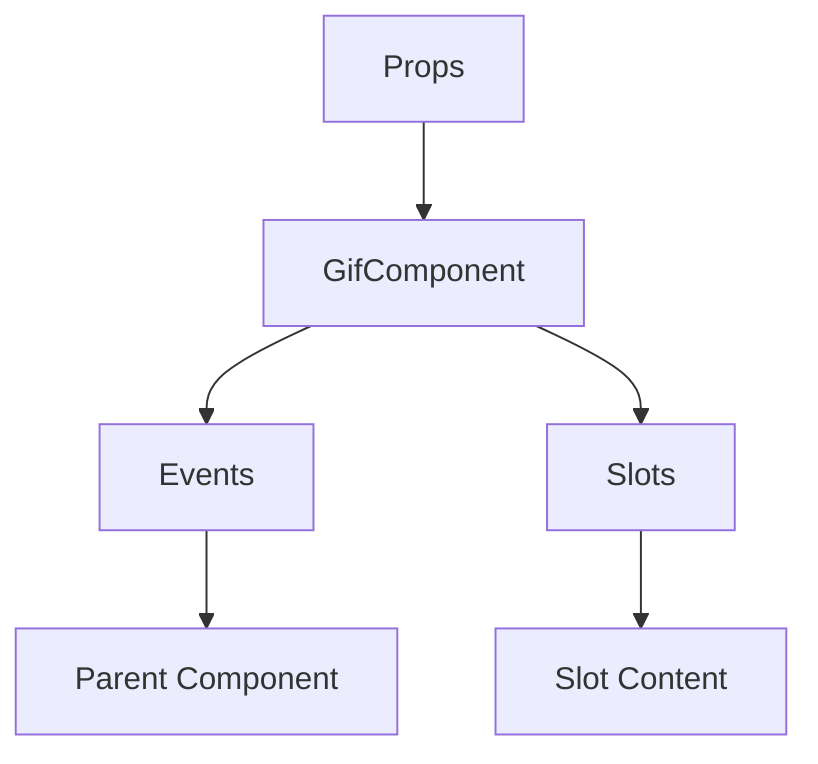

# GifComponent

A Vue component.

**File:** `src/components/GifComponent.vue`

## Overview



## Props

| Name | Type | Default | Required | Description |
|------|------|---------|----------|-------------|
| `closeGiphy` | `TSFunctionType` | `undefined` | ❌ | No description |
| `gifIconClicked` | `boolean` | `false` | ❌ | No description |
| `position` | `PopupPosition` | `'above'` | ❌ | No description |
| `triggerElement` | `HTMLElement` | `undefined` | ❌ | No description |
| `customPosition` | `{ x: number; y: number }` | `undefined` | ❌ | No description |

### Props Details

#### `closeGiphy`

No description available.

- **Type:** `TSFunctionType`
- **Required:** No
- **Default:** `undefined`


#### `gifIconClicked`

No description available.

- **Type:** `boolean`
- **Required:** No
- **Default:** `false`


#### `position`

No description available.

- **Type:** `PopupPosition`
- **Required:** No
- **Default:** `'above'`


#### `triggerElement`

No description available.

- **Type:** `HTMLElement`
- **Required:** No
- **Default:** `undefined`


#### `customPosition`

No description available.

- **Type:** `{ x: number; y: number }`
- **Required:** No
- **Default:** `undefined`


## Events

| Name | Parameters | Description |
|------|------------|-------------|
| `sendGif` | `Gif` | No description |
| `resetGifIconClicked` | `unknown` | No description |
| `switchToEmoji` | `unknown` | No description |

### Event Details

#### `sendGif`

No description available.

**Parameters:** `Gif`


#### `resetGifIconClicked`

No description available.

**Parameters:** `unknown`


#### `switchToEmoji`

No description available.

**Parameters:** `unknown`


## Slots

This component has no slots.

## Methods

This component exposes no public methods.

## Usage Example

```vue
<template>
  <GifComponent
    
    @sendGif="handleSendGif"
    @resetGifIconClicked="handleResetGifIconClicked"
    @switchToEmoji="handleSwitchToEmoji" />
</template>

<script setup lang="ts">
const handleSendGif = (data: Gif) => {
  // Handle sendGif event
}

const handleResetGifIconClicked = (data: unknown) => {
  // Handle resetGifIconClicked event
}

const handleSwitchToEmoji = (data: unknown) => {
  // Handle switchToEmoji event
}
</script>
```


## File Location

`src/components/GifComponent.vue`

---

*This documentation was automatically generated from the component source code.*