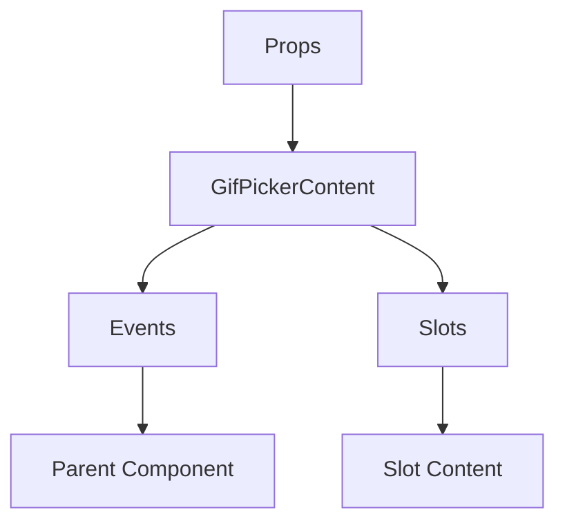

# GifPickerContent

A Vue component.

**File:** `src/components/GifPickerContent.vue`

## Overview



## Props

| Name | Type | Default | Required | Description |
|------|------|---------|----------|-------------|
| `showFavorites` | `boolean` | `undefined` | ✅ | No description |

### Props Details

#### `showFavorites`

No description available.

- **Type:** `boolean`
- **Required:** Yes
- **Default:** `undefined`


## Events

| Name | Parameters | Description |
|------|------------|-------------|
| `update:showFavorites` | `boolean` | No description |
| `sendGif` | `Gif` | No description |

### Event Details

#### `update:showFavorites`

No description available.

**Parameters:** `boolean`


#### `sendGif`

No description available.

**Parameters:** `Gif`


## Slots

This component has no slots.

## Methods

This component exposes no public methods.

## Usage Example

```vue
<template>
  <GifPickerContent
    :showFavorites="true"
    @update:showFavorites="handleUpdate:showFavorites"
    @sendGif="handleSendGif" />
</template>

<script setup lang="ts">
const handleUpdate:showFavorites = (data: boolean) => {
  // Handle update:showFavorites event
}

const handleSendGif = (data: Gif) => {
  // Handle sendGif event
}
</script>
```


## File Location

`src/components/GifPickerContent.vue`

---

*This documentation was automatically generated from the component source code.*