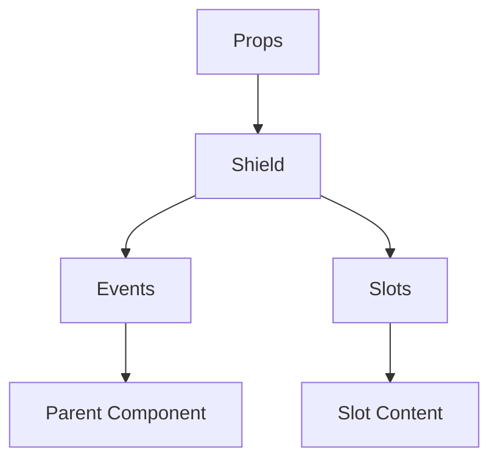

# Shield

A Vue component.

**File:** `src/components/icons/Shield.vue`

## Overview



## Props

This component has no props.

## Events

This component emits no events.

## Slots

This component has no slots.

## Methods

This component exposes no public methods.

## Usage Example

```vue
<template>
  <Shield />
</template>

<script setup lang="ts">
// No event handlers needed
</script>
```


## File Location

`src/components/icons/Shield.vue`

---

*This documentation was automatically generated from the component source code.*