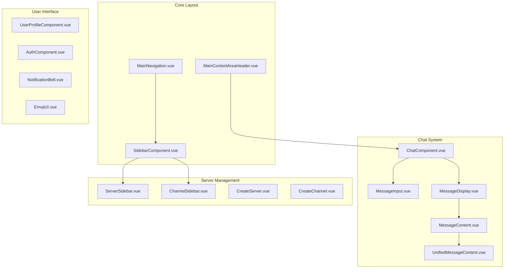

# Component Documentation

Welcome to the Harmony component library. This section documents all Vue 3 components used throughout the application.

## Component Architecture

Harmony follows a structured component architecture with clear separation of concerns:



## Component Categories

### Core Components

Essential components that form the backbone of the application:

- **[MainNavigation](/components/core/main-navigation)** - Primary application navigation
- **[SidebarComponent](/components/core/sidebar)** - Main sidebar container
- **[MainContentAreaHeader](/components/core/content-header)** - Content area header

### Chat Components

### Chat Components

Components specific to the chat functionality:

- **[ChatComponent](/components/chat/chat-component)** - Main chat interface container
- **[MessageInput](/components/chat/message-input)** - Message composition and sending
- **[MessageDisplay](/components/chat/message-display)** - Individual message rendering
- **[MessageContent](/components/chat/message-content)** - Message content parsing and display
- **[UnifiedMessageContent](/components/chat/unified-message-content)** - Unified message content handler
- **[MessageReactions](/components/chat/message-reactions)** - Message reactions and emojis
- **[MessageReply](/components/chat/message-reply)** - Reply functionality
- **[RichTextEditor](/components/chat/rich-text-editor)** - Rich text editing capabilities

### Server & Channel Management

Components for server and channel administration:

- **[ServerSidebar](/components/server/server-sidebar)** - Server navigation sidebar
- **[ChannelSidebar](/components/server/channel-sidebar)** - Channel list and navigation
- **[CreateServer](/components/server/create-server)** - Server creation modal
- **[CreateChannel](/components/server/create-channel)** - Channel creation interface
- **[ServerDropdown](/components/server/server-dropdown)** - Server selection dropdown
- **[CategoryCreator](/components/server/category-creator)** - Channel category management
- **[CategoryEditModal](/components/server/category-edit-modal)** - Category editing interface
- **[ChannelEditModal](/components/server/channel-edit-modal)** - Channel settings modal

### User Interface Components

Essential UI elements and user interactions:

- **[UserProfileComponent](/components/user/user-profile)** - User profile display
- **[UserProfileModal](/components/user/user-profile-modal)** - User profile modal
- **[UserPreviewComponent](/components/user/user-preview)** - Quick user preview
- **[UserSidebar](/components/user/user-sidebar)** - User list sidebar
- **[AuthComponent](/components/auth/auth-component)** - Authentication interface
- **[NotificationBell](/components/notifications/notification-bell)** - Notification indicator
- **[NotificationItem](/components/notifications/notification-item)** - Individual notification
- **[NotificationToast](/components/notifications/notification-toast)** - Toast notifications

### Media & Content

Components for handling media and rich content:

- **[EmojiUI](/components/media/emoji-ui)** - Emoji picker interface
- **[EmojiPopup](/components/media/emoji-popup)** - Emoji selection popup
- **[FilePreview](/components/media/file-preview)** - File preview component
- **[FileUploadMenu](/components/media/file-upload-menu)** - File upload interface
- **[GifComponent](/components/media/gif-component)** - GIF handling and display
- **[MarkdownContent](/components/media/markdown-content)** - Markdown rendering

### Voice & Communication

Voice chat and communication components:

- **[PersistentVoiceConnection](/components/voice/persistent-voice-connection)** - Voice connection manager
- **[SpaceTimeGrid](/components/voice/space-time-grid)** - Spatial voice interface

### Modal & Dialog Components

Various modal dialogs and overlays:

- **[ConfirmationModal](/components/modals/confirmation-modal)** - Confirmation dialogs
- **[InviteModal](/components/modals/invite-modal)** - Server invite interface
- **[InviteAccept](/components/modals/invite-accept)** - Invite acceptance modal

### Context Menus

Right-click context menu components:

- **[CategoryContextMenu](/components/context/category-context-menu)** - Category right-click menu
- **[ChannelContextMenu](/components/context/channel-context-menu)** - Channel right-click menu

### Special Features

Specialized functionality components:

- **[AutoSuggest](/components/special/auto-suggest)** - Auto-suggestion interface
- **[DMSidebar](/components/special/dm-sidebar)** - Direct message sidebar
- **[NoServersSplash](/components/special/no-servers-splash)** - Empty state display
- **[PublicServers](/components/special/public-servers)** - Public server browser

### PWA Components

Progressive Web App functionality:

- **[PWAInstallBanner](/components/pwa/pwa-install-banner)** - PWA installation banner
- **[PWAInstallPrompt](/components/pwa/pwa-install-prompt)** - PWA installation prompt
- **[PWAUpdateNotification](/components/pwa/pwa-update-notification)** - Update notifications

## Component Organization

Components are organized into logical directories within `src/components/`:

```
src/components/
├── activitypub/          # ActivityPub/Federation components
├── chat/                 # Chat-specific components
├── common/               # Shared utility components
├── debug/                # Development/debugging tools
├── demo/                 # Demo and example components
├── dm/                   # Direct message components
├── icons/                # Icon components
├── settings/             # Settings and configuration
├── shared/               # Shared components across features
└── voice/                # Voice chat components
```

## Component Guidelines

### Naming Conventions

- Use PascalCase for component names
- End component files with `.vue`
- Use descriptive, feature-based names
- Avoid abbreviations unless commonly understood

### Structure Standards

All components follow a consistent structure:

```vue
<template>
  <!-- Component template -->
</template>

<script setup lang="ts">
// TypeScript composition API setup
</script>

<style scoped>
/* Scoped component styles */
</style>
```

### TypeScript Integration

- All components use TypeScript with `<script setup lang="ts">`
- Props are defined using TypeScript interfaces
- Emits are strongly typed
- Composables return typed objects

### Styling Approach

- Scoped CSS for component-specific styles
- CSS variables for theming
- Tailwind CSS for utility classes
- BEM methodology for complex components

## Usage Examples

### Basic Component Usage

```vue
<template>
  <ChatComponent 
    :server-id="currentServerId"
    :channel-id="currentChannelId"
    @message-sent="handleMessageSent"
  />
</template>
```

### Component with Slots

```vue
<template>
  <ConfirmationModal 
    :show="showConfirm"
    @confirm="handleConfirm"
    @cancel="handleCancel"
  >
    <template #title>Delete Channel</template>
    <template #content>
      Are you sure you want to delete this channel?
    </template>
  </ConfirmationModal>
</template>
```

### Composable Integration

```vue
<script setup lang="ts">
import { useChannels } from '@/composables/useChannels'
import { useAuth } from '@/composables/useAuth'

const { channels, createChannel } = useChannels()
const { user } = useAuth()
</script>
```

For detailed documentation on individual components, select from the navigation menu or browse the component categories above.

- **[Message Display](/components/chat/message)** - Individual message rendering
- **[Message Input](/components/chat/input)** - Message composition interface
- **[Channel Sidebar](/components/chat/sidebar)** - Channel navigation
- **[Voice Panel](/components/chat/voice)** - Voice/video controls

### Social Components

Components for ActivityPub and social features:

- **[Post Composer](/components/social/composer)** - Create new posts
- **[Timeline](/components/social/timeline)** - Social timeline display
- **[User Card](/components/social/usercard)** - User profile cards
- **[Notification Bell](/components/social/notifications)** - Notification center

### Shared Components

Reusable UI components used throughout the application:

- **[Avatar](/components/shared/avatar)** - User avatar display
- **[Modal](/components/shared/modal)** - Modal dialog system
- **[Button](/components/shared/button)** - Button component variants
- **[Form Controls](/components/shared/forms)** - Input, select, and form elements

## Design System

All components follow a consistent design system based on:

### Color Palette
```css
--primary: #646cff
--secondary: #747bff
--success: #10b981
--warning: #f59e0b
--error: #ef4444
--text: #1f2937
--background: #ffffff
```

### Typography
- **Primary Font**: Inter, system-ui, sans-serif
- **Monospace**: JetBrains Mono, Fira Code, monospace
- **Headings**: 1.5rem to 3rem with 500-700 font weight
- **Body**: 1rem with 400 font weight

### Spacing
- **Base Unit**: 0.25rem (4px)
- **Common Spacings**: 0.5rem, 1rem, 1.5rem, 2rem, 3rem
- **Grid**: 12-column responsive grid system

## Component Patterns

### Composition API Usage

All components use Vue 3 Composition API:

```vue
<script setup lang="ts">
import { ref, computed, onMounted } from 'vue'

interface Props {
  modelValue: string
  disabled?: boolean
}

const props = withDefaults(defineProps<Props>(), {
  disabled: false
})

const emit = defineEmits<{
  'update:modelValue': [value: string]
}>()

const localValue = computed({
  get: () => props.modelValue,
  set: (value) => emit('update:modelValue', value)
})
</script>
```

### TypeScript Integration

All components are fully typed:

```typescript
// Component prop types
interface ButtonProps {
  variant?: 'primary' | 'secondary' | 'danger'
  size?: 'sm' | 'md' | 'lg'
  disabled?: boolean
  loading?: boolean
}

// Event types
interface ButtonEmits {
  click: [event: MouseEvent]
  focus: [event: FocusEvent]
}
```

### Accessibility

Components follow WCAG 2.1 AA standards:

- **Keyboard Navigation**: All interactive elements are keyboard accessible
- **ARIA Labels**: Proper ARIA attributes for screen readers
- **Focus Management**: Visible focus indicators and logical tab order
- **Color Contrast**: Minimum 4.5:1 contrast ratio

## State Management Integration

Components integrate seamlessly with Pinia stores:

```vue
<script setup lang="ts">
import { useChatStore } from '@/stores/useChat'
import { useAuthStore } from '@/stores/auth'

const chatStore = useChatStore()
const authStore = useAuthStore()

// Reactive computed properties
const messages = computed(() => chatStore.messages)
const currentUser = computed(() => authStore.currentUser)
</script>
```

## Styling Approach

### CSS Modules
Components use scoped CSS with CSS variables:

```vue
<style scoped>
.component {
  color: var(--text-primary);
  background: var(--bg-primary);
  border-radius: var(--radius-md);
}

.component--variant-primary {
  background: var(--color-primary);
  color: white;
}
</style>
```

### Responsive Design
All components are mobile-first responsive:

```css
/* Mobile first */
.component {
  width: 100%;
}

/* Tablet and up */
@media (min-width: 768px) {
  .component {
    width: auto;
  }
}

/* Desktop and up */
@media (min-width: 1024px) {
  .component {
    max-width: 1200px;
  }
}
```

## Performance Optimizations

### Lazy Loading
Components implement lazy loading where appropriate:

```typescript
// Lazy component loading
const HeavyComponent = defineAsyncComponent(() => 
  import('@/components/HeavyComponent.vue')
)
```

### Virtual Scrolling
Large lists use virtual scrolling:

```vue
<VirtualList
  :items="messages"
  :item-height="60"
  v-slot="{ item }"
>
  <MessageComponent :message="item" />
</VirtualList>
```

## Testing

All components include comprehensive tests:

```typescript
import { mount } from '@vue/test-utils'
import { describe, it, expect } from 'vitest'
import ButtonComponent from '@/components/ButtonComponent.vue'

describe('ButtonComponent', () => {
  it('renders with correct props', () => {
    const wrapper = mount(ButtonComponent, {
      props: {
        variant: 'primary',
        disabled: false
      }
    })
    
    expect(wrapper.classes()).toContain('btn--primary')
    expect(wrapper.attributes('disabled')).toBeUndefined()
  })
})
```

## Contributing

When creating new components:

1. **Follow naming conventions**: PascalCase for component names
2. **Use TypeScript**: Define proper prop and emit types
3. **Add documentation**: Include JSDoc comments for props
4. **Write tests**: Unit tests for component behavior
5. **Accessibility**: Ensure WCAG compliance
6. **Responsive**: Mobile-first responsive design

## Component Guidelines

### Props
- Use TypeScript interfaces for prop definitions
- Provide sensible defaults with `withDefaults()`
- Keep props simple and focused
- Use composition for complex state

### Events
- Define events with TypeScript interfaces
- Use descriptive event names
- Pass relevant data with events
- Avoid excessive event chaining

### Slots
- Provide named slots for customization
- Use scoped slots for data passing
- Document slot usage in JSDoc
- Provide fallback content where appropriate

---

Explore the specific component documentation using the navigation menu to learn about individual components, their APIs, and usage examples.
