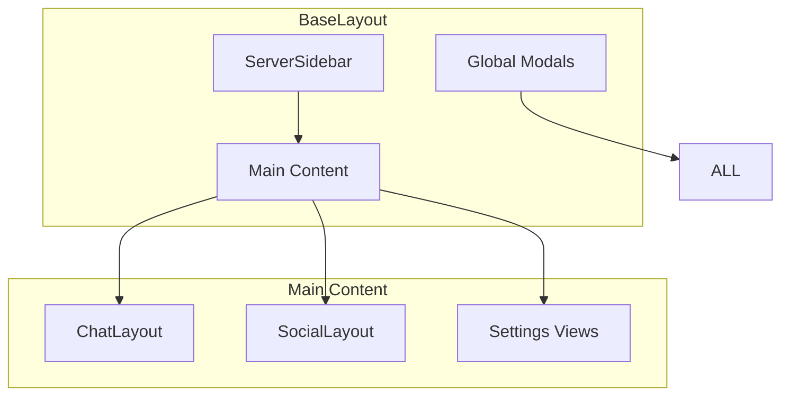

# BaseLayout Component

The BaseLayout component serves as the root layout for the entire Harmony application, providing the foundational structure that all other views and layouts build upon.

## Overview

BaseLayout manages the overall application structure including:
- Server sidebar navigation
- Mobile responsive behavior  
- Global modals and overlays
- Layout state management
- Background processes

```vue
<template>
  <div class="base-layout">
    <ServerSidebar :servers="servers" />
    <main class="main-content">
      <router-view />
    </main>
    <GlobalModals />
  </div>
</template>
```

## Props

The BaseLayout component accepts the following props:

### `isMobile: boolean`
- **Type**: `boolean`
- **Default**: `false`
- **Description**: Indicates if the application is running on a mobile device

### `sidebarCollapsed: boolean`
- **Type**: `boolean`  
- **Default**: `false`
- **Description**: Controls whether the sidebar is collapsed

## Slots

### Default Slot
The main content area where child layouts (ChatLayout, SocialLayout) are rendered.

```vue
<BaseLayout>
  <ChatLayout>
    <!-- Chat content -->
  </ChatLayout>
</BaseLayout>
```

## Layout Structure



## Responsive Behavior

### Desktop (1024px+)
- Full sidebar visible
- Three-column layout support
- Hover interactions enabled

### Tablet (768px - 1023px)  
- Collapsible sidebar
- Two-column layout
- Touch-friendly interactions

### Mobile (< 768px)
- Hidden sidebar (accessible via menu)
- Single-column layout
- Swipe gestures enabled

```css
/* Desktop */
@media (min-width: 1024px) {
  .base-layout {
    grid-template-columns: 240px 1fr;
  }
}

/* Tablet */
@media (max-width: 1023px) {
  .base-layout {
    grid-template-columns: 60px 1fr;
  }
}

/* Mobile */
@media (max-width: 767px) {
  .base-layout {
    grid-template-columns: 1fr;
  }
  
  .server-sidebar {
    position: fixed;
    transform: translateX(-100%);
  }
  
  .server-sidebar--open {
    transform: translateX(0);
  }
}
```

## State Management Integration

BaseLayout integrates with multiple Pinia stores:

### Layout State
```typescript
import { useLayoutState } from '@/composables/useLayoutState'

const {
  isMobile,
  leftSidebarOpen,
  rightSidebarOpen,
  voicePanelOpen
} = useLayoutState()
```

### Server Management
```typescript
import { useServerChannelStore } from '@/stores/useServerChannel'

const serverStore = useServerChannelStore()
const servers = computed(() => serverStore.servers)
```

### Authentication
```typescript
import { useAuthStore } from '@/stores/auth'

const authStore = useAuthStore()
const isLoggedIn = computed(() => authStore.isLoggedIn)
```

## Event Handling

BaseLayout handles various global events:

### Window Resize
```typescript
const handleResize = () => {
  const width = window.innerWidth
  isMobile.value = width < 768
}

onMounted(() => {
  window.addEventListener('resize', handleResize)
})

onUnmounted(() => {
  window.removeEventListener('resize', handleResize)
})
```

### Keyboard Shortcuts
```typescript
const handleKeydown = (event: KeyboardEvent) => {
  // Ctrl/Cmd + K: Open command palette
  if ((event.ctrlKey || event.metaKey) && event.key === 'k') {
    event.preventDefault()
    showCommandPalette()
  }
  
  // Escape: Close modals
  if (event.key === 'Escape') {
    closeActiveModal()
  }
}
```

### Touch Gestures (Mobile)
```typescript
const handleTouchStart = (event: TouchEvent) => {
  touchStartX = event.touches[0].clientX
}

const handleTouchEnd = (event: TouchEvent) => {
  const touchEndX = event.changedTouches[0].clientX
  const difference = touchStartX - touchEndX
  
  // Swipe left to open sidebar
  if (difference < -50) {
    leftSidebarOpen.value = true
  }
  
  // Swipe right to close sidebar
  if (difference > 50) {
    leftSidebarOpen.value = false
  }
}
```

## Performance Optimizations

### Lazy Loading
Child layouts are loaded lazily to improve initial load time:

```typescript
const ChatLayout = defineAsyncComponent(() => 
  import('@/layouts/ChatLayout.vue')
)

const SocialLayout = defineAsyncComponent(() => 
  import('@/layouts/SocialLayout.vue')
)
```

### Virtual Scrolling
Server list uses virtual scrolling for large numbers of servers:

```vue
<VirtualList
  :items="servers"
  :item-height="48"
  class="server-list"
>
  <template #default="{ item }">
    <ServerIcon :server="item" />
  </template>
</VirtualList>
```

### Memory Management
Properly cleans up subscriptions and event listeners:

```typescript
let presenceSubscription: RealtimeChannel | null = null

onMounted(() => {
  presenceSubscription = supabase.channel('presence')
    .subscribe()
})

onUnmounted(() => {
  presenceSubscription?.unsubscribe()
})
```

## Accessibility

BaseLayout implements comprehensive accessibility features:

### ARIA Labels
```vue
<nav 
  class="server-sidebar"
  aria-label="Server navigation"
  role="navigation"
>
  <ul role="list">
    <li 
      v-for="server in servers"
      :key="server.id"
      role="listitem"
    >
      <ServerIcon 
        :server="server"
        :aria-label="`Switch to ${server.name}`"
      />
    </li>
  </ul>
</nav>
```

### Keyboard Navigation
- Tab order follows logical flow
- All interactive elements are keyboard accessible
- Focus indicators are clearly visible

### Screen Reader Support
- Semantic HTML structure
- Proper heading hierarchy
- Live regions for dynamic content updates

## Testing

Unit tests for BaseLayout:

```typescript
import { mount } from '@vue/test-utils'
import { describe, it, expect } from 'vitest'
import BaseLayout from '@/layouts/BaseLayout.vue'

describe('BaseLayout', () => {
  it('renders with default props', () => {
    const wrapper = mount(BaseLayout)
    expect(wrapper.find('.base-layout').exists()).toBe(true)
  })
  
  it('handles mobile responsive behavior', async () => {
    const wrapper = mount(BaseLayout, {
      props: { isMobile: true }
    })
    
    expect(wrapper.classes()).toContain('base-layout--mobile')
  })
  
  it('manages sidebar state correctly', async () => {
    const wrapper = mount(BaseLayout)
    
    await wrapper.vm.toggleSidebar()
    expect(wrapper.vm.leftSidebarOpen).toBe(true)
  })
})
```

## Integration Examples

### With ChatLayout
```vue
<BaseLayout>
  <ChatLayout 
    :servers="servers"
    :current-server="currentServer"
    @server-change="handleServerChange"
  >
    <ChatView :messages="messages" />
  </ChatLayout>
</BaseLayout>
```

### With SocialLayout
```vue
<BaseLayout>
  <SocialLayout
    :timeline="timeline"
    :notifications="notifications"
    @compose="handleCompose"
  >
    <TimelineView :posts="posts" />
  </SocialLayout>
</BaseLayout>
```

## Related Components

- [ServerSidebar](/components/serversidebar) - Server navigation component
- Chat-specific and social layouts live in `src/layouts/` in the repository (no separate doc pages yet).
- [UnifiedModal](/components/shared/unifiedmodal) - Base pattern for application-wide dialogs

## Best Practices

### Performance
- Use `v-memo` for expensive renders
- Implement proper key attributes for lists
- Avoid unnecessary re-renders with computed properties

### Maintainability  
- Keep layout logic separate from business logic
- Use composables for shared layout state
- Document all props and events thoroughly

### Accessibility
- Always provide ARIA labels for navigation
- Implement proper focus management
- Test with screen readers regularly

---

BaseLayout provides the stable foundation that enables Harmony's complex dual-mode (chat/social) interface while maintaining excellent performance and accessibility across all device types.
