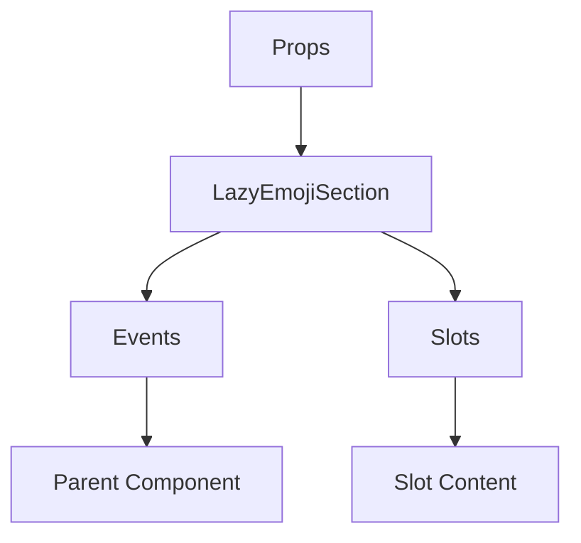

# LazyEmojiSection

A Vue component.

**File:** `src/components/LazyEmojiSection.vue`

## Overview



## Props

| Name | Type | Default | Required | Description |
|------|------|---------|----------|-------------|
| `emojiCount` | `number` | `undefined` | ✅ | Number of emoji items in this section - used to estimate placeholder height. |
| `columns` | `number` | `7` | ❌ | Grid column count. Defaults to 7 (fits a 320px popup). |

### Props Details

#### `emojiCount`

Number of emoji items in this section - used to estimate placeholder height.

- **Type:** `number`
- **Required:** Yes
- **Default:** `undefined`


#### `columns`

Grid column count. Defaults to 7 (fits a 320px popup).

- **Type:** `number`
- **Required:** No
- **Default:** `7`


## Events

This component emits no events.

## Slots

| Name | Scoped | Description |
|------|--------|-------------|
| `header` | ❌ | No description |
| `default` | ❌ | No description |

### Slot Details

#### `header`

No description available.

**Scoped:** No


#### `default`

No description available.

**Scoped:** No


## Methods

This component exposes no public methods.

## Usage Example

```vue
<template>
  <LazyEmojiSection
    :emojiCount="42">
    <template #header>
      <!-- Slot content for header -->
    </template>
    <template #default>
      <!-- Slot content for default -->
    </template>
  </LazyEmojiSection>
</template>

<script setup lang="ts">
// No event handlers needed
</script>
```


## File Location

`src/components/LazyEmojiSection.vue`

---

*This documentation was automatically generated from the component source code.*