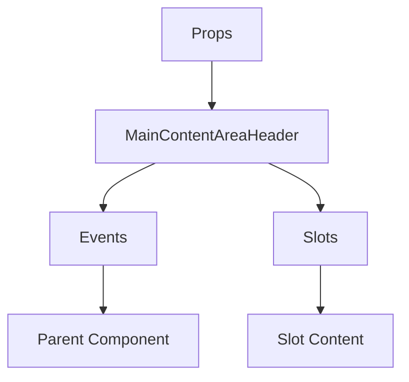

# MainContentAreaHeader

A Vue component.

**File:** `src/components/MainContentAreaHeader.vue`

## Overview



## Props

| Name | Type | Default | Required | Description |
|------|------|---------|----------|-------------|
| `mode` | `ViewMode` | `undefined` | ✅ | No description |
| `currentView` | `string` | `undefined` | ✅ | No description |
| `isMobile` | `boolean` | `undefined` | ✅ | No description |
| `currentChannel` | `Channel` | `undefined` | ❌ | No description |
| `viewType` | `ViewType` | `undefined` | ❌ | No description |

### Props Details

#### `mode`

No description available.

- **Type:** `ViewMode`
- **Required:** Yes
- **Default:** `undefined`


#### `currentView`

No description available.

- **Type:** `string`
- **Required:** Yes
- **Default:** `undefined`


#### `isMobile`

No description available.

- **Type:** `boolean`
- **Required:** Yes
- **Default:** `undefined`


#### `currentChannel`

No description available.

- **Type:** `Channel`
- **Required:** No
- **Default:** `undefined`


#### `viewType`

No description available.

- **Type:** `ViewType`
- **Required:** No
- **Default:** `undefined`


## Events

| Name | Parameters | Description |
|------|------------|-------------|
| `switch-feed` | `string` | No description |

### Event Details

#### `switch-feed`

No description available.

**Parameters:** `string`


## Slots

This component has no slots.

## Methods

This component exposes no public methods.

## Usage Example

```vue
<template>
  <MainContentAreaHeader
    :mode="undefined"
    :currentView=""example""
    :isMobile="true"
    @switch-feed="handleSwitchFeed" />
</template>

<script setup lang="ts">
const handleSwitchFeed = (data: string) => {
  // Handle switch-feed event
}
</script>
```


## File Location

`src/components/MainContentAreaHeader.vue`

---

*This documentation was automatically generated from the component source code.*