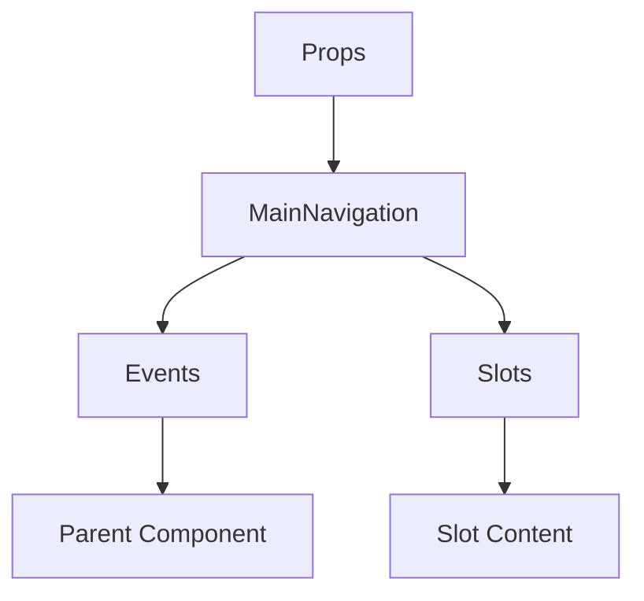

# MainNavigation

A Vue component.

**File:** `src/components/MainNavigation.vue`

## Overview



## Props

| Name | Type | Default | Required | Description |
|------|------|---------|----------|-------------|
| `servers` | `Array` | `undefined` | ✅ | No description |
| `showAddServerModal` | `boolean` | `undefined` | ❌ | No description |

### Props Details

#### `servers`

No description available.

- **Type:** `Array`
- **Required:** Yes
- **Default:** `undefined`


#### `showAddServerModal`

No description available.

- **Type:** `boolean`
- **Required:** No
- **Default:** `undefined`


## Events

| Name | Parameters | Description |
|------|------------|-------------|
| `showPublicServers` | `unknown` | No description |
| `update:showAddServerModal` | `boolean` | No description |

### Event Details

#### `showPublicServers`

No description available.

**Parameters:** `unknown`


#### `update:showAddServerModal`

No description available.

**Parameters:** `boolean`


## Slots

This component has no slots.

## Methods

This component exposes no public methods.

## Usage Example

```vue
<template>
  <MainNavigation
    :servers="[]"
    @showPublicServers="handleShowPublicServers"
    @update:showAddServerModal="handleUpdate:showAddServerModal" />
</template>

<script setup lang="ts">
const handleShowPublicServers = (data: unknown) => {
  // Handle showPublicServers event
}

const handleUpdate:showAddServerModal = (data: boolean) => {
  // Handle update:showAddServerModal event
}
</script>
```


## File Location

`src/components/MainNavigation.vue`

---

*This documentation was automatically generated from the component source code.*