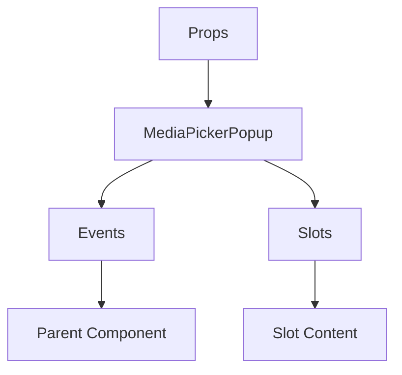

# MediaPickerPopup

A Vue component.

**File:** `src/components/MediaPickerPopup.vue`

## Overview



## Props

| Name | Type | Default | Required | Description |
|------|------|---------|----------|-------------|
| `closePopup` | `TSFunctionType` | `undefined` | ❌ | No description |
| `position` | `PopupPosition` | `'above'` | ❌ | No description |
| `triggerElement` | `HTMLElement` | `undefined` | ❌ | No description |
| `initialTab` | `union` | `'gifs'` | ❌ | No description |

### Props Details

#### `closePopup`

No description available.

- **Type:** `TSFunctionType`
- **Required:** No
- **Default:** `undefined`


#### `position`

No description available.

- **Type:** `PopupPosition`
- **Required:** No
- **Default:** `'above'`


#### `triggerElement`

No description available.

- **Type:** `HTMLElement`
- **Required:** No
- **Default:** `undefined`


#### `initialTab`

No description available.

- **Type:** `union`
- **Required:** No
- **Default:** `'gifs'`


## Events

| Name | Parameters | Description |
|------|------------|-------------|
| `sendGif` | `Gif` | No description |
| `sendEmoji` | `Emoji` | No description |

### Event Details

#### `sendGif`

No description available.

**Parameters:** `Gif`


#### `sendEmoji`

No description available.

**Parameters:** `Emoji`


## Slots

This component has no slots.

## Methods

This component exposes no public methods.

## Usage Example

```vue
<template>
  <MediaPickerPopup
    
    @sendGif="handleSendGif"
    @sendEmoji="handleSendEmoji" />
</template>

<script setup lang="ts">
const handleSendGif = (data: Gif) => {
  // Handle sendGif event
}

const handleSendEmoji = (data: Emoji) => {
  // Handle sendEmoji event
}
</script>
```


## File Location

`src/components/MediaPickerPopup.vue`

---

*This documentation was automatically generated from the component source code.*