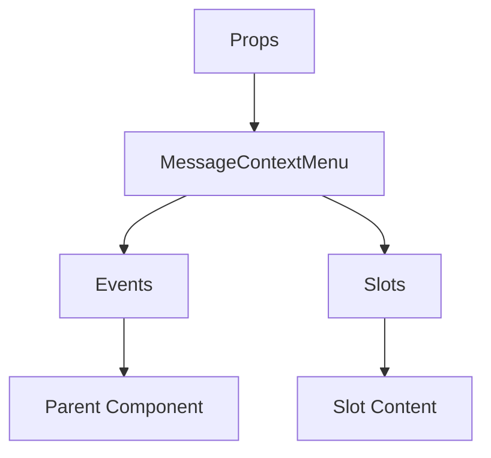

# MessageContextMenu

A Vue component.

**File:** `src/components/MessageContextMenu.vue`

## Overview


```mermaid
graph TB
    PROPS[Props] --> COMPONENT[MessageContextMenu]
    COMPONENT --> EVENTS[Events]
    COMPONENT --> SLOTS[Slots]
    EVENTS --> PARENT[Parent Component]
    SLOTS --> CONTENT[Slot Content]
```

## Props

| Name | Type | Default | Required | Description |
|------|------|---------|----------|-------------|
| `isVisible` | `boolean` | `undefined` | ✅ | No description |
| `position` | `{ x: number; y: number }` | `undefined` | ✅ | No description |
| `message` | `union` | `undefined` | ✅ | No description |
| `channelId` | `string` | `undefined` | ❌ | No description |
| `conversationId` | `string` | `undefined` | ❌ | No description |

### Props Details

#### `isVisible`

No description available.

- **Type:** `boolean`
- **Required:** Yes
- **Default:** `undefined`


#### `position`

No description available.

- **Type:** `{ x: number; y: number }`
- **Required:** Yes
- **Default:** `undefined`


#### `message`

No description available.

- **Type:** `union`
- **Required:** Yes
- **Default:** `undefined`


#### `channelId`

No description available.

- **Type:** `string`
- **Required:** No
- **Default:** `undefined`


#### `conversationId`

No description available.

- **Type:** `string`
- **Required:** No
- **Default:** `undefined`


## Events

| Name | Parameters | Description |
|------|------------|-------------|
| `close` | unknown | No description |

### Event Details

#### `close`

No description available.

**Parameters:** `unknown`


## Slots

This component has no slots.

## Methods

This component exposes no public methods.

## Usage Example

```vue
<template>
  <MessageContextMenu
    :isVisible="true"
    :position="undefined"
    :message="undefined"
    @close="handleClose" />
</template>

<script setup lang="ts">
const handleClose = (data) => {
  // Handle close event
}
</script>
```


## File Location

`src/components/MessageContextMenu.vue`

---

*This documentation was automatically generated from the component source code.*