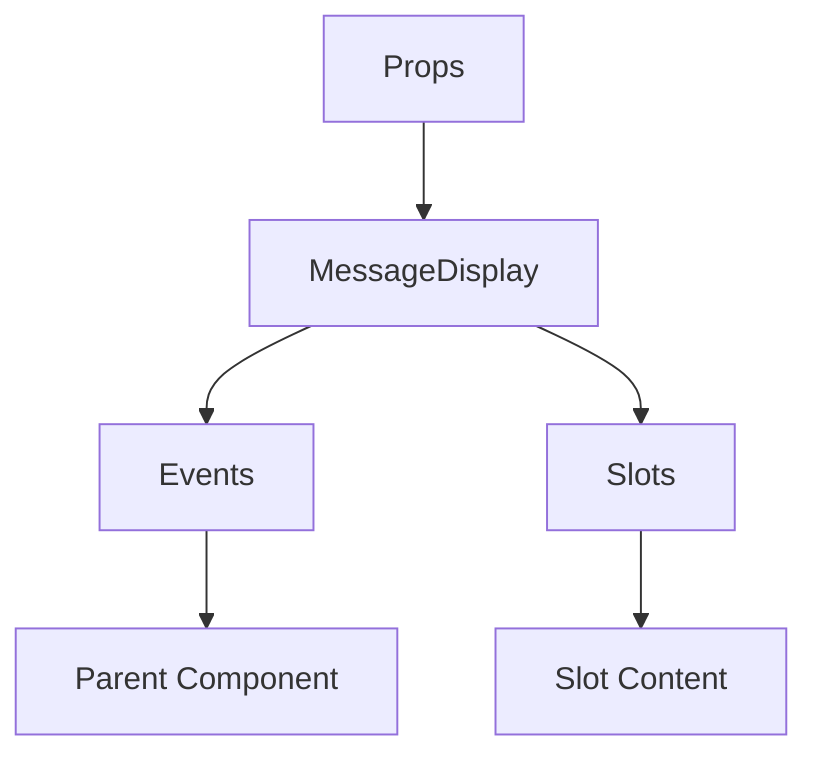

# MessageDisplay

A Vue component.

**File:** `src/components/MessageDisplay.vue`

## Overview



## Props

| Name | Type | Default | Required | Description |
|------|------|---------|----------|-------------|
| `messages` | `Message[]` | `undefined` | ✅ | No description |
| `loadMoreMessages` | `() => void` | `undefined` | ❌ | No description |
| `isAtBottom` | `boolean` | `undefined` | ❌ | No description |
| `currentUserId` | `string` | `undefined` | ❌ | No description |
| `isLoading` | `boolean` | `false` | ❌ | No description |
| `channelId` | `string` | `undefined` | ❌ | No description |
| `conversationId` | `string` | `undefined` | ❌ | No description |
| `hideThreadActions` | `boolean` | `false` | ❌ | No description |

### Props Details

#### `messages`

No description available.

- **Type:** `Message[]`
- **Required:** Yes
- **Default:** `undefined`


#### `loadMoreMessages`

No description available.

- **Type:** `() => void`
- **Required:** No
- **Default:** `undefined`


#### `isAtBottom`

No description available.

- **Type:** `boolean`
- **Required:** No
- **Default:** `undefined`


#### `currentUserId`

No description available.

- **Type:** `string`
- **Required:** No
- **Default:** `undefined`


#### `isLoading`

No description available.

- **Type:** `boolean`
- **Required:** No
- **Default:** `false`


#### `channelId`

No description available.

- **Type:** `string`
- **Required:** No
- **Default:** `undefined`


#### `conversationId`

No description available.

- **Type:** `string`
- **Required:** No
- **Default:** `undefined`


#### `hideThreadActions`

No description available.

- **Type:** `boolean`
- **Required:** No
- **Default:** `false`


## Events

| Name | Parameters | Description |
|------|------------|-------------|
| `loadMoreMessages` | `unknown` | No description |
| `toggleEmojiList` | `unknown` | No description |
| `sendReaction` | `unknown` | No description |
| `replyingTo` | `unknown` | No description |
| `update:isAtBottom` | `unknown` | No description |
| `createThread` | `unknown` | No description |
| `showAllThreads` | `unknown` | No description |
| `mentionUser` | `unknown` | No description |

### Event Details

#### `loadMoreMessages`

No description available.

**Parameters:** `unknown`


#### `toggleEmojiList`

No description available.

**Parameters:** `unknown`


#### `sendReaction`

No description available.

**Parameters:** `unknown`


#### `replyingTo`

No description available.

**Parameters:** `unknown`


#### `update:isAtBottom`

No description available.

**Parameters:** `unknown`


#### `createThread`

No description available.

**Parameters:** `unknown`


#### `showAllThreads`

No description available.

**Parameters:** `unknown`


#### `mentionUser`

No description available.

**Parameters:** `unknown`


## Slots

This component has no slots.

## Methods

This component exposes no public methods.

## Usage Example

```vue
<template>
  <MessageDisplay
    :messages="undefined"
    @loadMoreMessages="handleLoadMoreMessages"
    @toggleEmojiList="handleToggleEmojiList"
    @sendReaction="handleSendReaction"
    @replyingTo="handleReplyingTo"
    @update:isAtBottom="handleUpdate:isAtBottom"
    @createThread="handleCreateThread"
    @showAllThreads="handleShowAllThreads"
    @mentionUser="handleMentionUser" />
</template>

<script setup lang="ts">
const handleLoadMoreMessages = (data: unknown) => {
  // Handle loadMoreMessages event
}

const handleToggleEmojiList = (data: unknown) => {
  // Handle toggleEmojiList event
}

const handleSendReaction = (data: unknown) => {
  // Handle sendReaction event
}

const handleReplyingTo = (data: unknown) => {
  // Handle replyingTo event
}

const handleUpdate:isAtBottom = (data: unknown) => {
  // Handle update:isAtBottom event
}

const handleCreateThread = (data: unknown) => {
  // Handle createThread event
}

const handleShowAllThreads = (data: unknown) => {
  // Handle showAllThreads event
}

const handleMentionUser = (data: unknown) => {
  // Handle mentionUser event
}
</script>
```


## File Location

`src/components/MessageDisplay.vue`

---

*This documentation was automatically generated from the component source code.*