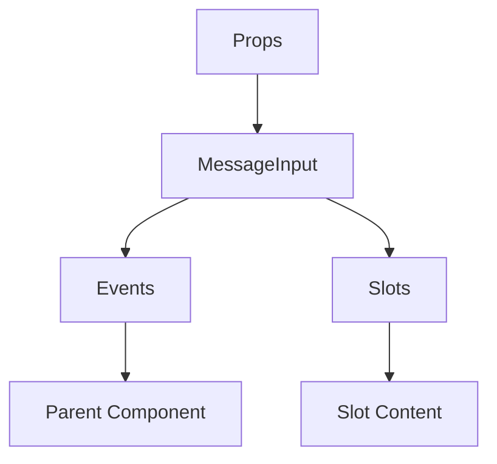

# MessageInput

A Vue component.

**File:** `src/components/MessageInput.vue`

## Overview



## Props

| Name | Type | Default | Required | Description |
|------|------|---------|----------|-------------|
| `giphyOpen` | `boolean` | `false` | ❌ | No description |
| `emojiListOpen` | `boolean` | `false` | ❌ | No description |
| `modelValue` | `string` | `''` | ❌ | No description |
| `replyMessageId` | `string` | `''` | ❌ | No description |
| `replyUserDisplayName` | `string` | `''` | ❌ | No description |
| `channelName` | `string` | `undefined` | ❌ | No description |
| `username` | `string` | `undefined` | ❌ | No description |
| `channelId` | `string` | `undefined` | ❌ | No description |
| `threadId` | `string` | `undefined` | ❌ | No description |
| `conversationId` | `string` | `undefined` | ❌ | No description |

### Props Details

#### `giphyOpen`

No description available.

- **Type:** `boolean`
- **Required:** No
- **Default:** `false`


#### `emojiListOpen`

No description available.

- **Type:** `boolean`
- **Required:** No
- **Default:** `false`


#### `modelValue`

No description available.

- **Type:** `string`
- **Required:** No
- **Default:** `''`


#### `replyMessageId`

No description available.

- **Type:** `string`
- **Required:** No
- **Default:** `''`


#### `replyUserDisplayName`

No description available.

- **Type:** `string`
- **Required:** No
- **Default:** `''`


#### `channelName`

No description available.

- **Type:** `string`
- **Required:** No
- **Default:** `undefined`


#### `username`

No description available.

- **Type:** `string`
- **Required:** No
- **Default:** `undefined`


#### `channelId`

No description available.

- **Type:** `string`
- **Required:** No
- **Default:** `undefined`


#### `threadId`

No description available.

- **Type:** `string`
- **Required:** No
- **Default:** `undefined`


#### `conversationId`

No description available.

- **Type:** `string`
- **Required:** No
- **Default:** `undefined`


## Events

| Name | Parameters | Description |
|------|------------|-------------|
| `update:modelValue` | `string` | No description |
| `sendMessage` | `string` | No description |
| `toggleGiphy` | `unknown` | No description |
| `toggleEmojiList` | `boolean` | No description |
| `update:replyMessageId` | `string` | No description |
| `files-attached` | `Array` | No description |
| `upload-status-changed` | `boolean` | No description |

### Event Details

#### `update:modelValue`

No description available.

**Parameters:** `string`


#### `sendMessage`

No description available.

**Parameters:** `string`


#### `toggleGiphy`

No description available.

**Parameters:** `unknown`


#### `toggleEmojiList`

No description available.

**Parameters:** `boolean`


#### `update:replyMessageId`

No description available.

**Parameters:** `string`


#### `files-attached`

No description available.

**Parameters:** `Array`


#### `upload-status-changed`

No description available.

**Parameters:** `boolean`


## Slots

This component has no slots.

## Methods

This component exposes no public methods.

## Usage Example

```vue
<template>
  <MessageInput
    
    @update:modelValue="handleUpdate:modelValue"
    @sendMessage="handleSendMessage"
    @toggleGiphy="handleToggleGiphy"
    @toggleEmojiList="handleToggleEmojiList"
    @update:replyMessageId="handleUpdate:replyMessageId"
    @files-attached="handleFilesAttached"
    @upload-status-changed="handleUploadStatusChanged" />
</template>

<script setup lang="ts">
const handleUpdate:modelValue = (data: string) => {
  // Handle update:modelValue event
}

const handleSendMessage = (data: string) => {
  // Handle sendMessage event
}

const handleToggleGiphy = (data: unknown) => {
  // Handle toggleGiphy event
}

const handleToggleEmojiList = (data: boolean) => {
  // Handle toggleEmojiList event
}

const handleUpdate:replyMessageId = (data: string) => {
  // Handle update:replyMessageId event
}

const handleFilesAttached = (data: Array) => {
  // Handle files-attached event
}

const handleUploadStatusChanged = (data: boolean) => {
  // Handle upload-status-changed event
}
</script>
```


## File Location

`src/components/MessageInput.vue`

---

*This documentation was automatically generated from the component source code.*