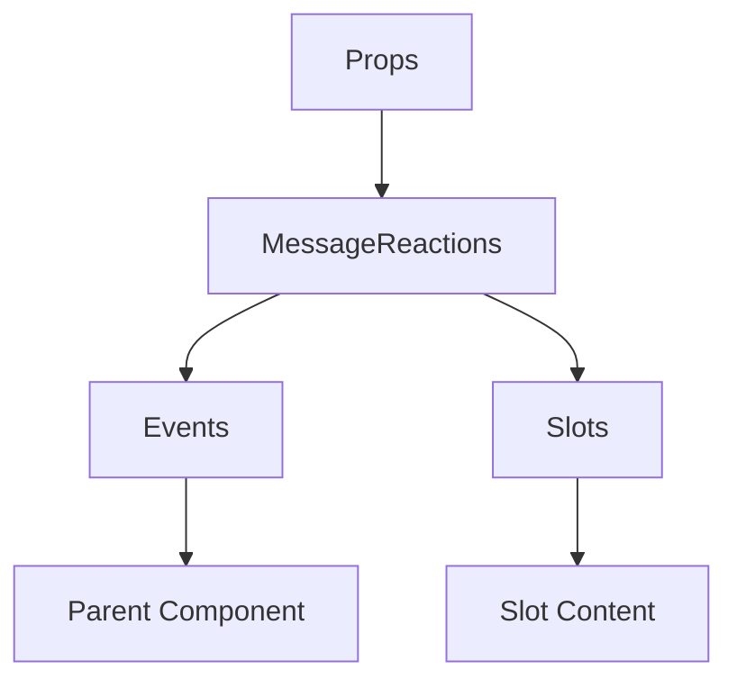

# MessageReactions

A Vue component.

**File:** `src/components/MessageReactions.vue`

## Overview



## Props

| Name | Type | Default | Required | Description |
|------|------|---------|----------|-------------|
| `message` | `Message` | `undefined` | ✅ | No description |
| `showReactions` | `boolean` | `true` | ❌ | No description |

### Props Details

#### `message`

No description available.

- **Type:** `Message`
- **Required:** Yes
- **Default:** `undefined`


#### `showReactions`

No description available.

- **Type:** `boolean`
- **Required:** No
- **Default:** `true`


## Events

| Name | Parameters | Description |
|------|------------|-------------|
| `toggle-reaction` | `string` | No description |
| `show-reaction-tooltip` | `MouseEvent` | No description |
| `hide-reaction-tooltip` | `unknown` | No description |
| `open-emoji-picker` | `string` | No description |

### Event Details

#### `toggle-reaction`

No description available.

**Parameters:** `string`


#### `show-reaction-tooltip`

No description available.

**Parameters:** `MouseEvent`


#### `hide-reaction-tooltip`

No description available.

**Parameters:** `unknown`


#### `open-emoji-picker`

No description available.

**Parameters:** `string`


## Slots

This component has no slots.

## Methods

This component exposes no public methods.

## Usage Example

```vue
<template>
  <MessageReactions
    :message="undefined"
    @toggle-reaction="handleToggleReaction"
    @show-reaction-tooltip="handleShowReactionTooltip"
    @hide-reaction-tooltip="handleHideReactionTooltip"
    @open-emoji-picker="handleOpenEmojiPicker" />
</template>

<script setup lang="ts">
const handleToggleReaction = (data: string) => {
  // Handle toggle-reaction event
}

const handleShowReactionTooltip = (data: MouseEvent) => {
  // Handle show-reaction-tooltip event
}

const handleHideReactionTooltip = (data: unknown) => {
  // Handle hide-reaction-tooltip event
}

const handleOpenEmojiPicker = (data: string) => {
  // Handle open-emoji-picker event
}
</script>
```


## File Location

`src/components/MessageReactions.vue`

---

*This documentation was automatically generated from the component source code.*