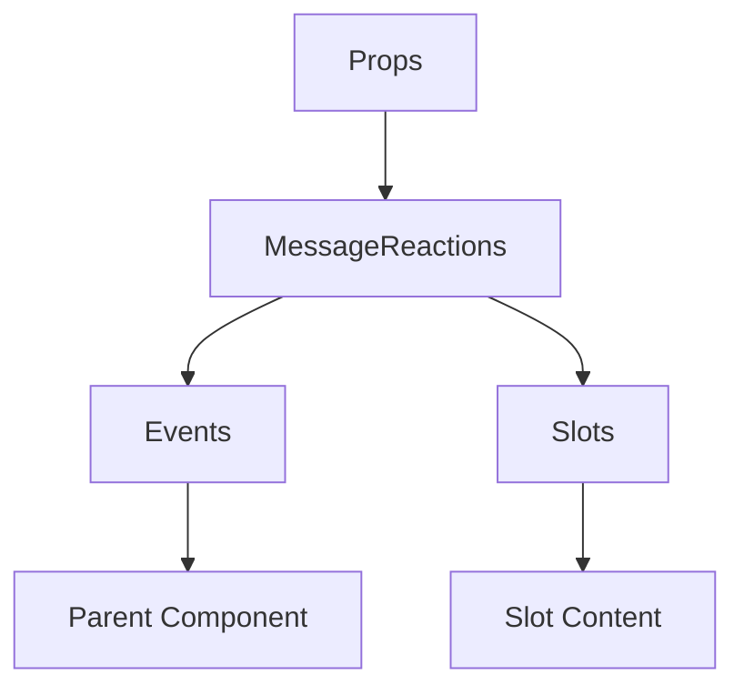

# MessageReactions

No description available.

**File:** `src/components/MessageReactions.vue`

## Overview


```mermaid
graph TB
    PROPS[Props] --> COMPONENT[MessageReactions]
    COMPONENT --> EVENTS[Events]
    COMPONENT --> SLOTS[Slots]
    EVENTS --> PARENT[Parent Component]
    SLOTS --> CONTENT[Slot Content]
```

## Props

| Name | Type | Default | Required | Description |
|------|------|---------|----------|-------------|
| `message` | `Message` | `undefined` | ✅ | No description |
| `showReactions` | `boolean` | `true` | ❌ | No description |

### Props Details

#### `message`

No description available.

- **Type:** `Message`
- **Required:** Yes
- **Default:** `undefined`


#### `showReactions`

No description available.

- **Type:** `boolean`
- **Required:** No
- **Default:** `true`


## Events

| Name | Parameters | Description |
|------|------------|-------------|
| `toggle-reaction` | string | No description |
| `show-reaction-tooltip` | MouseEvent | No description |
| `hide-reaction-tooltip` | unknown | No description |

### Event Details

#### `toggle-reaction`

No description available.

**Parameters:** `string`


#### `show-reaction-tooltip`

No description available.

**Parameters:** `MouseEvent`


#### `hide-reaction-tooltip`

No description available.

**Parameters:** `unknown`


## Slots

This component has no slots.

## Methods

This component exposes no public methods.

## Usage Example

```vue
<template>
  <MessageReactions
    :message="undefined"
    @toggle-reaction="handleToggle-reaction"
    @show-reaction-tooltip="handleShow-reaction-tooltip"
    @hide-reaction-tooltip="handleHide-reaction-tooltip" />
</template>

<script setup lang="ts">
const handleToggle-reaction = (string) => {
  // Handle toggle-reaction event
}

const handleShow-reaction-tooltip = (MouseEvent) => {
  // Handle show-reaction-tooltip event
}

const handleHide-reaction-tooltip = (data) => {
  // Handle hide-reaction-tooltip event
}
</script>
```


## File Location

`src/components/MessageReactions.vue`

---

*This documentation was automatically generated from the component source code.*