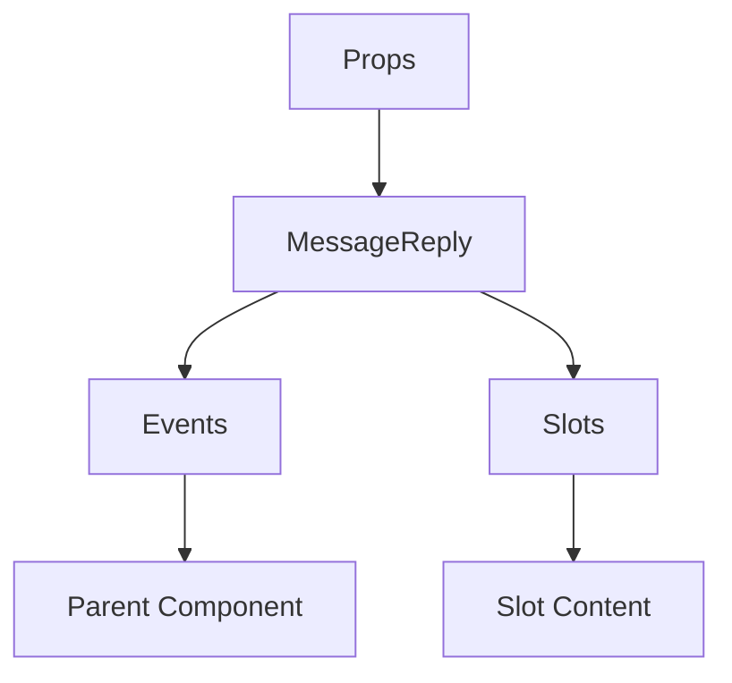

# MessageReply

A Vue component.

**File:** `src/components/MessageReply.vue`

## Overview



## Props

| Name | Type | Default | Required | Description |
|------|------|---------|----------|-------------|
| `replyMessageId` | `string` | `undefined` | ✅ | No description |
| `replyUserDisplayName` | `string` | `'Deleted User'` | ❌ | No description |

### Props Details

#### `replyMessageId`

No description available.

- **Type:** `string`
- **Required:** Yes
- **Default:** `undefined`


#### `replyUserDisplayName`

No description available.

- **Type:** `string`
- **Required:** No
- **Default:** `'Deleted User'`


## Events

| Name | Parameters | Description |
|------|------------|-------------|
| `update:replyMessageId` | `string` | No description |

### Event Details

#### `update:replyMessageId`

No description available.

**Parameters:** `string`


## Slots

This component has no slots.

## Methods

This component exposes no public methods.

## Usage Example

```vue
<template>
  <MessageReply
    :replyMessageId=""example""
    @update:replyMessageId="handleUpdate:replyMessageId" />
</template>

<script setup lang="ts">
const handleUpdate:replyMessageId = (data: string) => {
  // Handle update:replyMessageId event
}
</script>
```


## File Location

`src/components/MessageReply.vue`

---

*This documentation was automatically generated from the component source code.*