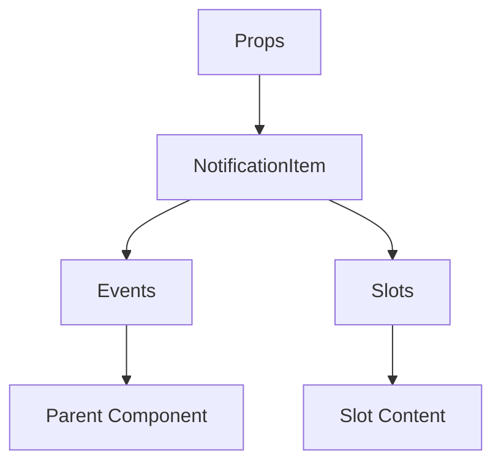

# NotificationItem

A Vue component.

**File:** `src/components/NotificationItem.vue`

## Overview



## Props

| Name | Type | Default | Required | Description |
|------|------|---------|----------|-------------|
| `notification` | `Notification` | `undefined` | ✅ | No description |

### Props Details

#### `notification`

No description available.

- **Type:** `Notification`
- **Required:** Yes
- **Default:** `undefined`


## Events

| Name | Parameters | Description |
|------|------------|-------------|
| `click` | `Notification` | No description |
| `mark-read` | `string` | No description |
| `dismiss` | `string` | No description |

### Event Details

#### `click`

No description available.

**Parameters:** `Notification`


#### `mark-read`

No description available.

**Parameters:** `string`


#### `dismiss`

No description available.

**Parameters:** `string`


## Slots

This component has no slots.

## Methods

This component exposes no public methods.

## Usage Example

```vue
<template>
  <NotificationItem
    :notification="undefined"
    @click="handleClick"
    @mark-read="handleMarkRead"
    @dismiss="handleDismiss" />
</template>

<script setup lang="ts">
const handleClick = (data: Notification) => {
  // Handle click event
}

const handleMarkRead = (data: string) => {
  // Handle mark-read event
}

const handleDismiss = (data: string) => {
  // Handle dismiss event
}
</script>
```


## File Location

`src/components/NotificationItem.vue`

---

*This documentation was automatically generated from the component source code.*