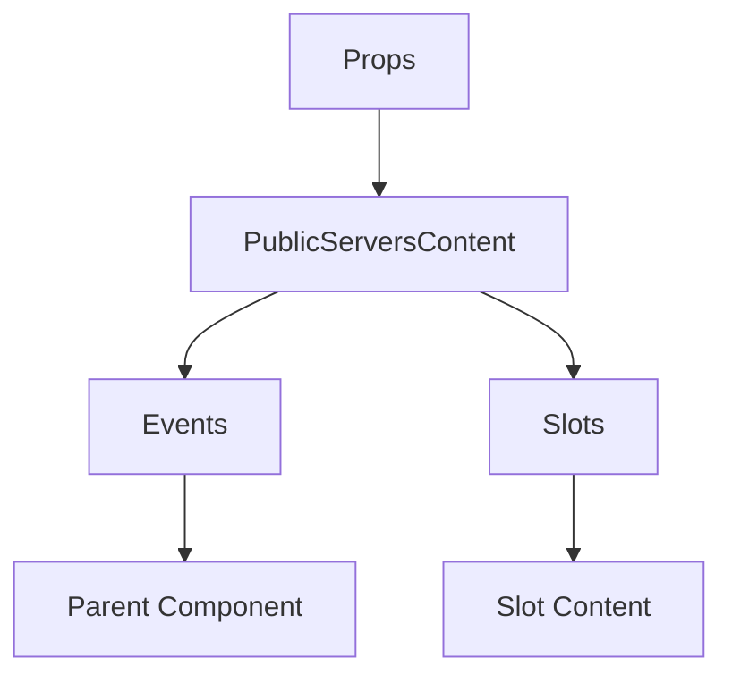

# PublicServersContent

A Vue component.

**File:** `src/components/PublicServers/PublicServersContent.vue`

## Overview



## Props

| Name | Type | Default | Required | Description |
|------|------|---------|----------|-------------|
| `servers` | `Array` | `undefined` | ✅ | No description |
| `featuredServers` | `Array` | `undefined` | ✅ | No description |
| `isLoading` | `boolean` | `undefined` | ✅ | No description |
| `isEmpty` | `boolean` | `undefined` | ✅ | No description |
| `isEmptySearch` | `boolean` | `undefined` | ✅ | No description |
| `searchQuery` | `string` | `undefined` | ✅ | No description |
| `joinedServerIds` | `Set` | `undefined` | ✅ | No description |
| `loadingServerIds` | `Set` | `undefined` | ✅ | No description |
| `error` | `union` | `undefined` | ❌ | No description |

### Props Details

#### `servers`

No description available.

- **Type:** `Array`
- **Required:** Yes
- **Default:** `undefined`


#### `featuredServers`

No description available.

- **Type:** `Array`
- **Required:** Yes
- **Default:** `undefined`


#### `isLoading`

No description available.

- **Type:** `boolean`
- **Required:** Yes
- **Default:** `undefined`


#### `isEmpty`

No description available.

- **Type:** `boolean`
- **Required:** Yes
- **Default:** `undefined`


#### `isEmptySearch`

No description available.

- **Type:** `boolean`
- **Required:** Yes
- **Default:** `undefined`


#### `searchQuery`

No description available.

- **Type:** `string`
- **Required:** Yes
- **Default:** `undefined`


#### `joinedServerIds`

No description available.

- **Type:** `Set`
- **Required:** Yes
- **Default:** `undefined`


#### `loadingServerIds`

No description available.

- **Type:** `Set`
- **Required:** Yes
- **Default:** `undefined`


#### `error`

No description available.

- **Type:** `union`
- **Required:** No
- **Default:** `undefined`


## Events

| Name | Parameters | Description |
|------|------------|-------------|
| `refresh` | `unknown` | No description |
| `joinServer` | `string` | No description |
| `leaveServer` | `string` | No description |
| `viewOwnerProfile` | `string` | No description |

### Event Details

#### `refresh`

No description available.

**Parameters:** `unknown`


#### `joinServer`

No description available.

**Parameters:** `string`


#### `leaveServer`

No description available.

**Parameters:** `string`


#### `viewOwnerProfile`

No description available.

**Parameters:** `string`


## Slots

This component has no slots.

## Methods

This component exposes no public methods.

## Usage Example

```vue
<template>
  <PublicServersContent
    :servers="[]"
    :featuredServers="[]"
    :isLoading="true"
    :isEmpty="true"
    :isEmptySearch="true"
    :searchQuery=""example""
    :joinedServerIds="undefined"
    :loadingServerIds="undefined"
    @refresh="handleRefresh"
    @joinServer="handleJoinServer"
    @leaveServer="handleLeaveServer"
    @viewOwnerProfile="handleViewOwnerProfile" />
</template>

<script setup lang="ts">
const handleRefresh = (data: unknown) => {
  // Handle refresh event
}

const handleJoinServer = (data: string) => {
  // Handle joinServer event
}

const handleLeaveServer = (data: string) => {
  // Handle leaveServer event
}

const handleViewOwnerProfile = (data: string) => {
  // Handle viewOwnerProfile event
}
</script>
```


## File Location

`src/components/PublicServers/PublicServersContent.vue`

---

*This documentation was automatically generated from the component source code.*