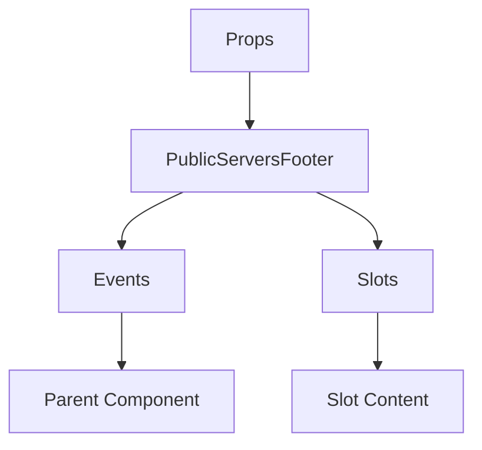

# PublicServersFooter

A Vue component.

**File:** `src/components/PublicServers/PublicServersFooter.vue`

## Overview



## Props

This component has no props.

## Events

| Name | Parameters | Description |
|------|------------|-------------|
| `joinByUrl` | `unknown` | No description |
| `createServer` | `unknown` | No description |

### Event Details

#### `joinByUrl`

No description available.

**Parameters:** `unknown`


#### `createServer`

No description available.

**Parameters:** `unknown`


## Slots

This component has no slots.

## Methods

This component exposes no public methods.

## Usage Example

```vue
<template>
  <PublicServersFooter
    @joinByUrl="handleJoinByUrl"
    @createServer="handleCreateServer" />
</template>

<script setup lang="ts">
const handleJoinByUrl = (data: unknown) => {
  // Handle joinByUrl event
}

const handleCreateServer = (data: unknown) => {
  // Handle createServer event
}
</script>
```


## File Location

`src/components/PublicServers/PublicServersFooter.vue`

---

*This documentation was automatically generated from the component source code.*