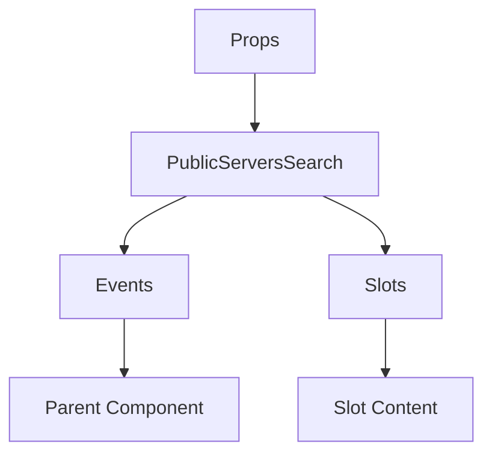

# PublicServersSearch

A Vue component.

**File:** `src/components/PublicServers/PublicServersSearch.vue`

## Overview



## Props

| Name | Type | Default | Required | Description |
|------|------|---------|----------|-------------|
| `searchQuery` | `string` | `undefined` | ✅ | No description |
| `selectedCategory` | `union` | `undefined` | ✅ | No description |
| `isSearching` | `boolean` | `undefined` | ✅ | No description |
| `categories` | `Array` | `undefined` | ✅ | No description |
| `totalServers` | `number` | `undefined` | ✅ | No description |
| `filteredCount` | `number` | `undefined` | ✅ | No description |

### Props Details

#### `searchQuery`

No description available.

- **Type:** `string`
- **Required:** Yes
- **Default:** `undefined`


#### `selectedCategory`

No description available.

- **Type:** `union`
- **Required:** Yes
- **Default:** `undefined`


#### `isSearching`

No description available.

- **Type:** `boolean`
- **Required:** Yes
- **Default:** `undefined`


#### `categories`

No description available.

- **Type:** `Array`
- **Required:** Yes
- **Default:** `undefined`


#### `totalServers`

No description available.

- **Type:** `number`
- **Required:** Yes
- **Default:** `undefined`


#### `filteredCount`

No description available.

- **Type:** `number`
- **Required:** Yes
- **Default:** `undefined`


## Events

| Name | Parameters | Description |
|------|------------|-------------|
| `update:searchQuery` | `string` | No description |
| `update:selectedCategory` | `union` | No description |

### Event Details

#### `update:searchQuery`

No description available.

**Parameters:** `string`


#### `update:selectedCategory`

No description available.

**Parameters:** `union`


## Slots

This component has no slots.

## Methods

This component exposes no public methods.

## Usage Example

```vue
<template>
  <PublicServersSearch
    :searchQuery=""example""
    :selectedCategory="undefined"
    :isSearching="true"
    :categories="[]"
    :totalServers="42"
    :filteredCount="42"
    @update:searchQuery="handleUpdate:searchQuery"
    @update:selectedCategory="handleUpdate:selectedCategory" />
</template>

<script setup lang="ts">
const handleUpdate:searchQuery = (data: string) => {
  // Handle update:searchQuery event
}

const handleUpdate:selectedCategory = (data: union) => {
  // Handle update:selectedCategory event
}
</script>
```


## File Location

`src/components/PublicServers/PublicServersSearch.vue`

---

*This documentation was automatically generated from the component source code.*