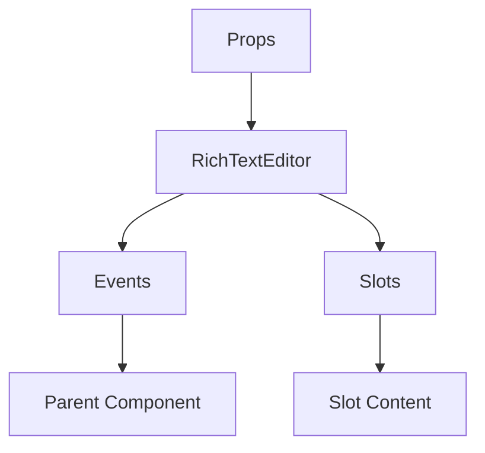

# RichTextEditor

A Vue component.

**File:** `src/components/RichTextEditor.vue`

## Overview



## Props

| Name | Type | Default | Required | Description |
|------|------|---------|----------|-------------|
| `modelValue` | `string` | `undefined` | ✅ | No description |
| `placeholder` | `string` | `'Type a message...'` | ❌ | No description |
| `maxHeight` | `number` | `200` | ❌ | No description |
| `minHeight` | `number` | `44` | ❌ | No description |

### Props Details

#### `modelValue`

No description available.

- **Type:** `string`
- **Required:** Yes
- **Default:** `undefined`


#### `placeholder`

No description available.

- **Type:** `string`
- **Required:** No
- **Default:** `'Type a message...'`


#### `maxHeight`

No description available.

- **Type:** `number`
- **Required:** No
- **Default:** `200`


#### `minHeight`

No description available.

- **Type:** `number`
- **Required:** No
- **Default:** `44`


## Events

| Name | Parameters | Description |
|------|------------|-------------|
| `update:modelValue` | `string` | No description |
| `input` | `Event` | No description |
| `keydown` | `KeyboardEvent` | No description |
| `focus` | `FocusEvent` | No description |
| `blur` | `FocusEvent` | No description |
| `cursor-position-changed` | `number` | No description |
| `paste` | `ClipboardEvent` | No description |

### Event Details

#### `update:modelValue`

No description available.

**Parameters:** `string`


#### `input`

No description available.

**Parameters:** `Event`


#### `keydown`

No description available.

**Parameters:** `KeyboardEvent`


#### `focus`

No description available.

**Parameters:** `FocusEvent`


#### `blur`

No description available.

**Parameters:** `FocusEvent`


#### `cursor-position-changed`

No description available.

**Parameters:** `number`


#### `paste`

No description available.

**Parameters:** `ClipboardEvent`


## Slots

This component has no slots.

## Methods

This component exposes no public methods.

## Usage Example

```vue
<template>
  <RichTextEditor
    :modelValue=""example""
    @update:modelValue="handleUpdate:modelValue"
    @input="handleInput"
    @keydown="handleKeydown"
    @focus="handleFocus"
    @blur="handleBlur"
    @cursor-position-changed="handleCursorPositionChanged"
    @paste="handlePaste" />
</template>

<script setup lang="ts">
const handleUpdate:modelValue = (data: string) => {
  // Handle update:modelValue event
}

const handleInput = (data: Event) => {
  // Handle input event
}

const handleKeydown = (data: KeyboardEvent) => {
  // Handle keydown event
}

const handleFocus = (data: FocusEvent) => {
  // Handle focus event
}

const handleBlur = (data: FocusEvent) => {
  // Handle blur event
}

const handleCursorPositionChanged = (data: number) => {
  // Handle cursor-position-changed event
}

const handlePaste = (data: ClipboardEvent) => {
  // Handle paste event
}
</script>
```


## File Location

`src/components/RichTextEditor.vue`

---

*This documentation was automatically generated from the component source code.*