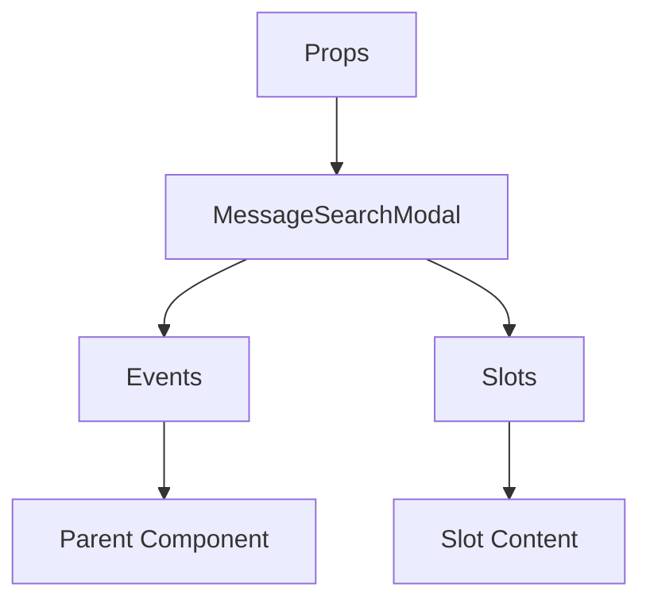

# MessageSearchModal

A Vue component.

**File:** `src/components/search/MessageSearchModal.vue`

## Overview



## Props

| Name | Type | Default | Required | Description |
|------|------|---------|----------|-------------|
| `show` | `boolean` | `false` | ✅ | No description |
| `initialQuery` | `string` | `''` | ❌ | No description |
| `initialChannelId` | `string` | `undefined` | ❌ | No description |
| `initialConversationId` | `string` | `undefined` | ❌ | No description |
| `initialServerId` | `string` | `undefined` | ❌ | No description |

### Props Details

#### `show`

No description available.

- **Type:** `boolean`
- **Required:** Yes
- **Default:** `false`


#### `initialQuery`

No description available.

- **Type:** `string`
- **Required:** No
- **Default:** `''`


#### `initialChannelId`

No description available.

- **Type:** `string`
- **Required:** No
- **Default:** `undefined`


#### `initialConversationId`

No description available.

- **Type:** `string`
- **Required:** No
- **Default:** `undefined`


#### `initialServerId`

No description available.

- **Type:** `string`
- **Required:** No
- **Default:** `undefined`


## Events

| Name | Parameters | Description |
|------|------------|-------------|
| `close` | `unknown` | No description |
| `message-click` | `Message` | No description |

### Event Details

#### `close`

No description available.

**Parameters:** `unknown`


#### `message-click`

No description available.

**Parameters:** `Message`


## Slots

This component has no slots.

## Methods

This component exposes no public methods.

## Usage Example

```vue
<template>
  <MessageSearchModal
    :show="true"
    @close="handleClose"
    @message-click="handleMessageClick" />
</template>

<script setup lang="ts">
const handleClose = (data: unknown) => {
  // Handle close event
}

const handleMessageClick = (data: Message) => {
  // Handle message-click event
}
</script>
```


## File Location

`src/components/search/MessageSearchModal.vue`

---

*This documentation was automatically generated from the component source code.*