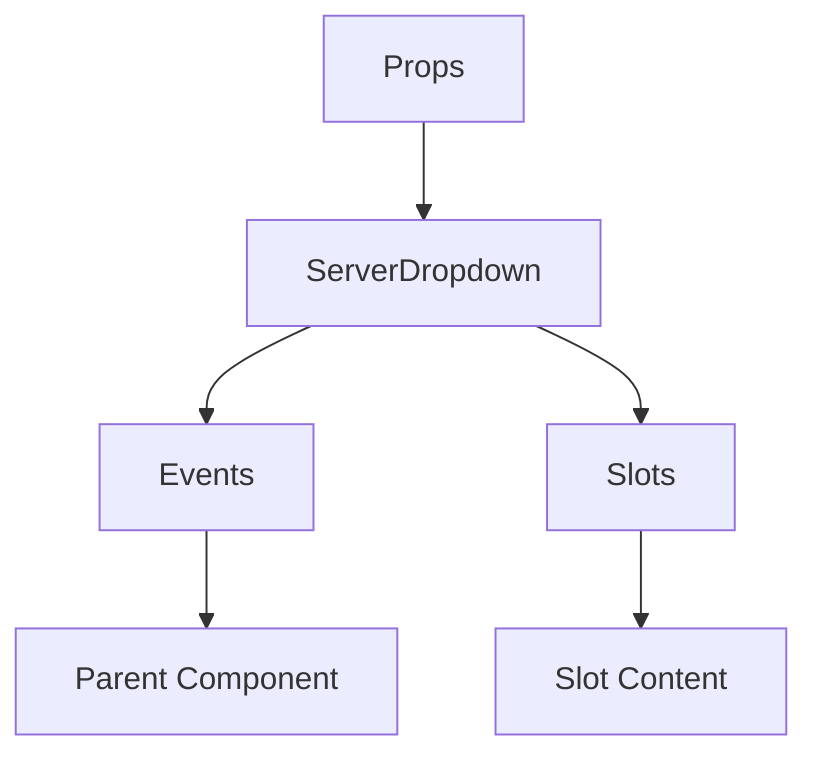

# ServerDropdown

A Vue component.

**File:** `src/components/ServerDropdown.vue`

## Overview



## Props

| Name | Type | Default | Required | Description |
|------|------|---------|----------|-------------|
| `serverId` | `string` | `undefined` | ❌ | No description |
| `isVisible` | `boolean` | `undefined` | ❌ | No description |

### Props Details

#### `serverId`

No description available.

- **Type:** `string`
- **Required:** No
- **Default:** `undefined`


#### `isVisible`

No description available.

- **Type:** `boolean`
- **Required:** No
- **Default:** `undefined`


## Events

| Name | Parameters | Description |
|------|------------|-------------|
| `toggle` | `unknown` | No description |
| `showCategoryCreator` | `boolean` | No description |
| `createChannel` | `string` | No description |
| `openInviteModal` | `unknown` | No description |
| `serverLeft` | `unknown` | No description |

### Event Details

#### `toggle`

No description available.

**Parameters:** `unknown`


#### `showCategoryCreator`

No description available.

**Parameters:** `boolean`


#### `createChannel`

No description available.

**Parameters:** `string`


#### `openInviteModal`

No description available.

**Parameters:** `unknown`


#### `serverLeft`

No description available.

**Parameters:** `unknown`


## Slots

This component has no slots.

## Methods

This component exposes no public methods.

## Usage Example

```vue
<template>
  <ServerDropdown
    
    @toggle="handleToggle"
    @showCategoryCreator="handleShowCategoryCreator"
    @createChannel="handleCreateChannel"
    @openInviteModal="handleOpenInviteModal"
    @serverLeft="handleServerLeft" />
</template>

<script setup lang="ts">
const handleToggle = (data: unknown) => {
  // Handle toggle event
}

const handleShowCategoryCreator = (data: boolean) => {
  // Handle showCategoryCreator event
}

const handleCreateChannel = (data: string) => {
  // Handle createChannel event
}

const handleOpenInviteModal = (data: unknown) => {
  // Handle openInviteModal event
}

const handleServerLeft = (data: unknown) => {
  // Handle serverLeft event
}
</script>
```


## File Location

`src/components/ServerDropdown.vue`

---

*This documentation was automatically generated from the component source code.*